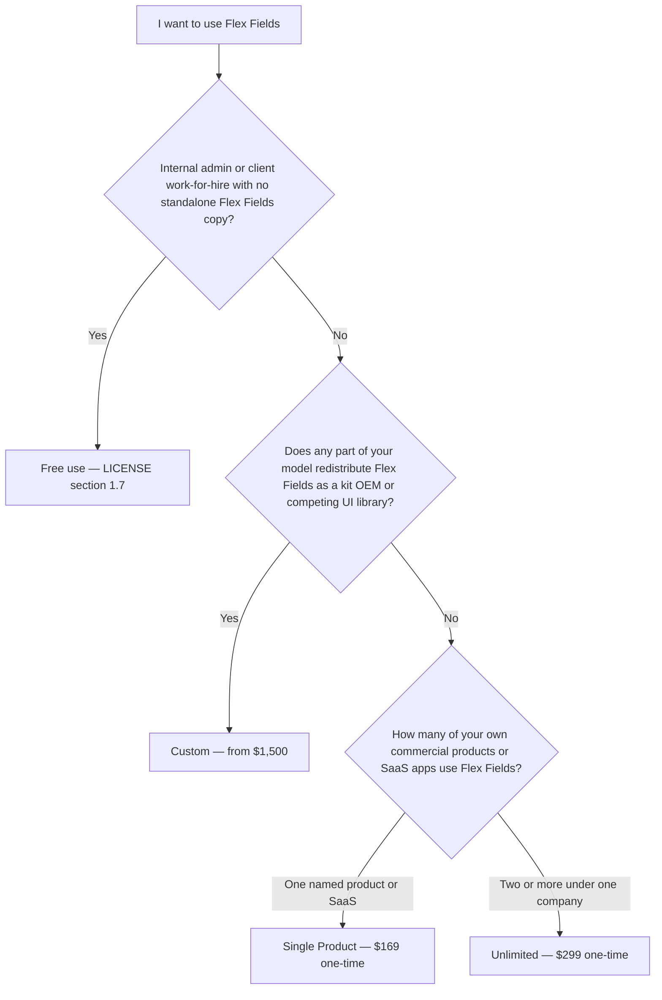

# Flex Fields — Commercial Licenses

**Product:** `janczakb/filament-flex-fields`  
**Governing free-use terms:** [LICENSE](LICENSE) (v1.1)  
**Contact:** [barek122@gmail.com](mailto:barek122@gmail.com)

This document is the public commercial pricing and plan guide for Flex Fields. It is written for founders, legal, and procurement teams evaluating whether your product needs a commercial license—and which plan fits.

The free license text in [LICENSE](LICENSE) remains authoritative for Permitted Free Use. A commercial license is a separate written grant for use that the free license does not allow.

---

## 1. How Flex Fields is licensed

Flex Fields is **source-available and dual-licensed**:

1. **Free license** — You may obtain the Software from official channels (GitHub, Packagist) and use it under **Permitted Free Use** as defined in [LICENSE](LICENSE) §1.7, subject to the restrictions in §3.
2. **Commercial license** — Required when your use is Commercial Distribution, a Bundled Product offered commercially, multi-tenant SaaS where Flex Fields is a material component, or any other exploitation called out in [LICENSE](LICENSE) §5.1.

Package source, Composer installs, and updates remain available through official public channels for everyone. **A commercial license does not sell “access to updates.”** It grants **commercial rights** that the free license withholds.

---

## 2. Do you need a commercial license?

Use this decision path first. Prices shown are the current standard public offerings (USD, one-time).

**Important:** If **any** part of your business redistributes Flex Fields as a kit, white-label plugin, starter buyers can extract, or competing UI library, choose **Custom**—even if you also run your own SaaS. Single Product and Unlimited never include kit rights.

### Typical free situations (no purchase required)

| Situation | Free? |
|-----------|-------|
| Your company’s own internal / staff Filament admin | Yes — [LICENSE](LICENSE) §1.7(a) |
| Staging and development for that same entity | Yes |
| Building one client project as work-for-hire, where the client receives the running application but **not** a standalone copy of Flex Fields to redistribute | Yes — §1.7(b) |
| Keeping `vendor/` or published Filament assets in your **private** application repository under the conditions in §1.5(iii) | Yes |
| Theming / CSS overrides in your own app that target Flex Fields output | Yes — §2.3 |
| Local patches under `vendor/` used only for your Permitted Free Use | Yes — §2.4 |

**Free §1.7(b) ends** if the client **resells, licenses, distributes, or operates** the resulting product for third parties ([LICENSE](LICENSE) §1.7(b)(iii)). Then the party that commercially distributes needs a **commercial** license (typically Single Product or Unlimited for in-product use). The agency/freelancer engagement is no longer “free work-for-hire.”

### Situations that require a commercial license

| Situation | Plan |
|-----------|------|
| You operate a **multi-tenant SaaS** (or similar hosted product) where Flex Fields is a dependency; customers get **runtime access to your product only** | **Single Product** ($169) or **Unlimited** ($299) |
| You sell a **hosted / operated commercial application**; buyers do **not** receive Flex Fields as an installable package they can reuse in other projects | **Single Product** or **Unlimited** |
| You sell a **developer starter, boilerplate, admin pack, or codebase** where buyers receive project source **and** Flex Fields (e.g. `vendor/` or Composer) for that project or can extract it for other work | **Custom** — see [§6](#6-custom-license--reselling-flex-fields-as-a-kit-from-1500) |
| Your client will **resell** the app you built (FF stays inside *their* product, not sold as a kit) | Commercial for the **distributing** party — Single / Unlimited; free §1.7(b) no longer applies |
| You **resell, white-label, republish, or redistribute Flex Fields itself** as a field kit or competing UI library | **Custom** (from **$1,500**) |

#### Starter kits and boilerplates (read carefully)

| What you ship | Correct plan |
|---------------|--------------|
| Hosted SaaS / app you run; customers never get a standalone Flex Fields install | Single Product or Unlimited |
| Downloadable binary/service you operate without handing buyers a reusable FF package | Single Product or Unlimited |
| Template / boilerplate / “Filament starter” ZIP or repo where buyers install or keep Flex Fields as **their** dependency | **Custom** |
| Same starter “but buyers pinky-promise not to extract FF” while `vendor/` is in the tree | Still **Custom** unless we confirm otherwise in writing |

**Rule of thumb:** “I use *your* product in the browser” → Single / Unlimited (or free). “I received a codebase / kit that includes Flex Fields for *my* projects” → **Custom**.

If you are unsure, email [barek122@gmail.com](mailto:barek122@gmail.com) with a one-paragraph description of your product. We will tell you whether free use applies or which plan matches.

---

## 3. Commercial plans and pricing

All **standard** commercial licenses (Single Product and Unlimited) are:

- **One-time** payment (USD)
- **Perpetual** commercial rights for the plan’s scope (no annual renewal to keep those rights)
- **No runtime kill-switch** and **no private “updates subscription”** — the package stays public

| Plan | Price (USD) | Scope |
|------|-------------|--------|
| **Single Product** | **$169** | One named commercial product or SaaS (including that product’s production, staging, and local environments) |
| **Unlimited** | **$299** | All commercial products and SaaS applications owned by **one** legal entity |
| **Custom — kit / OEM / redistribution** | **From $1,500** | Put Flex Fields **into other companies’ hands** as a kit, white-label plugin, or competing UI library. Not “bigger Unlimited”—see [§6](#6-custom-license--reselling-flex-fields-as-a-kit-from-1500). |

### What standard plans buy (Single / Unlimited)

You are purchasing a **written commercial license** that authorizes Commercial Distribution / Bundled Product use described in [LICENSE](LICENSE) §1.8–§1.10 and §5, **where Flex Fields stays inside your application** and end customers do **not** receive Flex Fields as a standalone package.

You are **not** purchasing under Single / Unlimited:

- Exclusive ownership of the Flex Fields codebase  
- The right to relicense or redistribute Flex Fields to third parties as a **standalone** package, SDK, or competing Filament UI kit  
- Guaranteed SLA support (optional support can be discussed separately)  
- A private update channel (updates remain on official public channels)

---

## 4. Single Product — $169 (one-time, perpetual)

**Best for:** One SaaS or one commercial application that depends on Flex Fields.

**Licensee:** One individual or one legal entity.  
**Named product:** Identified in the license confirmation (for example, “Acme CRM” or your public product URL / brand).

### Allowed

- Use Flex Fields as a Composer dependency inside that **one** named product  
- Multi-tenant SaaS for that product, with **unlimited end users / tenants**  
- Production, staging, preview, CI, and local environments **for that product**  
- Unlimited developers and contractors of the licensee working on that product  
- Local modifications of Flex Fields **inside** that product’s controlled runtime, provided you do **not** publish or redistribute Flex Fields (or a competing kit) as a standalone package  
- Customers of your product receive **your application** (runtime access), not a standalone Flex Fields distribution  

### Not allowed

- A second commercial product or second SaaS brand under the same Single Product license (purchase Unlimited, or a second Single Product license)  
- Giving customers Packagist credentials, a zip of `janczakb/filament-flex-fields`, or any other **standalone** copy they can reuse outside your product  
- Selling a **starter kit / boilerplate / codebase** that includes Flex Fields for the buyer’s own projects — that is **Custom**, not Single Product  
- Selling, relicensing, or publishing Flex Fields (modified or not) as a Filament field kit, starter, or competing library — that is **Custom** (see [§6](#6-custom-license--reselling-flex-fields-as-a-kit-from-1500)), not Single Product  
- Removing or misrepresenting copyright and license notices  
- Transferring the commercial license to another company without written approval  

---

## 5. Unlimited — $299 (one-time, perpetual)

**Best for:** Companies that ship more than one commercial product or SaaS on Flex Fields.

**Licensee:** One legal entity (one company).  
**Scope:** All commercial products and SaaS offerings **owned and operated by that entity**.

### Allowed

- Everything allowed under Single Product, for **every** product of that entity  
- Multiple brands and applications under the same company  

### Not allowed

- Covering separate legal entities, subsidiaries, sister companies, or clients’ companies under one Unlimited seat without a written **group / multi-entity addendum** (email us for a quote—each entity normally needs its own license or an addendum)  
- Standalone redistribution of Flex Fields / competing UI kit (see **Custom**, [§6](#6-custom-license--reselling-flex-fields-as-a-kit-from-1500))  
- Treating Unlimited as a license you can pass to your customer so *they* become the commercial licensee (your customer needs their own license if they commercially distribute)

### Agencies and freelancers

If you only deliver **client work-for-hire** under [LICENSE](LICENSE) §1.7(b)—runtime access, no standalone Flex Fields transfer, and the client does **not** resell/license the product to third parties—you may remain on the **free** license for those engagements. If the client later commercially distributes that product, **§1.7(b) no longer applies** and a commercial license is required for the distributing party. Unlimited is for **your own** commercial products / SaaS portfolio, not a substitute for every freelance invoice.

---

## 6. Custom license — reselling Flex Fields as a kit (from $1,500)

This is a **different product category** from Single Product and Unlimited—not a “bigger Unlimited.”

| | **Unlimited ($299)** | **Custom (from $1,500)** |
|--|----------------------|---------------------------|
| What you sell to *your* customers | **Your** application / SaaS | **Flex Fields itself** (or a kit / white-label / fork derived from it) |
| Do your customers install `janczakb/filament-flex-fields` (or your rename) as their own dependency? | **No** | **Yes** (that is the point) |
| How many commercial apps may *you* run with FF inside? | Unlimited (one company) | As negotiated—and separately, your **downstream buyers** get their own usage rights under *your* redistribution model |
| Are you an OEM / reseller / competing UI vendor? | No | Yes |
| Self-serve checkout | Email purchase of a standard plan | **Always** a written custom agreement |
| Starting price | $299 one-time | **From $1,500** one-time (often higher) |

**Single Product ($169) and Unlimited ($299) never include Custom rights.** Paying for Unlimited does not unlock Packagist redistribution, white-label kits, or sublicensing.

---

### 6.1 Why Custom costs so much more than Unlimited

Unlimited is priced for **in-product use**: Flex Fields powers *your* UI; end users never become Flex Fields licensees. One company, any number of *your* products—closed loop.

Custom is priced for **channel / OEM / redistribution economics**:

1. **You create new licensees.** Each buyer of your kit may embed Flex Fields in *their* commercial projects. Without Custom, those buyers would often need their own Single Product or Unlimited licenses from us. Your kit can displace many direct purchases—so the grant must be priced like a **wholesale / OEM** right, not like one extra SaaS seat.
2. **Software Transfer at scale.** [LICENSE](LICENSE) §1.5 and §3 tightly restrict giving third parties standalone copies. Custom is the only standard path that *intentionally* opens that door—under negotiated limits.
3. **Brand and competition.** White-label or “our Filament fields pack based on Flex Fields” can compete with the official package and with Flex Forms positioning. That risk is not included in a $299 Unlimited grant.
4. **Negotiation surface.** Territory, exclusivity, sublicensing depth, modification rights, support to *your* customers, and whether we may decline—all live only in Custom. The **$1,500** floor is the **minimum entry** for a narrow OEM grant—not a flat “everything unlocked” price.

**In one sentence:** Unlimited = Flex Fields stays *inside your company*. Custom = you are allowed to *put Flex Fields into other companies’ hands* as a kit.

---

### 6.2 What a Custom license can offer (negotiated menu)

A Custom agreement is assembled from rights you actually need. Nothing below is automatic—each item must appear in the written instrument.

| Right (examples) | What it typically means |
|------------------|-------------------------|
| **Redistribution / OEM** | You may distribute Flex Fields (or an agreed derivative) to your customers as a installable package or as source inside a kit they own |
| **Private Composer / mirror** | You may host an agreed package name or feed for *your* paying customers only (scope defined in the contract) |
| **Sublicensing (limited)** | Your customers may use the Software under terms you pass through—**only** as far as the Custom grant allows (often: use in *their* apps, not further resale) |
| **White-label / branding** | Whether you may rename UI strings, package name, or docs branding—and what copyright notices must remain |
| **Modification + redistribute** | Whether your *modified* tree may be shipped to customers (beyond local patches inside a single Unlimited product) |
| **Starter kits / boilerplates** | Whether buyers may extract Flex Fields from a template and reuse it across many of *their* projects |
| **Geographic or channel limits** | e.g. agency-only, max N downstream seats/year, no public Packagist listing |
| **Optional support add-on** | Support for *your* team (or, rarely, escalations for your customers)—priced separately if offered |

**What you receive after purchase (typical):** a signed or authenticated license letter / agreement stating licensee name, granted rights, restrictions, price paid, effective date, and governing law alignment with [LICENSE](LICENSE). You do **not** receive ownership of the Flex Fields IP unless the instrument expressly says so (standard Custom deals **do not** sell the copyright).

---

### 6.3 What Custom does **not** include by default

Unless the written agreement explicitly says otherwise, Custom still does **not** mean:

- Ownership transfer of Flex Fields copyright or trademarks  
- Unlimited further sublicensing so *your* customers can become kit resellers themselves  
- Permission to remove all copyright / LICENSE notices  
- An exclusive worldwide monopoly on Filament field kits  
- Obligation for us to support *your* end customers directly  
- A guarantee we will accept every OEM request (we may decline)

---

### 6.4 Situations that require Custom

| Example | Why Custom |
|---------|------------|
| You publish Flex Fields (or a fork) on Packagist / a private Composer feed **for customers to `composer require`** | Standalone Software Transfer |
| You sell a “Filament fields pack”, “admin UI kit”, or “form components library” where the deliverable *is* the field code | You license the Software itself |
| You white-label / rebrand Flex Fields as your commercial plugin | Relabeling + redistribution ([LICENSE](LICENSE) §3.6 / §3.9) |
| You sell a boilerplate and buyers may lift Flex Fields into other apps | Kit extraction = redistribution |
| You sell a Filament/Laravel **starter kit** that ships Flex Fields in `vendor/` or as a required dependency the buyer owns | Buyer receives a standalone-capable copy — **Custom**, not Single Product |
| You ship a competing Filament UI kit substantially based on Flex Fields | Competing product (§3.9) |
| You want your customers to redistribute Flex Fields further | Multi-tier sublicensing |

### 6.5 Situations that do **not** need Custom

| Example | Correct path |
|---------|----------------|
| Your SaaS uses Flex Fields; tenants never install the package | **Single Product** or **Unlimited** |
| You sell your CRM; FF is only in *your* deployment | **Single Product** or **Unlimited** |
| Agency work-for-hire, runtime only, no standalone FF, client does not resell | **Free** §1.7(b) when conditions are met |

**Needs Custom (do not buy Single thinking it covers this):** selling a Filament/Laravel **starter kit or boilerplate** that includes Flex Fields in the buyer’s tree, even if you also call it “your product.”

**Rule of thumb:**  
“I bought *your hosted product*” → Single / Unlimited (or free).  
“I bought a *codebase / kit* that includes Flex Fields for *my* projects” → **Custom**.

---

### 6.6 Pricing: how quotes work

| Item | Detail |
|------|--------|
| **Floor** | **$1,500 USD** one-time for a **narrow** OEM / redistribution grant |
| **Above the floor** | Wider sublicensing, public listing, white-label, high downstream volume, exclusivity, or competing-kit positioning increase the quote—sometimes substantially |
| **Not “Unlimited × N”** | Do not expect Custom ≈ $299. The economic object is different (channel rights vs in-house SaaS rights) |
| **Process** | Email scope → we confirm fit or decline → firm quote → written instrument → payment → license effective |
| **Outcomes** | Tailored grant; capped grant (e.g. max downstream seats/year); or **decline** |

### 6.7 How to request Custom terms

Email [barek122@gmail.com](mailto:barek122@gmail.com) with:

1. Legal name of the licensee  
2. Distribution model (Packagist, private feed, zip, white-label plugin store, boilerplate, etc.)  
3. Whether buyers may modify and/or further redistribute  
4. Expected downstream volume (customers / year)  
5. Branding needs (keep Flex Fields attribution vs white-label)  
6. Whether you need exclusivity or territory limits  

We reply with fit (yes / narrow / no), draft scope, and a firm quote at or above **$1,500**.

---

## 7. Shared commercial terms

These apply to every commercial license we issue (standard or Custom), except where a Custom instrument expressly overrides them:

1. **Governing free license.** [LICENSE](LICENSE) v1.1 continues to define the Software, Software Transfer, Bundled Product, and related terms. A commercial license **adds** rights for your grant; it does not silently waive attribution or third-party licenses (Laravel, Filament, Mapbox keys you configure, and so on).
2. **Intellectual property.** Flex Fields remains owned by Bartłomiej Janczak. You receive a license, not a sale of ownership ([LICENSE](LICENSE) §6), unless a Custom instrument expressly transfers rights (standard plans never do).
3. **No implied kit rights.** Single Product and Unlimited never imply the right to redistribute Flex Fields as a standalone SDK or competing kit.
4. **Effective date.** A commercial license is effective only when confirmed in writing by the copyright holder (invoice / license email / signed instrument) after payment ([LICENSE](LICENSE) §5.3).
5. **Verification.** Upon reasonable notice, we may ask for a short written confirmation that your use matches the licensed plan ([LICENSE](LICENSE) §10.8).
6. **Refunds.** Digital license grants are generally non-refundable once issued. If checkout fails or you were charged in error, contact us promptly.

---

## 8. FAQ

### Is Flex Fields still free?

Yes—for Permitted Free Use. Internal tools and qualifying client work-for-hire remain free under [LICENSE](LICENSE) §1.7. Commercial SaaS and productized distribution require a commercial license. “Free” never meant “free for every commercial productization scenario.”

### Are updates included?

Everyone receives updates from official public channels. Commercial pricing is **not** an updates subscription. Your one-time fee is for **commercial rights**, which remain perpetual for the licensed scope (or for the term stated in a Custom agreement).

### Is this a yearly subscription?

No. **Single Product** and **Unlimited** are **one-time**. Custom kit licenses are quoted per deal (typically one-time as well unless we agree otherwise in writing).

### Can I run a SaaS and keep Flex Fields only as a dependency (customers never get the package)?

Yes—that is exactly what Single Product / Unlimited are for. Customers use **your** product; they must not receive a standalone Flex Fields distribution.

### May I modify Flex Fields for my product?

Yes, within your licensed product(s) under Single / Unlimited, as long as you do not publish or redistribute Flex Fields (or a competing kit derived from it) as a standalone package. Prefer application-level theming ([LICENSE](LICENSE) §2.3) when you only need presentation changes. Broader redistribution of modified copies requires **Custom**.

### Does one Single Product license cover staging and production?

Yes, for the **same named product**.

### We have two SaaS products in one company. Which plan?

**Unlimited** ($299), or two Single Product licenses if you prefer separate named grants.

### We are an agency building client projects only. Do we need Unlimited?

Usually **no**, if each engagement fits §1.7(b). If you productize your own SaaS or sell a reusable app that embeds Flex Fields to many buyers, you need a commercial plan. If you sell Flex Fields itself (or a rename) to many agencies, that is **Custom**.

### Why is Custom from $1,500 when Unlimited is only $299?

Because they buy **different rights**. Unlimited lets **your company** run Flex Fields inside **your** products. Custom lets you **redistribute Flex Fields as a kit** so *other* companies install and commercially use it. That is OEM / channel pricing (floor **$1,500**), not “Unlimited with a higher number.” See [§6.1](#61-why-custom-costs-so-much-more-than-unlimited).

### We want to sell our own “fields kit” based on Flex Fields. Is $169 or $299 enough?

**No.** That is kit / redistribution use. See [§6](#6-custom-license--reselling-flex-fields-as-a-kit-from-1500). Budget **from $1,500**, subject to a written quote. We may decline requests that conflict with the official Flex Fields product.

### What do I actually get with a Custom license?

A **written grant** listing which redistribution / OEM / white-label rights you have—and which you do not. You do not automatically get copyright ownership, unlimited sub-resellers, or direct support for your customers. See [§6.2](#62-what-a-custom-license-can-offer-negotiated-menu) and [§6.3](#63-what-custom-does-not-include-by-default).

### What does a standard commercial license *not* allow?

Standalone redistribution of Flex Fields, removing copyright notices, transferring the license without approval, and offering a competing Filament UI kit built on Flex Fields—unless a **Custom** agreement expressly grants those rights.

---

## 9. How to purchase

Commercial licenses are sold worldwide through **[Lemon Squeezy](https://www.lemonsqueezy.com/)** (merchant of record). Checkout, tax documents, and receipts are issued by Lemon Squeezy according to their rules and your billing country.

| What you receive | Who issues it |
|------------------|---------------|
| Payment receipt / tax document from checkout | **Lemon Squeezy** |
| License confirmation (plan, licensee name, product name, effective date) | Email from **Bartłomiej Janczak** (`barek122@gmail.com`) after payment is confirmed |

Prices on this page are listed in **USD**. The checkout currency and any VAT/sales tax shown at payment are controlled by Lemon Squeezy and your location.

### Single Product or Unlimited

1. Email [barek122@gmail.com](mailto:barek122@gmail.com) with:
   - Legal name of the licensee (person or company)
   - Billing email and country
   - Plan: **Single Product** or **Unlimited**
   - For Single Product: the **product name** (and URL if available)
   - Short description of how Flex Fields will be used (confirm customers do **not** receive a standalone FF package or extractable starter kit)
2. You receive a **Lemon Squeezy** payment link and, after payment, a **license confirmation** email.
3. Keep the Lemon Squeezy receipt and the license confirmation with your compliance records.

### Custom (kit / redistribution)

Follow the checklist in [§6](#6-custom-license--reselling-flex-fields-as-a-kit-from-1500). Do not pay for Single / Unlimited expecting kit rights. Custom deals are confirmed by written instrument; payment typically runs through Lemon Squeezy when possible.

---

## 10. Related documents

| Document | Purpose |
|----------|---------|
| [LICENSE](LICENSE) | Full free-use license (v1.1) |
| [CREDITS.md](CREDITS.md) | Third-party attributions |
| [README.md](README.md) | Product overview |

---

© 2026 Bartłomiej Janczak. Flex Fields commercial plans described above may be updated for new purchases; your written license confirmation controls the terms of an issued license.
