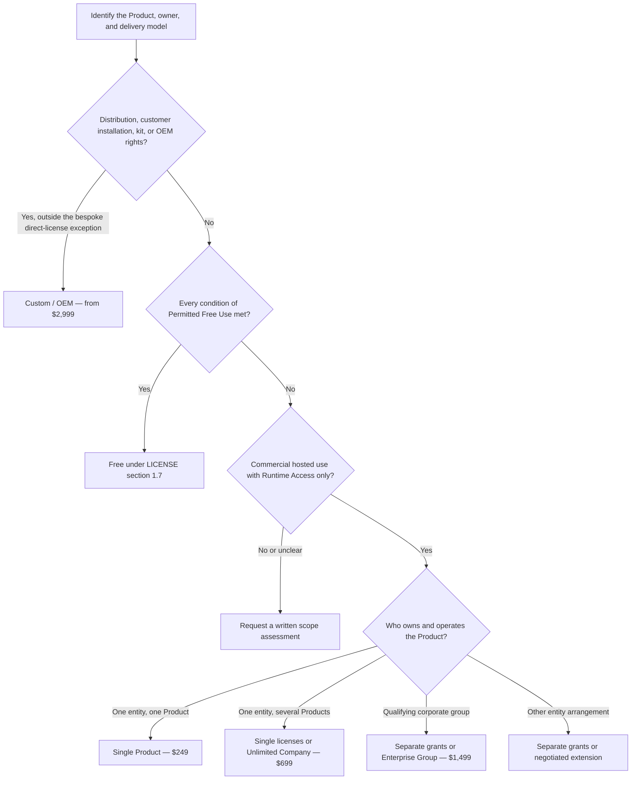

# Flex Fields — Commercial Licenses

**Package:** `janczakb/filament-flex-fields`  
**License:** [LICENSE](LICENSE), version **2.0**, effective **1 October 2026**  
**Contact / purchase:** [barek122@gmail.com](mailto:barek122@gmail.com)

Flex Fields is source-available: you can inspect the source and evaluate the package through official public channels. Qualifying internal use and bespoke client work remain free. Commercial hosted products require the appropriate commercial grant; customer installations, OEM, and redistribution require expressly agreed Custom rights.

This is the pricing and practical interpretation guide. [LICENSE](LICENSE) contains the actual free and standard commercial grants. Your accepted License Confirmation identifies your purchased scope; an expressly agreed Custom agreement can vary it. See LICENSE §5.7(c) for precedence. Existing purchases keep their agreed terms under §10.6.

## 1. Plans at a glance

All prices are in **USD, excluding applicable VAT/sales tax**. The three Standard Plans are **one-time purchases with perpetual rights within their scope**. They have the same package features. Product ownership, entity coverage, and distribution rights determine the plan—not employees, revenue, users, tenants, or servers.

| | Single Product | Unlimited Company | Enterprise Group | Custom / OEM / Redistribution |
|---|---|---|---|---|
| **Current price** | **$249 one-time** | **$699 one-time** | **$1,499 one-time** | **From $2,999; contact us** |
| **Suitable for** | One commercial product or SaaS | A growing portfolio owned by one company | Products owned across a qualifying corporate group | Customer installations, OEM, software distribution, or other negotiated scope |
| **Products** | One named Product | Unlimited current and future Products | Unlimited current and future Products within the group | Specified in the agreement |
| **Licensee / entities** | One named person or legal entity | One named legal entity or sole proprietor | Named parent + its 100%-owned direct/indirect subsidiaries | Specified in the agreement |
| **Users and tenants** | Unlimited | Unlimited | Unlimited | As agreed |
| **Developers and teams** | Unlimited for the covered Product | Unlimited for the covered entity | Unlimited across Covered Entities | As agreed |
| **Production, staging, local, CI, replicas, regions** | Included for the named Product | Included for covered Products | Included for covered Products | As agreed |
| **Private modifications and integration** | Included within scope | Included within scope | Included within scope | As agreed, including any distribution of modifications |
| **Selling hosted runtime access** | Included | Included | Included | As agreed |
| **Copies shared inside a corporate group** | Only personnel working for the named licensee | Only personnel working for the named licensee | Included among Covered Entities for covered use | As agreed |
| **External customer installations / source handover** | Not included | Not included | Not included | Only if expressly granted |
| **Starter kits, OEM, Software white-labeling, sublicensing** | Not included | Not included | Not included | Only if expressly granted |
| **Mandatory renewal to continue licensed use** | None | None | None | Term and fees agreed individually |
| **Guaranteed SLA, custom work, or other packages** | Not included | Not included | Not included | Only if expressly agreed |

**Recommended for a growing product portfolio: Unlimited Company.** One company can build future Products without purchasing another license each time. For one Product, Single Product is sufficient. For exactly two Products, two Single Product licenses cost less at current prices; see [the cost comparison](#8-prices-upgrades-and-choosing-the-economic-threshold).

**Enterprise Group does not include OEM.** Neither team size nor buying the highest Standard Plan creates redistribution rights. **From $2,999 is a starting quote level, not an unlimited-distribution price.**

## 2. Choose by use, then by ownership

Apply these questions to the particular Product and delivery model you are licensing. A separate OEM project does not reclassify every compliant hosted Product in your portfolio, but each part needs its own adequate scope.

1. **Will you distribute a Software-containing product, deliver customer installations, sell a starter/code kit depending on Flex Fields, or grant independent reseller/OEM rights?** Request Custom terms before that activity. An integrated, encrypted, or non-extractable copy is still a copy. For genuine bespoke client development with the client's own license, see [section 7](#7-agencies-freelancers-and-client-owned-applications).
2. **Does the use meet every condition for free internal, personal, educational, research, evaluation, or qualifying work-for-hire use?** No commercial purchase is required. Read LICENSE §1.7, including its limits.
3. **Is this a commercial hosted Product with customers receiving Runtime Access only?** Choose the Standard Plan matching its owners/operators: Single Product, Unlimited Company, or Enterprise Group. Otherwise, obtain written scope guidance before assuming a Standard Plan covers it.
4. **Are multiple legal entities involved as owners/operators?** They need their own applicable grants, Enterprise Group if they qualify, or a negotiated extension. A shared developer, director, invoice, or brand is not shared license coverage.

```mermaid
flowchart TD
    start[Identify the Product, owner, and delivery model]
    start --> customq{Distribution, customer installation, kit, or OEM rights?}
    customq -->|Yes, outside the bespoke direct-license exception| custom["Custom / OEM — from $2,999"]
    customq -->|No| freeq{Every condition of Permitted Free Use met?}
    freeq -->|Yes| free[Free under LICENSE section 1.7]
    freeq -->|No| hostedq{Commercial hosted use with Runtime Access only?}
    hostedq -->|No or unclear| scope[Request a written scope assessment]
    hostedq -->|Yes| entityq{Who owns and operates the Product?}
    entityq -->|One entity, one Product| single["Single Product — $249"]
    entityq -->|One entity, several Products| company["Single licenses or Unlimited Company — $699"]
    entityq -->|Qualifying corporate group| group["Separate grants or Enterprise Group — $1,499"]
    entityq -->|Other entity arrangement| other[Separate grants or negotiated extension]
```

### What remains free

| Example | Conditions |
|---|---|
| Your staff CRM, HR system, inventory admin, or other internal operational tool | One entity's own operations; not supplying the application as a commercial software service |
| An ordinary shop, company website, booking/contact form, or incidental customer/supplier portal | Supports your own non-software goods/services; the application itself is not the product sold |
| A staff back office for a software company | It administers the business independently of the software service sold; tenant-facing or service-configuring functionality is not made free by a staff-only login |
| Personal, educational, or research use | Within LICENSE §1.7; not an indirect label for commercial product operation |
| Private evaluation and development of a prospective SaaS | No live customer operations, paid pilot, or production launch before the commercial grant |
| A bespoke internal application operated for an identified client | Every condition of LICENSE §1.7(b), including runtime-only access and no client product resale, must hold |
| A client's own internal application built by an agency acting for that client | The client independently qualifies for free use, obtains the official package directly, and authorizes the agency as its contractor; see section 7 |

Free use includes private repositories/build artifacts, backups, CSS/theme overrides, and local patches within its scope. It does not authorize public forks, customer distribution of private package copies, or reusable starter kits.

**No revenue threshold applies.** A profitable company can use an eligible internal tool for free. A small SaaS serving its first paying customer needs a commercial grant. A live freemium tier of a commercial service is part of that commercial Product. Staging labels do not exempt a paid pilot or live customer workload.

## 3. Single Product — $249 one-time

**Licensee:** one named natural person or one legal entity.  
**Scope:** one named, licensee-owned Product in Hosted Use.  
**Duration:** perpetual within the grant, subject to compliance; no annual renewal.

Your confirmation identifies the Product by name and a short description; include its URL if available. One Product can have unlimited users, tenants, developers, servers, and environments. Commercial scale does not force an upgrade.

### What counts as one Product

| Change or deployment | Treatment |
|---|---|
| Production + staging + previews + CI + local development | One Product |
| Several servers, regions, databases, failover sites, or replicas | One Product |
| Dedicated instances for individual tenants in your controlled hosting | One Product if they are the same service and customers have runtime-only access |
| Basic/Pro/Enterprise pricing tiers and feature modules of the same application | One Product |
| Language editions, regional domains, or a mobile/web interface to the same service | One Product, provided no Software-containing installable client is distributed |
| A normal new version, migration, or rebrand replacing the old name | One Product; notify us of a name change so the confirmation remains identifiable |
| Tenant logos, colors, and custom domains | One Product if you retain the service relationship and tenants have no independent reseller rights |
| A separately offered CRM and a separately offered booking application sharing a codebase | Two Products |
| A second independently offered fork or product, even in the same repository or sales bundle | A separate Product |
| A downloadable/on-premises/customer-cloud edition containing Flex Fields | Custom rights needed, even if it has the same Product name |

Product count follows the actual offering, purpose, and identity—not repository or domain count. A bundle is not a way to place unrelated applications under one Single Product license. A tenant customization does not create a second Product merely because it has different settings.

Single Product includes private modifications and your own application branding. It excludes other owners, separate Products, customer installation/source delivery, starter kits, OEM, and independent sublicensing. Retiring a Product does not turn the license into a reusable slot for a different Product. Product ownership changes follow LICENSE §5.10.

## 4. Unlimited Company — $699 one-time

**Licensee:** one named legal entity, or a named sole proprietor.  
**Scope:** all current and future Products owned and operated by that licensee in Hosted Use.  
**Duration:** perpetual within the grant, subject to compliance; no annual renewal.

This is the portfolio plan. The company can operate one, five, twenty, or more SaaS applications without another Product fee. Every covered Product has the same unlimited tenant, user, developer, server, and environment allowances as Single Product.

| Organizational situation | Covered? |
|---|---|
| Several brands or departments inside the named company | Yes |
| Multiple teams and external developers working solely for that company | Yes, as Authorized Personnel |
| Branches with no separate legal identity | Yes |
| A sole proprietor using several trading names | Yes, when the same named natural person owns/operates the Products |
| A founder personally and that founder's incorporated company | No; they are different licensees |
| Parent, subsidiary, or sister company | No, even with the same directors or owners |
| A client whose Product your agency develops | No; the client's own scope must be licensed |
| A newly incorporated company taking over a sole proprietor's Products | No automatic transfer; arrange a transfer or new license |

**Example:** a license issued to **Example Software GmbH** covers that entity's Products. It does not automatically cover **Example Holding GmbH**, **Example USA Inc.**, or a customer's company.

A subsidiary may supply developers as Authorized Personnel for the licensee's Products without obtaining product rights for itself. If it owns or independently operates its own Product, its role has changed and it needs appropriate entity coverage.

## 5. Enterprise Group — $1,499 one-time

**Licensee / administrator:** one named parent legal entity.  
**Covered Entities:** that parent and its direct/indirect subsidiaries with **100% ownership interests and voting rights** through the qualifying chain.  
**Scope:** unlimited Products owned and operated within that group in Hosted Use.

Enterprise Group adds entity coverage, shared development, internal hosting, and private repository access across the group. It does not add external distribution rights or an SLA. There is no employee, team, Product, or wholly owned subsidiary count limit.

| Relationship to the named parent | Covered? |
|---|---|
| The parent itself | Yes |
| Direct subsidiary, 100% owned with 100% voting rights | Yes |
| Indirect subsidiary through a wholly owned chain | Yes |
| Newly formed/acquired qualifying wholly owned subsidiary | Yes while it qualifies; no per-entity fee |
| 99%, 75%, or 51% ownership; joint venture | No automatic coverage |
| Two companies owned by the same individuals, without the required parent chain | No automatic coverage |
| Franchise, strategic partner, minority investment, or ordinary customer | No |
| The named parent's own parent or a sister outside its chain | No; choose the correct parent or obtain separate rights |

The parent must be authorized to accept for participating entities and is responsible for compliance. Keep an entity list and report changes within **30 calendar days**. Qualifying additions are automatic; notification is an administrative update, not a new purchase request.

When a subsidiary leaves, it has **90 calendar days** to continue its existing deployments while obtaining its own license or removing Flex Fields. Maintenance/security patches are allowed during that transition; launching new Products or redistribution is not. The group license continues for entities that remain covered. A new owner of the named parent does not automatically extend coverage to the new owner's other companies.

If related companies can operate entirely under their own separate grants, they may buy those instead. Enterprise becomes useful when Products, ownership, teams, or infrastructure are shared across the qualifying group; compare costs in section 8. Entities outside the 100% rule need separate grants or a negotiated group extension, whose terms do not automatically include OEM.

## 6. Custom / OEM / Redistribution — from $2,999

**Contact us for a written scope and quote. This is not a self-serve “everything included” tier.**

Custom is required when your business supplies Software-containing installations, distributes code/products, or grants rights beyond the Standard Plans. This includes a full business application with Flex Fields as a minor dependency; the package does not have to be sold as a standalone field kit.

### Hosted service versus customer delivery

| What the customer receives | Licensing route |
|---|---|
| Login/API access to your SaaS in your hosting account | Appropriate Standard Plan |
| Dedicated tenant instance in your hosting account; no server/package access | Appropriate Standard Plan |
| Normal browser CSS/JS, a hosted embedded form/widget, exported answers, PDFs, or configurations with no Software code | Allowed within the applicable free or commercial scope |
| Installable CRM/application containing Flex Fields on the customer's server | Custom |
| Your product installed in the customer's cloud account/VPC, even when you manage it | Custom |
| Docker image, VM, installer, offline build, or server source containing Flex Fields | Custom, even if compiled/encrypted or contractually non-extractable |
| Vendor copy/private fork supplied in a customer repository or download | Custom |
| A reusable starter, boilerplate, template, or app codebase built around Flex Fields, with buyers fetching the dependency themselves | Custom; excluding vendor/ does not change the vendor's distribution model |
| A genuine bespoke client-owned application, with the client directly licensed and the agency acting only for it | Direct-client route in section 7; not automatically OEM |

### Branding and resale are different rights

You may use your own application brand. Tenant colors, logos, and domains are allowed under a Standard Plan when you still own/operate the service and retain the customer service relationship. A referral partner may introduce customers who contract directly for your service.

Custom is required if another business receives the Software, an independently operated customer edition, or the right to resell/sublicense a Software-based product as its own. Renaming Flex Fields as your own plugin, publishing your fork, or supplying a competing component kit also requires express Custom terms. No standard purchase removes copyright notices or transfers authorship.

A hosted form builder can use a Standard Plan even when Flex Fields is central to its functionality. Runtime tools, filled forms, and ordinary data output do not themselves create redistribution rights. Exporting reusable Flex Fields code, a component SDK, or a deployable Software-containing application requires Custom scope.

### What a Custom agreement must settle

| Topic | Matters to agree explicitly |
|---|---|
| Licensees and Products | Which vendor, entities, Products, editions, versions, and modifications are covered |
| Delivery | On-premises, customer cloud, downloads, private Composer feeds, source, containers, or appliances |
| Scale | Customer/installation limits, measurement period, territory, sales channels, expansion pricing |
| Downstream rights | Runtime use, source access, modification, backups, transfer, and whether any further sublicensing is allowed |
| Branding | Application branding, Software/package renaming, and notices that must remain |
| Reuse | Whether buyers may use the Software only within your delivered Product or in other projects |
| Fees | Fixed fee, per-installation fee, royalty, revenue share, recurring minimum, or agreed combination |
| Term and updates | Perpetual or fixed term, covered releases, update delivery, and renewal conditions |
| Support and reporting | Whom we support, whether there is an SLA, relevant reporting, and verification requirements |
| End of agreement | Whether existing downstream installations continue, their limits, and when new distribution must stop |

**Starting at $2,999 does not promise any particular downstream volume or right.** A small, restricted deployment grant and worldwide distribution to thousands of buyers have different economics. A quote may be materially higher and may include ongoing fees. We may decline a request. Do not pay $2,999 unsolicited expecting a license to arise.

Unless expressly agreed, Custom does not include copyright ownership, exclusivity, unrestricted public redistribution, unlimited sub-resellers, permission to remove notices, or direct support for your end customers. Even paying a higher price grants only the rights written into the agreement.

For non-standard entity coverage without distribution, describe the ownership arrangement and request a tailored extension. Its price and rights are quoted individually; it is not an implied OEM grant.

## 7. Agencies, freelancers, and client-owned applications

The relevant distinction is **whose application it is and under whose rights the Software is installed**. An agency's Unlimited Company license covers its own hosted Products. It is not a blanket license for all client deliverables.

### Route A: qualifying runtime-only bespoke work

You can charge for bespoke development and remain within free use under LICENSE §1.7(b) when each documented engagement satisfies all its conditions: the client uses an internal operational application, you remain its responsible licensee/operator, and the client receives Runtime Access only. This is assessed per engagement; several qualifying engagements are possible.

If the client starts supplying the application as a software service/product to others, reassess before that change. The free engagement exception no longer covers that commercial productization.

### Route B: the client is the direct licensee

For a genuine bespoke application owned by the client:

1. The client obtains the official Flex Fields package under its own free-use entitlement or suitable commercial grant.
2. The agency works as the client's Authorized Personnel. It can install the official dependency in the client's environment on the client's behalf and maintain it there.
3. The agency can hand over its independently written application code without supplying its own copy or fork of Flex Fields. Identifying the official dependency is permitted for this bespoke project.
4. If the client's application is internal and satisfies §1.7(a), it can remain free. If the client operates a hosted SaaS, the client buys Single Product, Unlimited Company, or Enterprise Group as applicable.
5. If the client later distributes Software-containing copies to its own customers, the client needs Custom rights for that activity.

This route does not transfer the agency's license. It does not authorize a vendor to sell the same reusable product to many buyers and describe every installation as bespoke work. Customer licenses or Packagist downloads alone do not give that vendor distribution rights.

### Route C: you distribute your product

Selling a reusable application, installation package, starter kit, or customer edition containing or commercially requiring Flex Fields is a Custom model. The same applies to source delivery of your private Flex Fields fork. The number of clients may affect the quote, but even one customer delivery needs adequate distribution rights.

## 8. Prices, upgrades, and choosing the economic threshold

### Product count within one entity

| Current need | Cost at current list prices | Practical choice |
|---|---|---|
| One Product | Single: **$249**; Unlimited: $699 | Single, unless you prefer portfolio coverage immediately |
| Two Products | Two Singles: **$498**; Unlimited: $699 | Two Singles are **$201 cheaper**; Unlimited also covers future Products |
| Three Products | Three Singles: **$747**; Unlimited: **$699** | Unlimited is **$48 cheaper** and has no future Product limit |
| Four or more Products | Four Singles: $996; Unlimited: **$699** | Unlimited for the same entity's eligible portfolio |

The numerical break-even is **three Products** at current prices. This is a cost comparison, not a restriction: a company can buy Unlimited for one Product, and it may hold separate Singles for several Products.

### Several legal entities

Two Unlimited Company licenses cost **$1,398**, which is **$101 less** than Enterprise Group. Three cost **$2,097**, which is **$598 more** than Enterprise Group. These comparisons apply only when each entity's use can be independently covered. One Product per entity may be cheaper with individual Single Product grants.

Enterprise Group provides common coverage across the named parent's qualifying group; it does not become mandatory at a particular employee or revenue threshold. Cross-entity ownership or operation must actually fit the selected grants. No number of standard purchases creates external redistribution rights.

### Upgrade credit

For Standard Plans originally issued under LICENSE v2.0, there is **no upgrade deadline**. Eligible net license fees already paid are credited toward the **then-current** destination price, with a minimum payable amount of zero. Taxes, support, refunds, chargebacks, and Custom fees do not count. Credits have no cash value and cannot be used twice.

Examples **at the current full list prices**, assuming no refund or discount:

| Upgrade | Additional license fee, before tax |
|---|---|
| One Single → Unlimited Company | **$450** ($699 − $249) |
| Two eligible Singles for the same entity → Unlimited Company | **$201** ($699 − $498) |
| One Single → Enterprise Group | **$1,250** ($1,499 − $249) |
| One Unlimited Company → Enterprise Group | **$800** ($1,499 − $699) |
| Two eligible Unlimited Company grants → Enterprise Group | **$101** ($1,499 − $1,398) |

Consolidation requires all Products/entities to fit the new scope, consent from affected holders, and identification of replaced grants in the new confirmation. Old grants do not remain spare transferable licenses. Broader rights start after the upgrade is paid and confirmed; the upgrade does not retroactively authorize out-of-scope use.

Pre-v2.0 purchases and Custom credits receive an individual written quote. There is no automatic downgrade refund. Future price changes affect future quotes and upgrade calculations, not rights already purchased.

## 9. Shared terms, versions, and existing customers

### Perpetual use and updates

Standard Plans are one-time grants for the licensed scope. There is no annual renewal, revenue share, user fee, or mandatory update subscription. The grant covers subsequent official updates, including major versions of the same package, under the issued terms. A later license header cannot unilaterally reduce those commercial rights. Separate packages, including Flex Forms, are not included.

The package is currently available through official public channels. The purchase is for commercial rights, not exclusive access to the code. Future releases, perpetual public hosting, particular framework compatibility, security-fix deadlines, custom development, and support SLAs are not promised. You can retain authorized copies; discontinuation does not cancel your existing perpetual rights. Custom version/update rights follow the negotiated agreement.

Standard licensing requires no periodic online validation or runtime activation. Lack of technical enforcement is not permission to exceed the grant.

### Source, private modifications, and attribution

You may inspect, theme, integrate, patch, and privately fork Flex Fields within your licensed scope. Confidential access for employees, agencies, and service providers is allowed for that work. They cannot reuse your license for their own Products. Private internal package feeds are allowed for Authorized Personnel and, under Enterprise Group, Covered Entities.

Keep copyright/license and third-party notices. There is no additional public “Powered by” badge requirement. Browser assets needed to operate your application may be served normally, including through a CDN. Public Software mirrors, reusable downloads, and maintained public forks require express rights; the limited upstream-contribution exception is in LICENSE §4.3.

### Corporate and Product changes

A name or shareholder change does not transfer the license if the same legal licensee remains. An asset sale, Product sale, incorporation of a sole proprietor, or merger into a different entity requires appropriate transfer approval, a new license, or an agreed transition, subject to mandatory law. Enterprise Group's subsidiary changes follow section 5 and LICENSE §5.4.

A buyer of your Product does not inherit your Unlimited portfolio license. Discuss a named Product transfer before the buyer takes over. Products moving between existing Covered Entities remain covered while the scope conditions hold.

### Existing purchases are protected

A previously issued license retains its agreed price, scope, duration, update entitlement, and applicable version. There is no forced repurchase or retroactive increase. Earlier Unlimited purchases do not automatically gain group or OEM rights. Expanding beyond the old grant requires suitable new rights; upgrades need an agreed confirmation.

Copies validly obtained under an earlier free license remain governed by that version for those copies. New downloads/releases require checking their accompanying terms unless an existing commercial grant already covers them. LICENSE v2.0 is a substantive revision, not a claim that all its restrictions already existed in v1.1.

### Verification, breach, and refunds

Standard verification is proportionate written confirmation by an authorized representative, normally no more than once per twelve months unless there is reasonable evidence of non-compliance or a relevant scope change. Reply within 30 calendar days. No on-site inspection, customer personal data, server access, or source-code disclosure is required by Standard Plans.

LICENSE §7 provides a 30-day cure process for remediable material breaches, with specified immediate-termination grounds for deliberate redistribution, fraud, or repeated material breach. Unauthorized activity must stop immediately; the cure period is not temporary permission. Compliant unrelated grants are not automatically cancelled.

Issued grants are generally non-refundable unless the accepted order, applicable payment-provider policy, or mandatory law says otherwise. If payment is collected but the agreed grant is declined, it must be refunded. Required legal rights are preserved. See LICENSE §§5.11 and 8–10 for refund, warranty, liability, and governing-law terms.

## 10. Worked examples

| Situation | Result |
|---|---|
| One company, one hosted SaaS, 500 developers and 100,000 tenants | **Single Product $249** suffices; team/tenant scale does not trigger Enterprise |
| One company, two independent hosted SaaS Products | **Two Singles $498**, or **Unlimited Company $699** for a future portfolio |
| One company, three independent hosted SaaS Products | **Unlimited Company $699** is less than three Singles |
| Parent and wholly owned subsidiary jointly own/operate the Product portfolio | **Enterprise Group $1,499**, or expressly adequate separate/negotiated coverage |
| Company owns only 75% of another operator | No automatic Enterprise coverage for that operator; separate grant or negotiated extension |
| Two companies share a founder but have no qualifying parent | Separate licenses or negotiated scope |
| One hosted CRM uses customer logos and separate tenant databases in the vendor's account | Suitable **Standard Plan**; branding alone is not OEM |
| The same CRM is delivered in Docker to one customer's cloud account | **Custom**, even if the vendor continues to manage it |
| A hosted form builder returns completed forms, PDFs, and data | Suitable **Standard Plan** if no reusable Software code/installations are delivered |
| A form builder exports deployable apps containing Flex Fields | **Custom** for that export/distribution feature |
| An agency builds a client's internal bespoke app; client obtains the official dependency | May be **free** under the direct-client route if every internal-use condition holds |
| An agency builds a client's SaaS and maintains it as the client's contractor | **Client's** suitable commercial license; agency's Unlimited does not cover ownership |
| A vendor sells a starter kit and tells buyers to install Flex Fields from Packagist | **Custom** for the vendor's kit model; a public dependency does not waive licensing |
| An OEM vendor also runs a separate ordinary hosted SaaS | Cover the hosted Product with a Standard Plan or explicit Custom scope; negotiate the distribution rights separately |
| A group subsidiary is sold | Existing deployments have the **90-day** transition described in LICENSE §5.4(c) |
| A company bought a license before this pricing revision | Its **existing agreed grant remains in force**; assess only requested expansion |

## 11. How to purchase

Email [barek122@gmail.com](mailto:barek122@gmail.com). Standard license payments are handled through **[Lemon Squeezy](https://www.lemonsqueezy.com/)** as merchant of record; it issues checkout receipts and tax documents under its terms. Bartłomiej Janczak issues the License Confirmation. Custom payment arrangements are stated in the quote.

### Standard order checklist

Send:

- Legal name of the intended licensee, billing country, billing email, and applicable company/tax identifier.
- Requested plan. For Single Product, the Product name, short description, and URL if available.
- For Enterprise Group, the named parent and a list of participating wholly owned subsidiaries/ownership relationships.
- Whether customers receive only hosted Runtime Access, and who owns/controls the hosting account.
- Any source delivery, customer-cloud/on-premises installation, reseller rights, or reusable kit distribution.
- Existing license references if requesting an upgrade or transfer.

We confirm scope, applicable terms/version, price, and any agreed exceptions **before payment** and provide the payment link. After confirmed payment, the Copyright Holder issues/authenticates the License Confirmation. Commercial rights start when both requirements are satisfied, unless the agreed instrument expressly specifies otherwise. A tax receipt alone is not the grant.

Keep the confirmation and receipt together. The confirmation should record the licensee, plan, named Product or parent/group scope, applicable License version, effective date, price/currency, payment reference, and any replaced licenses or expressly agreed variations. Newly issued terms cannot silently reduce the scope accepted at purchase.

### Custom inquiry checklist

In addition to licensee details, describe:

- Your Product and why customers need copies or additional rights.
- Delivery formats, hosting ownership, source access, and whether installations are managed or self-hosted.
- Expected customers/installations now and over the next 12–24 months, countries, and channels.
- Whether customers may modify, reuse, sublicense, redistribute, or appoint downstream resellers.
- Branding/package-renaming requirements and any requested exclusivity.
- Desired term, update rights, support, and treatment of installed customer copies when the agreement ends.

The process is **scope assessment → written proposal and quote → accepted agreement/payment arrangements → authenticated grant**. A Custom request is not approved until the specified rights are expressly agreed. Buying a Standard Plan while waiting does not authorize distribution.

## 12. Related documents

- [LICENSE](LICENSE) — full free and commercial grants, version 2.0.
- [README.md](README.md) — package overview and licensing summary.
- [Form OS one-pager](docs/form-os-one-pager.md) — product positioning and plan summary.
- [CREDITS.md](CREDITS.md) — third-party attributions.

© 2026 Bartłomiej Janczak. Public prices may change for future purchases. Accepted orders and issued licenses retain their agreed terms.
