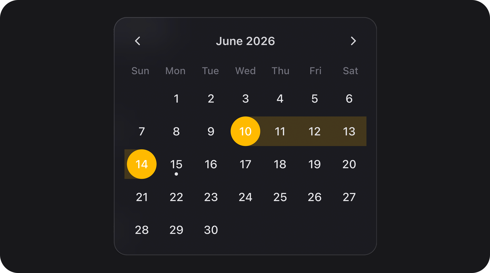
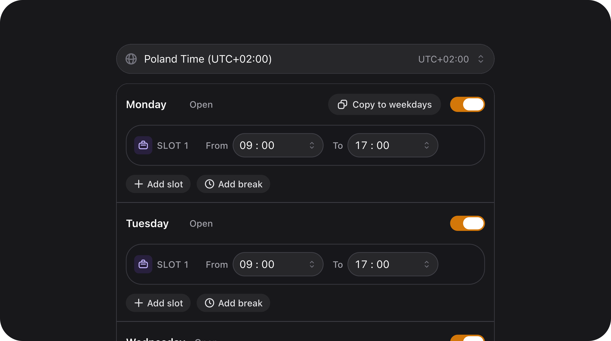
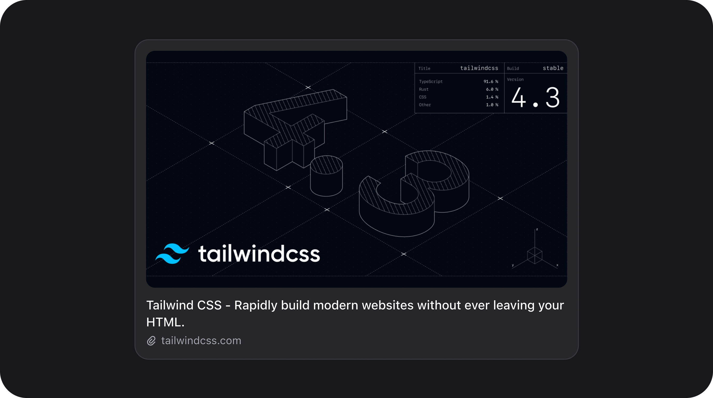
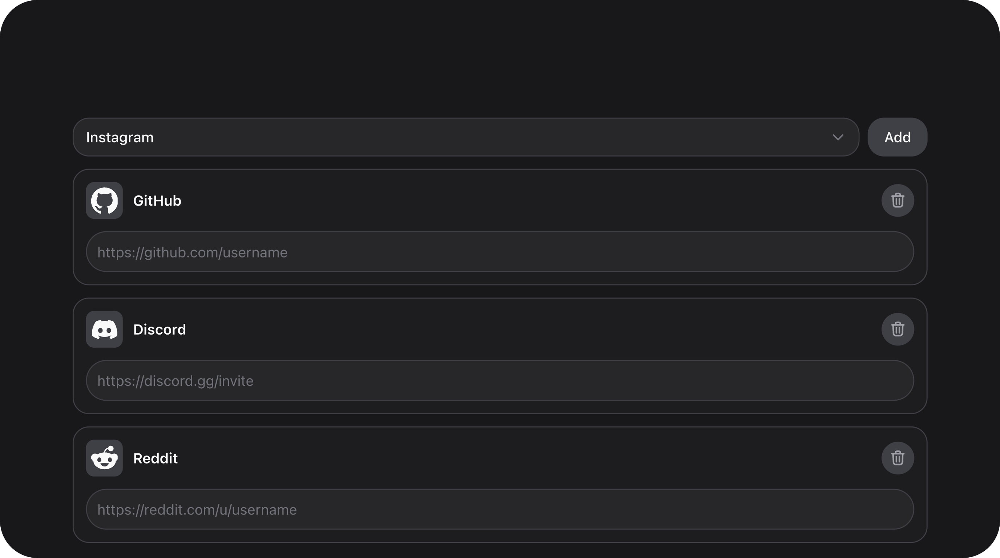
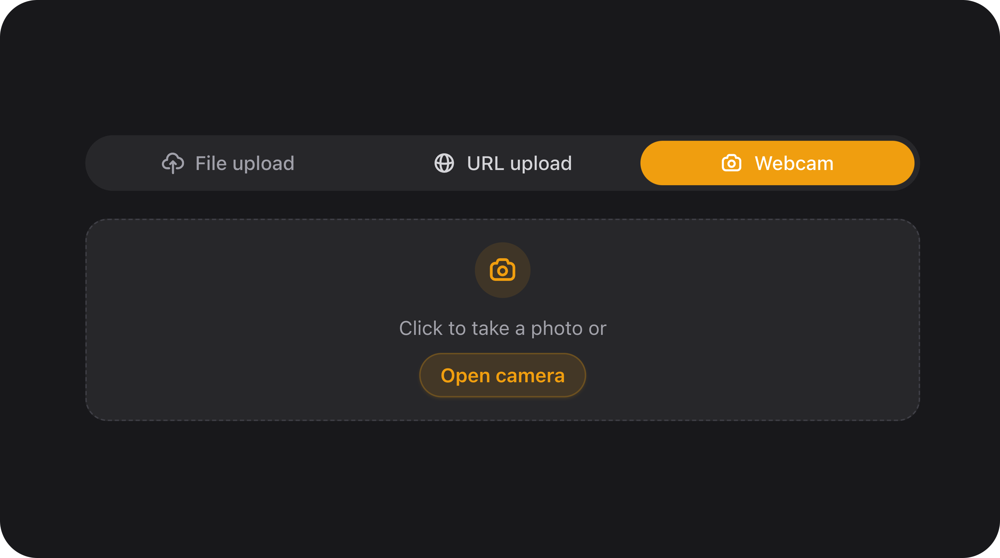
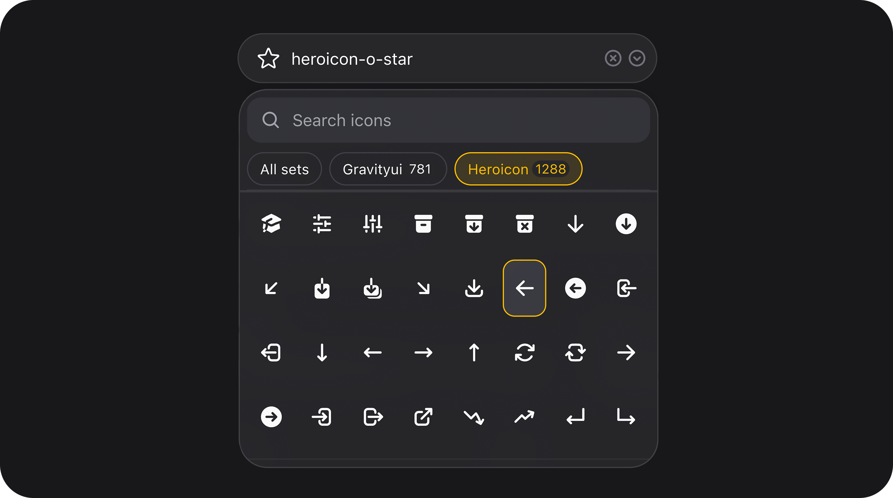

<p align="center" class="filament-hidden">
    
</p>

<h1 align="center">Filament Flex Fields</h1>

<p align="center"><strong>Filament v5 · Laravel admin forms · 68 custom components · one design system</strong><br>Replace a patchwork of field plugins with one cohesive form layer — lazy assets, optional JSON custom fields, built-in Playground.</p>
<p align="center">Pre-built CSS/JS · no Node.js in production · standalone fields or dynamic schemas · full per-component docs</p>

<p align="center">
    <a href="https://flex-fields.mintlify.app/" target="_blank" rel="noopener noreferrer">
        
    </a>
</p>

<p align="center">
    <a href="https://packagist.org/packages/janczakb/filament-flex-fields"></a>
    <a href="https://github.com/janczakb/filament-flex-fields/blob/main/LICENSE"></a>
    <a href="https://packagist.org/packages/janczakb/filament-flex-fields"></a>
    <a href="https://github.com/janczakb/filament-flex-fields/stargazers"></a>
    <a href="https://github.com/janczakb/filament-flex-fields/issues"></a>
    <a href="https://github.com/janczakb/filament-flex-fields/actions"></a>
</p>

<p align="center">
    
    
    
</p>

**Filament Flex Fields** is a [Filament v5](https://filamentphp.com) plugin for **Laravel admin panels**: **68 custom form components**, a unified `--fff-*` design system, and an optional **JSON custom-field layer** (no EAV, no per-attribute migrations). Use any field standalone, or wire schemas through `FlexFieldFormBuilder` + `HasFlexFields`.

---

## Quick start

**First-time install:**

```bash
composer require janczakb/filament-flex-fields
php artisan filament:assets
```

Register the plugin on your Filament panel:

```php
use Bjanczak\FilamentFlexFields\FilamentFlexFieldsPlugin;

public function panel(Panel $panel): Panel
{
    return $panel->plugin(FilamentFlexFieldsPlugin::make());
}
```

Then drop any component into a form — e.g. `MatrixChoiceField::make('priorities')`. Full install options (path repo, config, translations): [Installation](#installation). **Already installed?** See [Upgrading](#upgrading) below.

---

## Upgrading

When a new version is released, update the package and sync Filament assets into `public/`. **You do not need Node.js, npm, or `npm run build` in your Laravel app** — the plugin ships pre-built CSS/JS in `resources/dist/`.

### Standard upgrade (Packagist)

```bash
composer update janczakb/filament-flex-fields
php artisan filament:assets
```

That is the full required workflow for most apps.

### Path repository (monorepo / local package)

```bash
composer update janczakb/filament-flex-fields
php artisan filament:assets
```

If you develop the package itself, rebuild assets inside the package first (`npm run build` in `packages/filament-flex-fields/`), then run the commands above in the host app.

### Automate asset sync (recommended)

Add this to your host app `composer.json` so `filament:assets` runs after every `composer install` / `composer update`:

```json
"scripts": {
    "post-autoload-dump": [
        "Illuminate\\Foundation\\ComposerScripts::postAutoloadDump",
        "@php artisan package:discover --ansi",
        "@php artisan filament:assets --ansi"
    ]
}
```

With that hook in place, `composer update janczakb/filament-flex-fields` alone is enough.

### What you usually do **not** need on upgrade

| Step | Needed? |
|------|---------|
| `npm install` / `npm run build` in the host app | **No** — assets are pre-built in the package |
| `php artisan vendor:publish --tag=filament-flex-fields-config` | **No** — unless [CHANGELOG](CHANGELOG.md) documents a new config key you want to set |
| `php artisan vendor:publish --tag=filament-flex-fields-translations` | **No** — see [Updating translations after a plugin upgrade](#updating-translations-after-a-plugin-upgrade) |
| `php artisan optimize:clear` | **Only** if the panel still serves stale CSS/JS after `filament:assets` (rare) |

### After upgrading in the browser

If a field looks unstyled after deploy, hard-refresh the Filament panel (`Cmd+Shift+R` / `Ctrl+Shift+R`) once so the browser drops cached asset URLs.

### Version-specific notes

Read [CHANGELOG.md](CHANGELOG.md) for breaking changes, new config keys, and migration steps for a given release.

---

## Why Flex Fields?

### Who it's for

Teams building **Filament v5** backends that need more than native inputs — **CRM** custom attributes, **CMS** page builders, **SaaS** onboarding, **marketplaces** with configurable product fields, or any admin UI that should look and behave like one product, not ten plugins stitched together.

### At a glance

| | **Flex Fields** | **Typical approach** |
|---|-----------------|----------------------|
| **Scope** | **68** fields, layouts, and table columns — one package | Many single-purpose Filament plugins |
| **Design** | One `--fff-*` system — sizes, focus, menus, dark mode | Mixed UI from unrelated packages |
| **Flexibility** | Standalone fields **or** dynamic JSON on models — same components | Usually one mode only |
| **Depth** | Validation, formatting, and interaction built in — not thin wrappers | Basic inputs; edge cases left to you |
| **Performance** | Lazy per-field CSS/JS in `<head>`, shared chunks, pre-built `dist/` — no npm in your app | Global bundles or consumer-side builds |
| **DX** | Playground for every component + dedicated doc per field | Trial-and-error per plugin |

### What's inside

**68 components** — 56 form fields, 9 layout/schema pieces, 3 table columns, plus `HoldConfirmAction`. Matrix grids, slugs, translatable groups, media, ratings, signatures, layouts — [full list](#custom-components-68).

**One design system** — shared `sm` / `md` / `lg` sizes, `--fff-*` tokens, glass searchable menus, dark mode, consistent focus rings.

<a id="lazy-assets--shared-chunks"></a>**Lazy assets** — each field loads only its CSS/JS; heavy libraries share chunks and preload once per page. Pre-built `resources/dist/` means **no Node.js or Vite in your Laravel project**.

<details>
<summary>Asset pipeline (technical)</summary>

1. **Lean core** — `core.css` (~20 KB): tokens and hint chrome only.
2. **Conditional critical preload** — `teleported-menu` at `HEAD_END` only when a dropdown field is on the page (`FlexFieldStylesheetQueue::needsTeleportedMenu()`). Hold-confirm preloads per action via `@push` in `hold-confirm.blade.php`, not globally.
3. **Per-component bundles** — queued when the field renders, deduped per request via `FlexFieldStylesheetQueue` / `FlexFieldAlpineQueue`. Alpine entries register once; manifest chunks load on demand.
4. **Head delivery** — `emit-assets` pushes `<link>` / `modulepreload` via `@stack('styles')` on full pages; Livewire partials emit inline asset batches.
5. **SPA injector** — `flex-field-asset-injector.js` loads missing lazy CSS/JS on morph and navigation, with FOUC prevention inside Filament modals.
6. **Lazy Alpine mount** — heavy fields defer `x-data` init until `x-intersect` (see `lazy-alpine-mount` Blade component).

See [Performance-first assets](#performance-first-assets) for classes, manifest, and bundle metrics.

</details>

<a id="dynamic-custom-fields-json"></a>**JSON custom fields** — define schemas in PHP config or `FlexFieldSchemaRegistry`, store values in one JSON column via `HasFlexFields`. `FlexFieldFormBuilder` renders live Filament forms. Ideal for CMS, tenant settings, and CRM-style attributes. Options: [config/filament-flex-fields.php](config/filament-flex-fields.php).

**Playground & docs** — local preview of all 68 components; every field documented in `docs/` with methods, validation, and examples.

---

## Table of contents

- [Quick start](#quick-start)
- [Upgrading](#upgrading)
- [Why Flex Fields?](#why-flex-fields)
- [Screenshots](#screenshots)
- [Custom Components (68)](#custom-components-68)
- [Use cases](#use-cases)
- [Requirements](#requirements)
- [Installation](#installation)
- [Setup](#setup)
- [Quick usage](#quick-usage)
- [Playground](#playground)
- [Documentation](#documentation)
- [FAQ](#faq)
- [Development](#development)

---

## Screenshots

<div style="display: flex; flex-wrap: wrap; gap: 16px; justify-content: space-between; width: 100%;">
  <div style="flex-grow: 1; width: 48%; min-width: 280px; text-align: center; box-sizing: border-box; padding: 10px;">
    <a href="docs/signaturefield.md"></a>
    <p style="margin-top: 8px; font-weight: 600; color: #374151;">SignatureField — Canvas Handwriting Signature Pad</p>
  </div>
  <div style="flex-grow: 1; width: 48%; min-width: 280px; text-align: center; box-sizing: border-box; padding: 10px;">
    <a href="docs/matrixchoicefield.md"></a>
    <p style="margin-top: 8px; font-weight: 600; color: #374151;">MatrixChoiceField — Survey & Configurator Grid</p>
  </div>
  <div style="flex-grow: 1; width: 48%; min-width: 280px; text-align: center; box-sizing: border-box; padding: 10px;">
    <a href="docs/flextextareafield.md"></a>
    <p style="margin-top: 8px; font-weight: 600; color: #374151;">FlexTextareaField — Autosize Textarea with Voice & Emoji Input</p>
  </div>
  <div style="flex-grow: 1; width: 48%; min-width: 280px; text-align: center; box-sizing: border-box; padding: 10px;">
    <a href="docs/progressbar.md"></a>
    <p style="margin-top: 8px; font-weight: 600; color: #374151;">ProgressBar & ProgressCircle — Visual Progress Indicators</p>
  </div>
  <div style="flex-grow: 1; width: 48%; min-width: 280px; text-align: center; box-sizing: border-box; padding: 10px;">
    <a href="docs/currencyfield.md"></a>
    <p style="margin-top: 8px; font-weight: 600; color: #374151;">CurrencyField — Multi-Currency Localized Input</p>
  </div>
  <div style="flex-grow: 1; width: 48%; min-width: 280px; text-align: center; box-sizing: border-box; padding: 10px;">
    <a href="docs/mappickerfield.md"></a>
    <p style="margin-top: 8px; font-weight: 600; color: #374151;">MapPickerField — Interactive Map Pin Selector</p>
  </div>
  <div style="flex-grow: 1; width: 48%; min-width: 280px; text-align: center; box-sizing: border-box; padding: 10px;">
    <a href="docs/itemcardgroup.md"></a>
    <p style="margin-top: 8px; font-weight: 600; color: #374151;">ItemCardGroup — Card-Based Layout Group</p>
  </div>
  <div style="flex-grow: 1; width: 48%; min-width: 280px; text-align: center; box-sizing: border-box; padding: 10px;">
    <a href="docs/duallistboxfield.md"></a>
    <p style="margin-top: 8px; font-weight: 600; color: #374151;">DualListboxField — Reorderable Two-Panel Transfer List</p>
  </div>
  <div style="flex-grow: 1; width: 48%; min-width: 280px; text-align: center; box-sizing: border-box; padding: 10px;">
    <a href="docs/pricerangefield.md"></a>
    <p style="margin-top: 8px; font-weight: 600; color: #374151;">PriceRangeField — Dual-Handle Price Filter</p>
  </div>
  <div style="flex-grow: 1; width: 48%; min-width: 280px; text-align: center; box-sizing: border-box; padding: 10px;">
    <a href="docs/creditcardfield.md"></a>
    <p style="margin-top: 8px; font-weight: 600; color: #374151;">CreditCardField — Interactive Card Preview</p>
  </div>
  <div style="flex-grow: 1; width: 48%; min-width: 280px; text-align: center; box-sizing: border-box; padding: 10px;">
    <a href="docs/flexcolorpickerfield.md"></a>
    <p style="margin-top: 8px; font-weight: 600; color: #374151;">FlexColorPickerField — Advanced Color Picker</p>
  </div>
  <div style="flex-grow: 1; width: 48%; min-width: 280px; text-align: center; box-sizing: border-box; padding: 10px;">
    <a href="docs/audiofield.md"></a>
    <p style="margin-top: 8px; font-weight: 600; color: #374151;">AudioField & VoiceNoteRecorderField — Waveform Audio & Voice Messages</p>
  </div>
  <div style="flex-grow: 1; width: 48%; min-width: 280px; text-align: center; box-sizing: border-box; padding: 10px;">
    <a href="docs/numberstepper.md"></a>
    <p style="margin-top: 8px; font-weight: 600; color: #374151;">NumberStepper — Animated Numeric Control</p>
  </div>
  <div style="flex-grow: 1; width: 48%; min-width: 280px; text-align: center; box-sizing: border-box; padding: 10px;">
    <a href="docs/choicecards.md"></a>
    <p style="margin-top: 8px; font-weight: 600; color: #374151;">ChoiceCards — Rich Selection Grid</p>
  </div>
  <div style="flex-grow: 1; width: 48%; min-width: 280px; text-align: center; box-sizing: border-box; padding: 10px;">
    <a href="docs/videofield.md"></a>
    <p style="margin-top: 8px; font-weight: 600; color: #374151;">VideoField — Video Player & Embed Component</p>
  </div>
  <div style="flex-grow: 1; width: 48%; min-width: 280px; text-align: center; box-sizing: border-box; padding: 10px;">
    <a href="docs/trackslider.md"></a>
    <p style="margin-top: 8px; font-weight: 600; color: #374151;">TrackSlider — Inline Range & Segment Slider</p>
  </div>
  <div style="flex-grow: 1; width: 48%; min-width: 280px; text-align: center; box-sizing: border-box; padding: 10px;">
    <a href="docs/segmentcontrol.md"></a>
    <p style="margin-top: 8px; font-weight: 600; color: #374151;">SegmentControl — Segmented Button Tab Switcher</p>
  </div>
  <div style="flex-grow: 1; width: 48%; min-width: 280px; text-align: center; box-sizing: border-box; padding: 10px;">
    <a href="docs/covercard.md"></a>
    <p style="margin-top: 8px; font-weight: 600; color: #374151;">CoverCard — Media Rich Hero Banner</p>
  </div>
  <div style="flex-grow: 1; width: 48%; min-width: 280px; text-align: center; box-sizing: border-box; padding: 10px;">
    <a href="docs/progresscircle.md"></a>
    <p style="margin-top: 8px; font-weight: 600; color: #374151;">ProgressCircle — Semicircle & Circular Dashboard Metrics</p>
  </div>
  <div style="flex-grow: 1; width: 48%; min-width: 280px; text-align: center; box-sizing: border-box; padding: 10px;">
    <a href="docs/ratingfield.md"></a>
    <p style="margin-top: 8px; font-weight: 600; color: #374151;">RatingField — Visual Star Rating Input</p>
  </div>
  <div style="flex-grow: 1; width: 48%; min-width: 280px; text-align: center; box-sizing: border-box; padding: 10px;">
    
    <p style="margin-top: 8px; font-weight: 600; color: #374151;">HoldConfirmAction — Press & Hold Button</p>
  </div>
  <div style="flex-grow: 1; width: 48%; min-width: 280px; text-align: center; box-sizing: border-box; padding: 10px;">
    <a href="docs/slugfield-and-titleslugfield.md"></a>
    <p style="margin-top: 8px; font-weight: 600; color: #374151;">SlugField & TranslatableFields — Translatable SEO Slugs</p>
  </div>
  <div style="flex-grow: 1; width: 48%; min-width: 280px; text-align: center; box-sizing: border-box; padding: 10px;">
    <a href="docs/phonefield.md"></a>
    <p style="margin-top: 8px; font-weight: 600; color: #374151;">PhoneField — International Phone Input</p>
  </div>
  <div style="flex-grow: 1; width: 48%; min-width: 280px; text-align: center; box-sizing: border-box; padding: 10px;">
    <a href="docs/colorswatchfield.md"></a>
    <p style="margin-top: 8px; font-weight: 600; color: #374151;">ColorSwatchField — Preset Color Swatches</p>
  </div>
  <div style="flex-grow: 1; width: 48%; min-width: 280px; text-align: center; box-sizing: border-box; padding: 10px;">
    <a href="docs/flextextinput.md"></a>
    <p style="margin-top: 8px; font-weight: 600; color: #374151;">FlexEmojiPicker — Integrated Searchable Emoji Picker</p>
  </div>
  <div style="flex-grow: 1; width: 48%; min-width: 280px; text-align: center; box-sizing: border-box; padding: 10px;">
    <a href="docs/date-and-time-fields.md"></a>
    <p style="margin-top: 8px; font-weight: 600; color: #374151;">FlexDateRangeField — Dark Mode Calendar & Date Range Picker</p>
  </div>
  <div style="flex-grow: 1; width: 48%; min-width: 280px; text-align: center; box-sizing: border-box; padding: 10px;">
    <a href="docs/schedule-field.md"></a>
    <p style="margin-top: 8px; font-weight: 600; color: #374151;">ScheduleField — Weekly Schedule Editor</p>
  </div>
  <div style="flex-grow: 1; width: 48%; min-width: 280px; text-align: center; box-sizing: border-box; padding: 10px;">
    <a href="docs/link-preview-field.md"></a>
    <p style="margin-top: 8px; font-weight: 600; color: #374151;">LinkPreviewField — Open Graph Link Preview Card</p>
  </div>
  <div style="flex-grow: 1; width: 48%; min-width: 280px; text-align: center; box-sizing: border-box; padding: 10px;">
    <a href="docs/social-links-field.md"></a>
    <p style="margin-top: 8px; font-weight: 600; color: #374151;">SocialLinksField — Social Profile Link Editor</p>
  </div>
  <div style="flex-grow: 1; width: 48%; min-width: 280px; text-align: center; box-sizing: border-box; padding: 10px;">
    <a href="docs/barcode-scanner-field.md"></a>
    <p style="margin-top: 8px; font-weight: 600; color: #374151;">BarcodeScannerField — Camera Barcode & QR Scanner</p>
  </div>
  <div style="flex-grow: 1; width: 48%; min-width: 280px; text-align: center; box-sizing: border-box; padding: 10px;">
    <a href="docs/flexfileupload-and-fleximageupload.md"></a>
    <p style="margin-top: 8px; font-weight: 600; color: #374151;">FlexFileUpload — Webcam & URL File Import</p>
  </div>
  <div style="flex-grow: 1; width: 48%; min-width: 280px; text-align: center; box-sizing: border-box; padding: 10px;">
    <a href="docs/icon-picker-field.md"></a>
    <p style="margin-top: 8px; font-weight: 600; color: #374151;">IconPickerField — Virtual Scrolling & W3C ARIA</p>
  </div>
  <div style="flex-grow: 1; width: 100%; text-align: center; box-sizing: border-box; padding: 10px;">
    
    <p style="margin-top: 8px; font-weight: 600; color: #374151;">And More — 68 Components & Visual Playground</p>
  </div>
</div>

---

## Custom Components (68)

Every item below is a **custom class shipped by this package** — own Blade views, CSS, and configuration API. This list does **not** include native Filament fields (`TextInput`, `TagsInput`, `Repeater`, etc.) used only as passthrough inside `FlexFieldFormBuilder`.

Full API for each component: **[docs/index.md](docs/index.md)**.

### Text & input (13)

| Component | Description |
|-----------|-------------|
| [`FlexTextInput`](docs/flextextinput.md) | Enhanced text input — speech dictation, emoji picker, password strength, clearable |
| [`FlexTextareaField`](docs/flextextareafield.md) | Animated autosizing textarea with character counter |
| [`FlexRichEditor`](docs/flex-rich-editor.md) | JSON-first rich editor — responsive images, limits, fullscreen, autosave, optional Spatie |
| [`PhoneField`](docs/phonefield.md) | International phone input with libphonenumber validation |
| [`CountryField`](docs/countryfield.md) | Searchable country picker with flags |
| [`TimezoneField`](docs/timezonefield.md) | IANA timezone picker with UTC offset display |
| [`LinkPreviewField`](docs/link-preview-field.md) | URL input with live Open Graph preview card (horizontal, vertical, or full-width layouts) |
| [`BarcodeScannerField`](docs/barcode-scanner-field.md) | Barcode/QR input — Filament modal camera scanner, format whitelist, EAN/UPC checksum, hybrid BarcodeDetector + ZXing, torch & front/back switch, iOS-safe preview *(v2.6.0)* |
| [`SocialLinksField`](docs/social-links-field.md) | Social profile links — platform picker, URL validation, custom platforms, reorder |
| [`SlugField`](docs/slugfield-and-titleslugfield.md) | Slug input with permalink preview, uniqueness, regenerate/copy actions |
| [`TitleSlugField`](docs/slugfield-and-titleslugfield.md) | Title + slug pair with live URL preview and optional Spatie Sluggable |
| [`AddressAutocompleteField`](docs/addressautocompletefield.md) | Mapbox-powered address search with structured storage |
| [`FlexVerificationCode`](docs/flexverificationcode.md) | OTP / 2FA verification code input with grouping |

### Number & range (6)

| Component | Description |
|-----------|-------------|
| [`NumberStepper`](docs/numberstepper.md) | +/- numeric stepper control |
| [`CurrencyField`](docs/currencyfield.md) | Multi-currency money input with locale-aware formatting |
| [`FlexSlider`](docs/flexslider.md) | Styled range slider with value display |
| [`TrackSlider`](docs/trackslider.md) | Track-style slider — single value, percentage, or min/max range |
| [`PriceRangeField`](docs/pricerangefield.md) | Dual-handle price filter with histogram |
| [`TrafficSplit`](docs/trafficsplit.md) | Weighted segment split control (A/B-style traffic allocation) |

### Choice & selection (14)

| Component | Description |
|-----------|-------------|
| [`SwitchField`](docs/switchfield.md) | Animated toggle switch with row/inline layouts |
| [`CellSwitch`](docs/switchfield.md) | Compact `SwitchField` variant for table cells |
| [`SegmentControl`](docs/segmentcontrol.md) | Segmented button control |
| [`ChoiceCards`](docs/choicecards.md) | Rich card-based radio selection |
| [`ChoiceCheckboxCards`](docs/choicecheckboxcards.md) | Rich card-based multi-select |
| [`FlexChecklist`](docs/flexchecklist.md) | Animated checklist with icons and descriptions |
| [`FlexRadiolist`](docs/flexradiolist.md) | Animated radio list with icons and descriptions |
| [`MatrixChoiceField`](docs/matrixchoicefield.md) | Survey / configurator matrix grid — radio or checkbox per row |
| [`SelectField`](docs/selectfield.md) | Rich select with avatars, badges, and descriptions |
| [`UserSelect`](docs/userselect.md) | User picker with avatar stacks and verification badges |
| [`DualListboxField`](docs/duallistboxfield.md) | Two-panel reorderable transfer list |
| [`TagsField`](docs/tags-field.md) | Tag input — pills below the field with inline remove buttons |
| [`IconPickerField`](docs/icon-picker-field.md) | Searchable blade-icons picker with lazy SVG rendering, virtual scroll, and paginated search *(v2.7.0)* |
| [`FlexSpatieTagsField`](docs/tags-field.md) | Spatie Tags integration for `TagsField` |

### Date & time (11)

| Component | Description |
|-----------|-------------|
| [`FlexDateField`](docs/date-and-time-fields.md) | Segmented date input without calendar popover |
| [`FlexDatePicker`](docs/date-and-time-fields.md) | Date picker with calendar popover |
| [`FlexTimeField`](docs/date-and-time-fields.md) | Segmented time input (12h / 24h, seconds optional) |
| [`FlexTimeSegmentsField`](docs/date-and-time-fields.md) | Dropdown time picker (hour / minute columns, `HH:MM`) |
| [`ScheduleField`](docs/schedule-field.md) | Weekly opening-hours editor — day toggles, slots, breaks, copy-to-weekdays, timezone |
| [`FlexDateTimePicker`](docs/date-and-time-fields.md) | Combined date + time picker |
| [`FlexDateRangeField`](docs/date-and-time-fields.md) | Start/end date range |
| [`FlexDurationField`](docs/date-and-time-fields.md) | Duration input (hours / minutes) |
| [`FlexTimeRangeField`](docs/date-and-time-fields.md) | Start/end time range |
| [`FlexMonthPicker`](docs/date-and-time-fields.md) | Month picker |
| [`FlexYearPicker`](docs/date-and-time-fields.md) | Year picker |

### Media, color & location (12)

| Component | Description |
|-----------|-------------|
| [`ColorSwatchField`](docs/colorswatchfield.md) | Preset color swatch picker |
| [`FlexColorPickerField`](docs/flexcolorpickerfield.md) | Advanced color picker with grid and eyedropper |
| [`FlexFileUpload`](docs/flexfileupload-and-fleximageupload.md) | Styled file upload with webcam capture, URL import, and security presets *(v2.6.1)* |
| [`FlexImageUpload`](docs/flexfileupload-and-fleximageupload.md) | Image upload with processing options |
| [`FlexSpatieMediaLibraryFileUpload`](docs/flexfileupload-and-fleximageupload.md) | Spatie Media Library upload integration |
| [`VideoField`](docs/videofield.md) | Video URL / player with YouTube support |
| [`AudioField`](docs/audiofield.md) | Audio URL / player with waveform |
| [`VoiceNoteRecorderField`](docs/voicenoterecorderfield.md) | In-browser voice recorder — waveform, local playback, deferred or immediate upload |
| [`MapPickerField`](docs/mappickerfield.md) | Interactive map pin picker with draggable marker and address autofill |
| [`SignatureField`](docs/signaturefield.md) | Canvas signature pad |
| [`CreditCardField`](docs/creditcardfield.md) | Card preview with Luhn validation and CVV flip |
| [`CellSlider`](docs/trackslider.md) | Compact `TrackSlider` variant for table cells |

### Rating (1)

| Component | Description |
|-----------|-------------|
| [`RatingField`](docs/ratingfield.md) | Star rating input |

### Layout & display — schemas (9)

| Component | Description |
|-----------|-------------|
| [`SegmentTabs`](docs/segmenttabs.md) | Tabbed segment navigation for forms |
| [`TranslatableFields`](docs/translatablefields.md) | Locale tabs wrapping any fields (JSON or Spatie Translatable) |
| [`TranslatableTabs`](docs/translatablefields.md) | Legacy alias for `TranslatableFields` |
| [`ItemCard`](docs/itemcard.md) | Single settings-style card row |
| [`ItemCardGroup`](docs/itemcardgroup.md) | Polished card-based settings group |
| [`ItemCardStack`](docs/itemcardstack.md) | Stacked card layout for profile / settings pages |
| [`CoverCard`](docs/covercard.md) | Hero cover card for tabbed editors |
| [`ProgressBar`](docs/progressbar.md) | Linear, pill, or segment progress bar |
| [`ProgressCircle`](docs/progresscircle.md) | Circular or semicircle progress indicator |

Ready-made layout recipes: [Form layout patterns](docs/index.md#form-layout-patterns).

### Table columns (3)

| Component | Description |
|-----------|-------------|
| [`UserColumn`](docs/usercolumn.md) | Avatar + name/email display with hover card |
| [`RatingColumn`](docs/ratingcolumn.md) | Star rating display in Filament tables |
| [`IconColumn`](docs/iconcolumn.md) | Blade-icons display for `IconPickerField` values *(v2.7.0)* |

**Total: 68 custom components** (56 form fields + 9 layout/schema + 3 table columns). **HoldConfirmAction** (press-and-hold Filament actions) is documented in the playground but not counted in the 68.

---

## Use cases

| Scenario | Recommended components |
|----------|------------------------|
| **CRM / SaaS custom attributes** | JSON flex fields + `PhoneField`, `CountryField`, `UserSelect` |
| **CMS / page builder** | `TitleSlugField`, `TranslatableFields`, `FlexFileUpload`, `FlexImageUpload` |
| **Product configurator** | `MatrixChoiceField`, `ChoiceCards`, `PriceRangeField`, `ColorSwatchField` |
| **Surveys & assessments** | `MatrixChoiceField`, `FlexRadiolist`, `RatingField` |
| **SaaS onboarding** | `ChoiceCards`, `SegmentTabs`, `CoverCard`, `ProgressCircle` |
| **E-commerce filters** | `PriceRangeField`, `TrackSlider`, `DualListboxField` |
| **User profile settings** | `ItemCardGroup`, `PhoneField`, `TimezoneField`, `SignatureField` |
| **Payment forms** | `CreditCardField`, `FlexVerificationCode` |
| **Location services** | `MapPickerField`, `AddressAutocompleteField` |
| **A/B configuration** | `TrafficSplit`, `SegmentControl` |

---

## Requirements

| Dependency | Version |
|------------|---------|
| PHP | 8.3+ |
| Laravel | 11+ |
| Filament | 5.x (`filament/filament ^5.0`) |

**Optional integrations** (see `composer.json` → `suggest`):

| Package | Used for |
|---------|----------|
| `spatie/laravel-sluggable` | Model-based slug generation in `SlugField` |
| `spatie/laravel-translatable` | JSON translation storage for translatable titles |
| `spatie/laravel-medialibrary` | `FlexSpatieMediaLibraryFileUpload` |
| `filament/spatie-laravel-media-library-plugin` | Filament base class for media upload |
| `spatie/laravel-tags` | `FlexSpatieTagsField` — sync tags on models using `HasTags` |

---

## Installation

Already ran [Quick start](#quick-start)? Jump to [Setup](#setup). For version bumps, see [Upgrading](#upgrading). Below: Packagist install, monorepo path repo, and optional Composer automation.

### Composer (Packagist)

```bash
composer require janczakb/filament-flex-fields
php artisan filament:assets
```

### Composer (path repository — monorepo)

```json
{
    "repositories": [
        {
            "type": "path",
            "url": "packages/filament-flex-fields"
        }
    ],
    "require": {
        "janczakb/filament-flex-fields": "@dev"
    }
}
```

```bash
composer require janczakb/filament-flex-fields:@dev
php artisan filament:assets
```

Auto-discovered via `composer.json` → `extra.laravel.providers`.

**Asset sync on every Composer run** — optional but recommended; see [Automate asset sync](#automate-asset-sync-recommended) in [Upgrading](#upgrading).

```json
"scripts": {
    "post-autoload-dump": [
        "Illuminate\\Foundation\\ComposerScripts::postAutoloadDump",
        "@php artisan package:discover --ansi",
        "@php artisan filament:assets --ansi"
    ]
}
```

---

## Setup

### 1. Register the plugin

```php
use Bjanczak\FilamentFlexFields\FilamentFlexFieldsPlugin;

public function panel(Panel $panel): Panel
{
    return $panel->plugin(FilamentFlexFieldsPlugin::make());
}
```

### 2. Publish configuration (optional)

```bash
php artisan vendor:publish --tag=filament-flex-fields-config
```

### 3. Publish translations (optional)

Built-in locales ship with the package (`en`, `pl`). Publish them only when you need to customize strings in your app:

```bash
php artisan vendor:publish --tag=filament-flex-fields-translations
```

Files are copied to:

```
lang/vendor/filament-flex-fields/
├── en/
│   ├── default.php
│   ├── countries.php
│   ├── currencies.php
│   └── timezones.php
└── pl/
    ├── default.php
    ├── countries.php
    └── timezones.php
```

**Why `lang/vendor/`?** Laravel resolves package translation overrides only from `lang/vendor/{namespace}/` (see `FileLoader::loadNamespaceOverrides`). A flat path such as `lang/filament-flex-fields/` is **not** picked up for `__('filament-flex-fields::...')` unless you add custom loader logic. The `vendor` segment here is Laravel’s convention for published package lang files — it is not Composer’s `vendor/` directory.

#### Translation files

| File | Purpose |
|------|---------|
| `default.php` | UI labels (placeholders, buttons, validation copy, search hints) |
| `countries.php` | Country names for `CountryField` / `PhoneField` |
| `currencies.php` | Currency names for `CurrencyField` |
| `timezones.php` | Optional timezone name overrides for `TimezoneField` |

**Timezone names** resolve in this order:

1. `timezones.php` override (`Europe/Warsaw` → key `Europe__Warsaw`)
2. PHP `Intl` for the active locale (requires `ext-intl`)
3. Humanized IANA identifier (`America/New_York` → `New York`)

The field renders `{name} (UTC±HH:MM)` — only the name uses the chain above; offset is computed at runtime. You usually **do not** need to publish `timezones.php` unless you want custom wording.

Example override:

```php
// lang/vendor/filament-flex-fields/pl/timezones.php
return [
    'Europe__Warsaw' => 'Warszawa',
];
```

Without publishing, the package uses its bundled translations automatically.

#### Adding a new locale

1. Copy the structure from `vendor/janczakb/filament-flex-fields/resources/lang/en/`.
2. Create `lang/vendor/filament-flex-fields/{locale}/` with the files you need (`default.php` is usually enough to start).
3. Add `timezones.php` only for manual timezone wording overrides.
4. Set `app.locale` / Filament panel locale to your new locale.

You do **not** need to register anything else — `filament-flex-fields::…` lines resolve automatically.

#### Updating translations after a plugin upgrade

You usually **do not** need to re-publish translations when you update the package.

Laravel loads translations in two layers:

1. Built-in files from the package (`resources/lang` inside the plugin)
2. Your overrides from `lang/vendor/filament-flex-fields/` merged on top with `array_replace_recursive`

That means:

- **New keys** added in a new plugin version appear automatically, even if your published `default.php` is older and does not contain them yet.
- **Keys you customized** in `lang/vendor/...` keep your wording.
- **Keys you never published/overrode** always follow the latest built-in package text.
- **Timezone list labels** follow PHP `Intl` by default, so new IANA zones work without updating lang files.

**Recommended workflow**

| Situation | What to do |
|-----------|------------|
| You never published translations | Run `composer update` only — new keys work out of the box |
| You customized a few strings | Keep your `lang/vendor/...` files; do not re-publish with `--force` |
| You want to customize a new key from an upgrade | Copy that key from `vendor/janczakb/filament-flex-fields/resources/lang/{locale}/` into your published file |
| You need new country/currency keys in a published file | Diff package `countries.php` / `currencies.php` and append only missing keys to your copy |
| You want custom timezone wording | Add only those zones to published `timezones.php` |

Re-run `vendor:publish --tag=filament-flex-fields-translations` only when you want a fresh file template. **Avoid `--force`** unless you intend to overwrite your edits.

### 4. Mapbox geocoding (MapPicker & AddressAutocomplete)

Set `MAPBOX_ACCESS_TOKEN` in `.env`. By default **`use_server_proxy` is `true`** — geocoding requests go through authenticated Laravel routes so the token never ships to the browser for search/reverse geocode:

```env
MAPBOX_ACCESS_TOKEN=pk.…
FLEX_FIELDS_MAPBOX_SERVER_PROXY=true
FLEX_FIELDS_MAPBOX_CACHE_TTL=3600
FLEX_FIELDS_MAPBOX_RATE_LIMIT=60
```

Proxy routes use `web` + `auth` middleware by default (`config/filament-flex-fields.php` → `mapbox.proxy_middleware`). Disable the proxy only when you intentionally expose a public Mapbox token client-side.

**Field API highlights:** `searchTypes()`, `language()`, `minSearchLength()`, `searchDebounce()`, `streetAddressesOnly()`. See [MapPickerField](docs/mappickerfield.md) and [AddressAutocompleteField](docs/addressautocompletefield.md).

### 5. Flex field audit trail (enabled by default)

```env
# Enabled by default — set false to disable
FLEX_FIELDS_AUDIT_ENABLED=true
FLEX_FIELDS_AUDIT_COLUMN=flex_field_audit
```

`HasFlexFields` records value changes (user, timestamp, field key, old/new snapshot) in the configured JSON column.

### 6. Flex fields on a model (optional)

```php
use Bjanczak\FilamentFlexFields\Concerns\HasFlexFields;

class Product extends Model
{
    use HasFlexFields;

    protected $casts = [
        'flex_field_values' => 'array',
    ];
}
```

Define schemas in `config/filament-flex-fields.php` or `FlexFieldSchemaRegistry`, then build with `FlexFieldFormBuilder`.

---

## Quick usage

### Standalone form components

```php
use Bjanczak\FilamentFlexFields\Filament\Forms\Components\ChoiceCards;
use Bjanczak\FilamentFlexFields\Filament\Forms\Components\MatrixChoiceField;
use Bjanczak\FilamentFlexFields\Filament\Forms\Components\PhoneField;
use Bjanczak\FilamentFlexFields\Filament\Forms\Components\TitleSlugField;

ChoiceCards::make('plan')
    ->options(['basic' => 'Basic', 'pro' => 'Pro'])
    ->required();

MatrixChoiceField::make('priorities')
    ->mode('checkbox')
    ->rows(['dark_mode' => 'Dark mode', 'csv_export' => 'CSV export'])
    ->matrixColumns(['low' => 'Low', 'medium' => 'Medium', 'high' => 'High'])
    ->disableCellWhen('csv_export', 'high', 'dark_mode', 'high');

PhoneField::make('phone')->defaultCountry('PL');

TitleSlugField::make('title', 'slug')
    ->permalinkPreview()
    ->slugUnique();
```

Full API for every option: **[docs/index.md](docs/index.md)**.

### Schema / display components

```php
use Bjanczak\FilamentFlexFields\Filament\Schemas\Components\ItemCardGroup;
use Bjanczak\FilamentFlexFields\Filament\Schemas\Components\ProgressCircle;

ProgressCircle::make()
    ->value(72)
    ->displayValue('72%')
    ->variant('semicircle');

ItemCardGroup::make([
    // Polished card-based settings rows…
]);
```

---

## Playground

A dev UI page previews every custom component.

| Setting | Env variable | Default |
|---------|--------------|---------|
| Plugin enabled | `FLEX_FIELDS_ENABLED` | `true` |
| Playground | `FLEX_FIELDS_PLAYGROUND` | `true` when `APP_ENV=local` |
| Nav group | `FLEX_FIELDS_PLAYGROUND_NAV_GROUP` | `Settings & Tools` |
| Nav sort | `FLEX_FIELDS_PLAYGROUND_NAV_SORT` | `91` |

```env
FLEX_FIELDS_PLAYGROUND=false
```

Example slugs: `matrix-choice`, `choice-cards`, `tags-field`, `title-slug-field`, `phone-field`, `file-upload`, `item-card-group`, `progress-circle`.

---

## Documentation

| Document | Contents |
|----------|----------|
| **[docs/index.md](docs/index.md)** | Complete per-component API — every method, option, validation rule, config key, and example |
| **[docs/shared-concepts.md](docs/shared-concepts.md)** | Asset pipeline, overlay coordinator, `wire:ignore` + Livewire sync patterns |
| **[CHANGELOG.md](CHANGELOG.md)** | Version history and release notes |
| **config/filament-flex-fields.php** | Schemas, UI defaults, playground, Mapbox, audit |

---

## FAQ

**Why choose Flex Fields over multiple Filament field plugins?**
One design system, one asset pipeline, one Playground, and **68** components that work together — standalone or as dynamic JSON attributes. You avoid conflicting CSS, duplicate JS, and inconsistent field APIs.

**Do I need Node.js to use this package?**
No. Pre-built CSS/JS are committed to `resources/dist/`. Node is only needed when developing the package itself.

**How does asset loading work?**
Each component loads its own CSS/JS on demand. Shared libraries are split into cached chunks and loaded once per page. See [Development → Performance-first assets](#performance-first-assets).

**Can I use components without the JSON flex-field system?**
Yes. Import any component directly into Filament forms — the JSON column and `HasFlexFields` trait are optional.

**How many components are included?**
**68** custom UI classes with own views and CSS — listed in [Custom Components (68)](#custom-components-68).

**Does it work with Filament v4?**
No — this package targets **Filament v5** only.

**Is Spatie required?**
No. Sluggable, Translatable, and Media Library integrations are optional `composer suggest` packages.

**Where is the Matrix Choice / survey grid?**
`MatrixChoiceField` — radio or checkbox mode, per-row validation, reactive `disableCellWhen()` / `disableRowWhen()`. See [docs/matrixchoicefield.md](docs/matrixchoicefield.md).

---

## Development

**Główna instrukcja dla osób piszących kod pakietu** (CSS/JS, `FlexFieldStylesheetQueue`, współdzielenie bundle'i, antywzorce): **[DEVELOPMENT.md](DEVELOPMENT.md)**.

```bash
composer install
composer test          # Pest — 99+ PHP tests
composer analyse       # PHPStan

npm install
npm run build          # CSS + JS → resources/dist/
npm run test:js        # Node unit tests
npm run test:e2e       # Playwright playground tests (requires FLEX_FIELDS_PLAYGROUND_URL)
composer format        # Laravel Pint
```

Rebuild assets after changing `resources/css/` or `resources/js/`.

```bash
npm run check:budgets   # CI bundle size guard (reads resources/dist/bundle-metrics.json)
```

### Performance-first assets

This is the technical reference for [Lazy assets & shared chunks](#lazy-assets--shared-chunks) above.

#### CSS delivery pipeline

| Step | Class / file | Role |
|------|----------------|------|
| 1 | Field blade `@include(…load-stylesheet)` | Registers needed bundles when the field is on the page |
| 2 | `FlexFieldStylesheetQueue` / `FlexFieldAlpineQueue` | Request-scoped dedup — 5× `ChoiceCards` → 1× `choice-cards.css` |
| 3 | `emit-assets` (via `load-stylesheet`) | Full-page: `@push('styles')` into `<head>`; Livewire partial: inline `<link>` / `modulepreload` batches |
| 4 | `queued-stylesheets` render hook | Flushes any remaining `pending()` queues at `STYLES_AFTER` and `BODY_END` |
| 5 | Filament `@stack('styles')` in `layout/base.blade.php` | Renders pushed links in `<head>` before content paint |
| 6 | `flex-field-asset-injector.js` | SPA/morph: loads missing lazy assets, dedupes hrefs, prevents modal FOUC |
| 7 | `loadedOnRequest()` on Filament CSS assets | Prevents unused bundles from auto-loading via `@filamentStyles` |

Dependency order is declared in `FlexFieldAssets::STYLESHEET_DEPENDENCIES` and resolved depth-first in `stylesheetsFor()` (e.g. `schedule-field` → `timezone-field` → `flex-time-segments`).

#### JavaScript delivery pipeline

| Step | Class / file | Role |
|------|----------------|------|
| 1 | `x-load` + thin `{component}.js` entry | Alpine factory only — heavy libs in shared chunks |
| 2 | esbuild `splitting: true` + semantic chunk names | `flex-fields-phone-lib-*`, `flex-fields-emoji-*`, … |
| 3 | `alpine-manifest.json` | Maps each field → chunk list for preload |
| 4 | `FlexFieldAlpineQueue` | Dedup `modulepreload` in `<head>` — one fetch per chunk per request |
| 5 | `flex-field-asset-injector.js` | Loads missing chunks from morph batches; in-flight promise cache prevents duplicate fetches |
| 6 | Dynamic `import()` where possible | e.g. libphonenumber, emoji picker — parse cost deferred until interaction |

#### Bundle inventory & CI

`npm run build` writes `resources/dist/bundle-metrics.json` (raw + gzip KB per file). Core CSS stays lean; component CSS/JS load lazily through the pipeline above.

```bash
npm run build          # CSS + JS → resources/dist/
npm run check:budgets  # fail if any bundle exceeds limits
```

<!-- bundle-summary:start -->
| Field / component | JS (KB) | CSS (KB) |
|-------------------|--------:|---------:|
| core (always) | — | 27.6 (gzip 6) |
| PhoneField | 5.9 (gzip 1.9) + virtualized-list 7.3 (gzip 2.5) + select-menu 5.4 (gzip 1.9) + theme-utils 0.4 (gzip 0.3) + flex-dropdown-coordinator 1.7 (gzip 0.8) + phone-lib 185 (gzip 43.3) | 34.4 (gzip 6.9) + deps 72.5 |
| CountryField | 3.9 (gzip 1.4) + virtualized-list 7.3 (gzip 2.5) + select-menu 5.4 (gzip 1.9) + theme-utils 0.4 (gzip 0.3) + flex-dropdown-coordinator 1.7 (gzip 0.8) | 30.6 (gzip 6.4) + deps 72.5 |
| FlexTextInput | 10.6 (gzip 3.2) + flex-dropdown-coordinator 1.7 (gzip 0.8) + emoji 19.7 (gzip 6.2) lazy | 42.2 (gzip 7.7) + deps 24.5 |
| TagsField | 3.1 (gzip 1.1) | 25.4 (gzip 5.7) + deps 69.5 |
| RatingField | 0.7 (gzip 0.3) | 27.5 (gzip 6.1) |
| SwitchField | Alpine inline | 46.1 (gzip 8) |
| UserSelect | 14.6 (gzip 4.8) + select-menu 5.4 (gzip 1.9) + theme-utils 0.4 (gzip 0.3) + flex-dropdown-coordinator 1.7 (gzip 0.8) | 33.8 (gzip 6.8) + deps 168 |
| MapPickerField | 9.3 (gzip 2.9) + mapbox 6.1 (gzip 2.3) + select-menu 5.4 (gzip 1.9) + flex-dropdown-coordinator 1.7 (gzip 0.8) + theme-utils 0.4 (gzip 0.3) | 31.6 (gzip 7) + deps 56.8 |
| SelectField | 14.6 (gzip 4.8) + select-menu 5.4 (gzip 1.9) + theme-utils 0.4 (gzip 0.3) + flex-dropdown-coordinator 1.7 (gzip 0.8) | 84.1 (gzip 13.2) + deps 30.2 |

Sample bundles (10 of **56** production CSS files). Full per-file metrics — every component, shared chunk, and gzip size — live in [`resources/dist/bundle-metrics.json`](resources/dist/bundle-metrics.json) (regenerated on `npm run build`). JS = entry + preloaded chunks from `alpine-manifest.json`; CSS `+ deps` = declared stylesheet dependencies.
<!-- bundle-summary:end -->

---

See [LICENSE](LICENSE) for license details.

<p align="center">Made with ❤️ by <a href="mailto:barek122@gmail.com">Bartłomiej Janczak</a></p>
