<p align="center" class="filament-hidden">
    
</p>

<h1 align="center">Filament Flex Fields</h1>

<p align="center"><strong>The ultimate form components, custom fields builder, and UI kit for Laravel Filament v5.</strong><br>61+ premium inputs, dynamic JSON storage, and pre-built performance-first esbuild pipeline.</p>
<p align="center">Choice cards · Matrix choice grid · Tags · Slug & permalink preview · International Phone · Currency formatting · Maps & location · Translatable forms · Layout cards · Settings stack</p>

<p align="center">
    <a href="https://packagist.org/packages/janczakb/filament-flex-fields"></a>
    <a href="https://github.com/janczakb/filament-flex-fields/blob/main/LICENSE"></a>
    <a href="https://packagist.org/packages/janczakb/filament-flex-fields"></a>
    <a href="https://github.com/janczakb/filament-flex-fields/stargazers"></a>
    <a href="https://github.com/janczakb/filament-flex-fields/issues"></a>
    <a href="https://github.com/janczakb/filament-flex-fields/actions"></a>
</p>

<p align="center">
    
    
    
</p>

A [Filament v5](https://filamentphp.com) plugin for **dynamic custom fields** and a polished, modern SaaS-inspired form UI. Store all flex field values in a **single JSON column** — no per-field migrations, no EAV tables — or drop any component directly into Filament forms, tables, and schemas.

Stop stitching together a dozen separate Filament field plugins. Flex Fields ships **61 custom UI components** with modern SaaS-inspired styling, layout primitives (`ItemCard`, `SegmentTabs`, `CoverCard`), table columns (`UserColumn`, `RatingColumn`), optional **JSON custom-field storage**, and a dev **Playground** — with pre-built CSS/JS in `resources/dist/` so consumers **do not need Node.js** at install time. Assets are **lazy-loaded per component** with **shared JS chunks** so heavy pages stay fast.

---

## Screenshots

<table width="100%" style="border-collapse: collapse; border: none;">
  <tr>
    <td width="50%" style="padding: 10px; border: none; text-align: center; vertical-align: top;">
      
      <p style="margin-top: 8px; font-weight: 600; color: #374151;">SignatureField — Canvas Handwriting Signature Pad</p>
    </td>
    <td width="50%" style="padding: 10px; border: none; text-align: center; vertical-align: top;">
      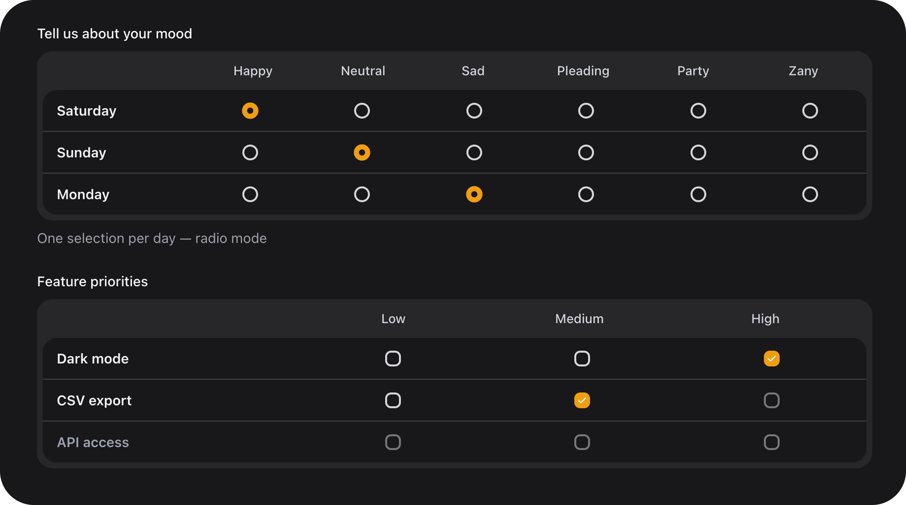
      <p style="margin-top: 8px; font-weight: 600; color: #374151;">MatrixChoiceField — Survey & Configurator Grid</p>
    </td>
  </tr>
  <tr>
    <td width="50%" style="padding: 10px; border: none; text-align: center; vertical-align: top;">
      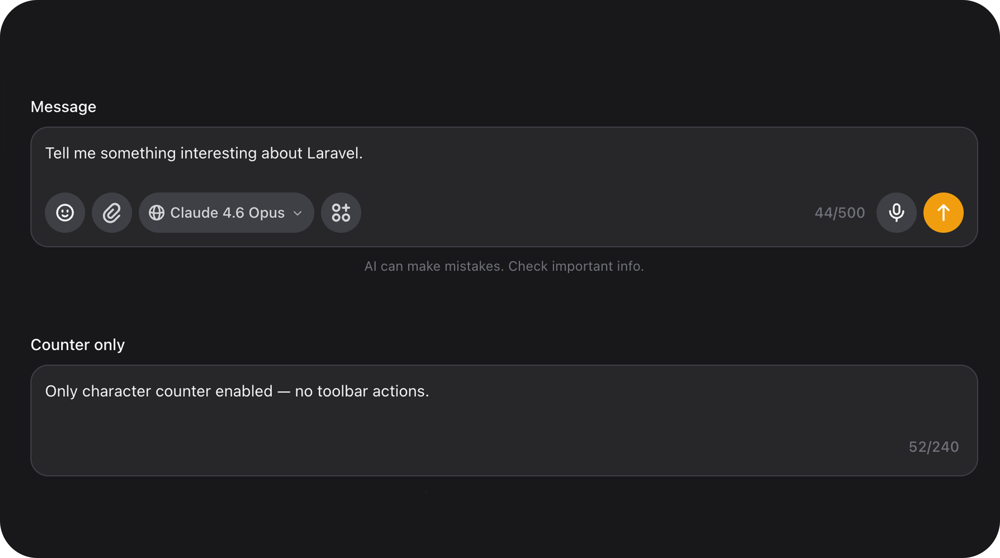
      <p style="margin-top: 8px; font-weight: 600; color: #374151;">FlexTextareaField — Autosize Textarea with Voice & Emoji Input</p>
    </td>
    <td width="50%" style="padding: 10px; border: none; text-align: center; vertical-align: top;">
      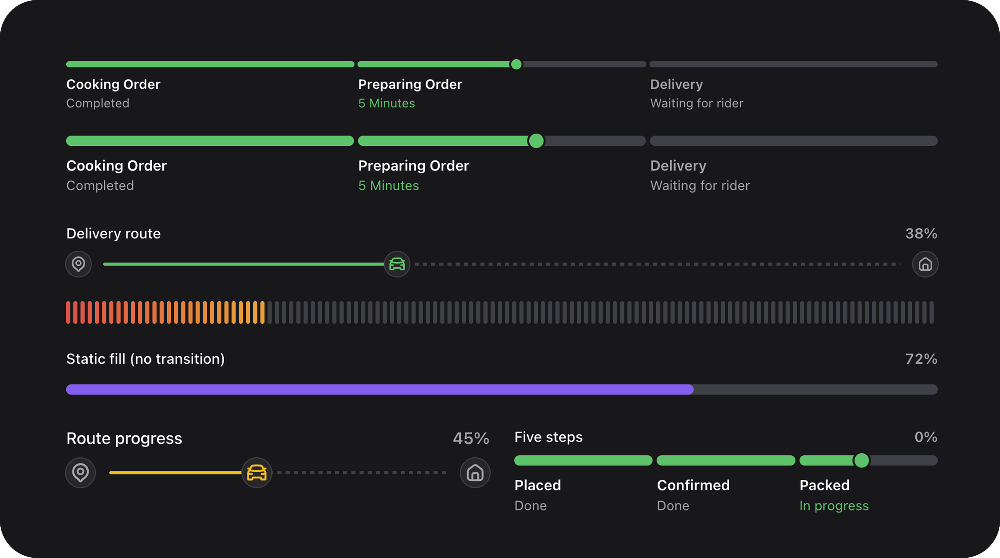
      <p style="margin-top: 8px; font-weight: 600; color: #374151;">ProgressBar & ProgressCircle — Visual Progress Indicators</p>
    </td>
  </tr>
  <tr>
    <td width="50%" style="padding: 10px; border: none; text-align: center; vertical-align: top;">
      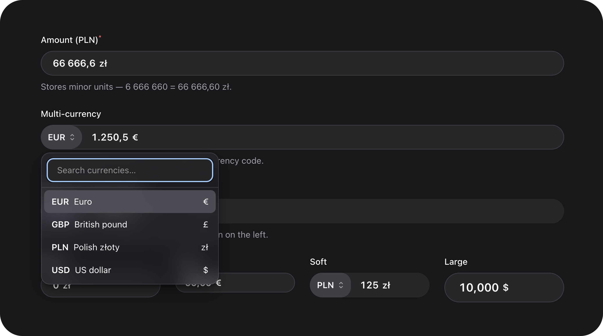
      <p style="margin-top: 8px; font-weight: 600; color: #374151;">CurrencyField — Multi-Currency Localized Input</p>
    </td>
    <td width="50%" style="padding: 10px; border: none; text-align: center; vertical-align: top;">
      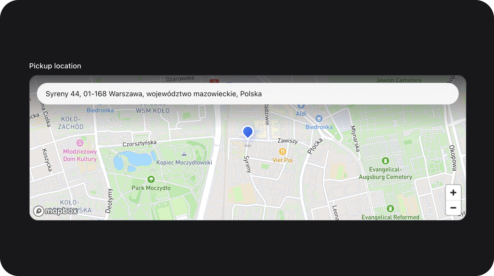
      <p style="margin-top: 8px; font-weight: 600; color: #374151;">MapPickerField — Interactive Map Pin Selector</p>
    </td>
  </tr>
  <tr>
    <td width="50%" style="padding: 10px; border: none; text-align: center; vertical-align: top;">
      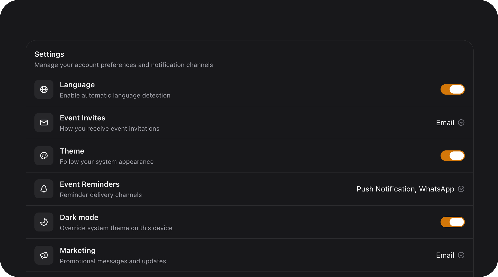
      <p style="margin-top: 8px; font-weight: 600; color: #374151;">ItemCardGroup — Premium Card-Based Layout Group</p>
    </td>
    <td width="50%" style="padding: 10px; border: none; text-align: center; vertical-align: top;">
      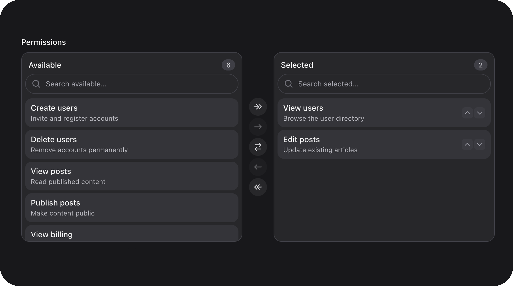
      <p style="margin-top: 8px; font-weight: 600; color: #374151;">DualListboxField — Reorderable Two-Panel Transfer List</p>
    </td>
  </tr>
  <tr>
    <td width="50%" style="padding: 10px; border: none; text-align: center; vertical-align: top;">
      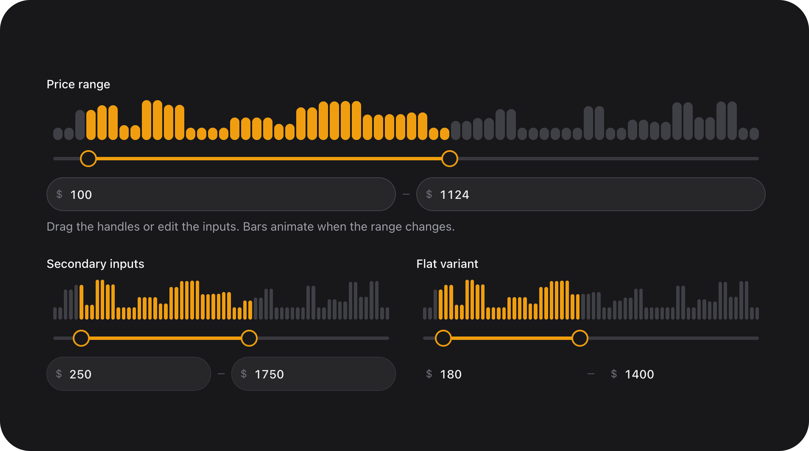
      <p style="margin-top: 8px; font-weight: 600; color: #374151;">PriceRangeField — Dual-Handle Price Filter</p>
    </td>
    <td width="50%" style="padding: 10px; border: none; text-align: center; vertical-align: top;">
      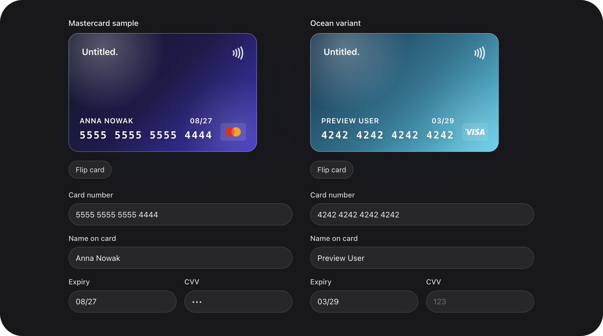
      <p style="margin-top: 8px; font-weight: 600; color: #374151;">CreditCardField — Interactive Card Preview</p>
    </td>
  </tr>
  <tr>
    <td width="50%" style="padding: 10px; border: none; text-align: center; vertical-align: top;">
      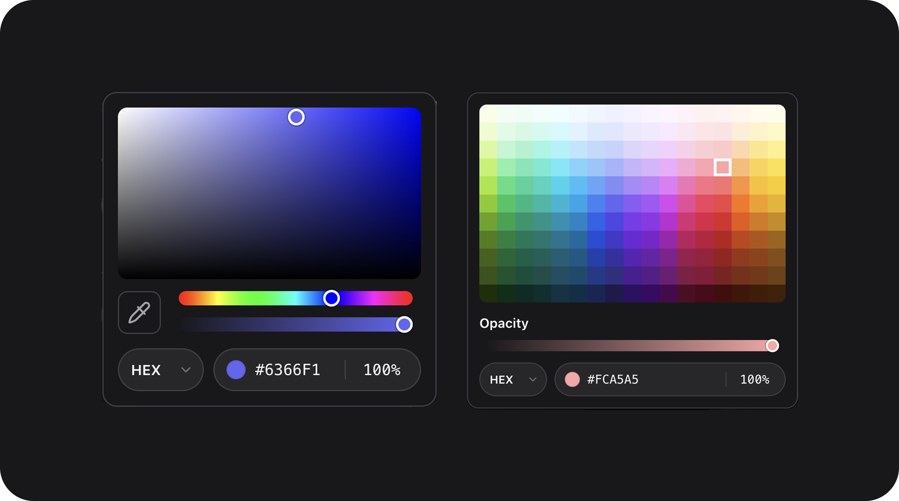
      <p style="margin-top: 8px; font-weight: 600; color: #374151;">FlexColorPickerField — Advanced Color Picker</p>
    </td>
    <td width="50%" style="padding: 10px; border: none; text-align: center; vertical-align: top;">
      
      <p style="margin-top: 8px; font-weight: 600; color: #374151;">AudioField & VoiceNoteRecorderField — Waveform Audio & Voice Messages</p>
    </td>
  </tr>
  <tr>
    <td width="50%" style="padding: 10px; border: none; text-align: center; vertical-align: top;">
      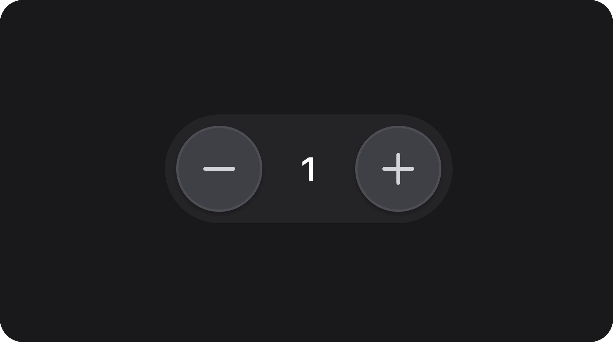
      <p style="margin-top: 8px; font-weight: 600; color: #374151;">NumberStepper — Animated Numeric Control</p>
    </td>
    <td width="50%" style="padding: 10px; border: none; text-align: center; vertical-align: top;">
      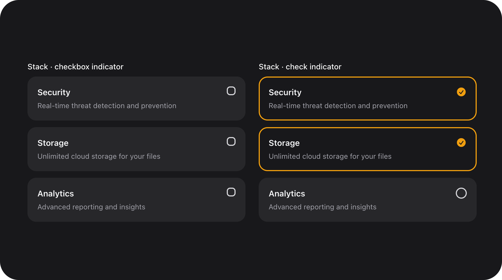
      <p style="margin-top: 8px; font-weight: 600; color: #374151;">ChoiceCards — Rich Selection Grid</p>
    </td>
  </tr>
  <tr>
    <td width="50%" style="padding: 10px; border: none; text-align: center; vertical-align: top;">
      
      <p style="margin-top: 8px; font-weight: 600; color: #374151;">VideoField — Video Player & Embed Component</p>
    </td>
    <td width="50%" style="padding: 10px; border: none; text-align: center; vertical-align: top;">
      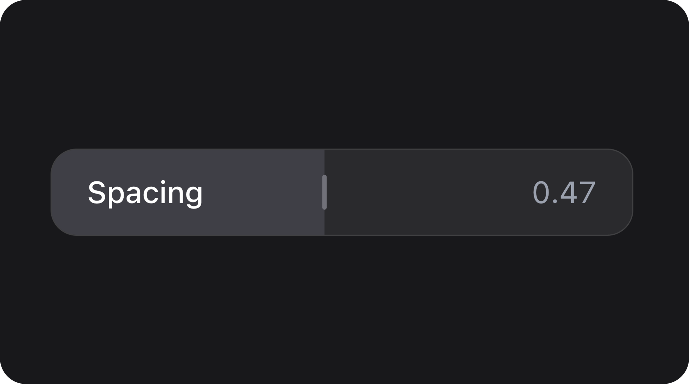
      <p style="margin-top: 8px; font-weight: 600; color: #374151;">TrackSlider — Inline Range & Segment Slider</p>
    </td>
  </tr>
  <tr>
    <td width="50%" style="padding: 10px; border: none; text-align: center; vertical-align: top;">
      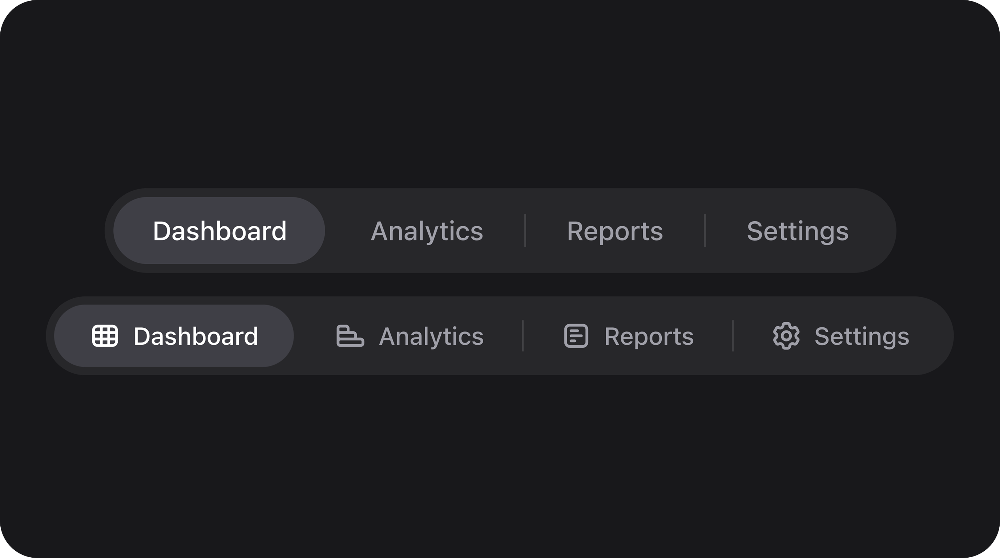
      <p style="margin-top: 8px; font-weight: 600; color: #374151;">SegmentControl — Segmented Button Tab Switcher</p>
    </td>
    <td width="50%" style="padding: 10px; border: none; text-align: center; vertical-align: top;">
      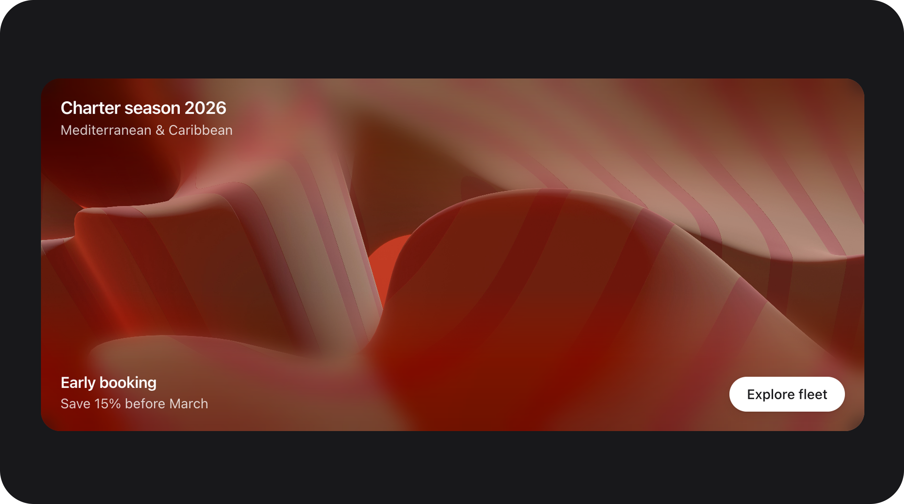
      <p style="margin-top: 8px; font-weight: 600; color: #374151;">CoverCard — Media Rich Hero Banner</p>
    </td>
  </tr>
  <tr>
    <td width="50%" style="padding: 10px; border: none; text-align: center; vertical-align: top;">
      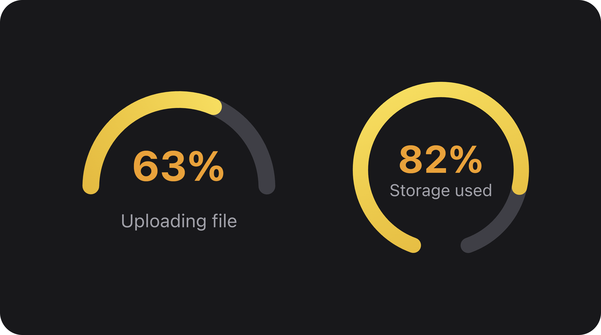
      <p style="margin-top: 8px; font-weight: 600; color: #374151;">ProgressCircle — Semicircle & Circular Dashboard Metrics</p>
    </td>
    <td width="50%" style="padding: 10px; border: none; text-align: center; vertical-align: top;">
      
      <p style="margin-top: 8px; font-weight: 600; color: #374151;">RatingField — Visual Star Rating Input</p>
    </td>
  </tr>
  <tr>
    <td width="50%" style="padding: 10px; border: none; text-align: center; vertical-align: top;">
      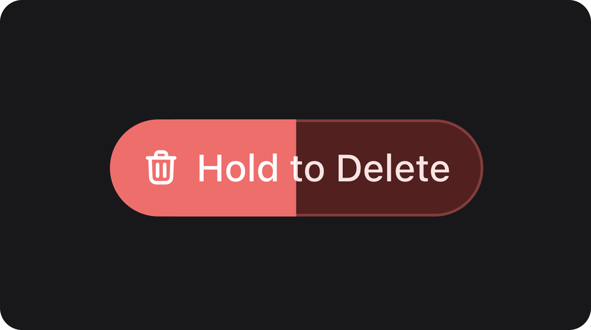
      <p style="margin-top: 8px; font-weight: 600; color: #374151;">HoldConfirmAction — Press & Hold Button</p>
    </td>
    <td width="50%" style="padding: 10px; border: none; text-align: center; vertical-align: top;">
      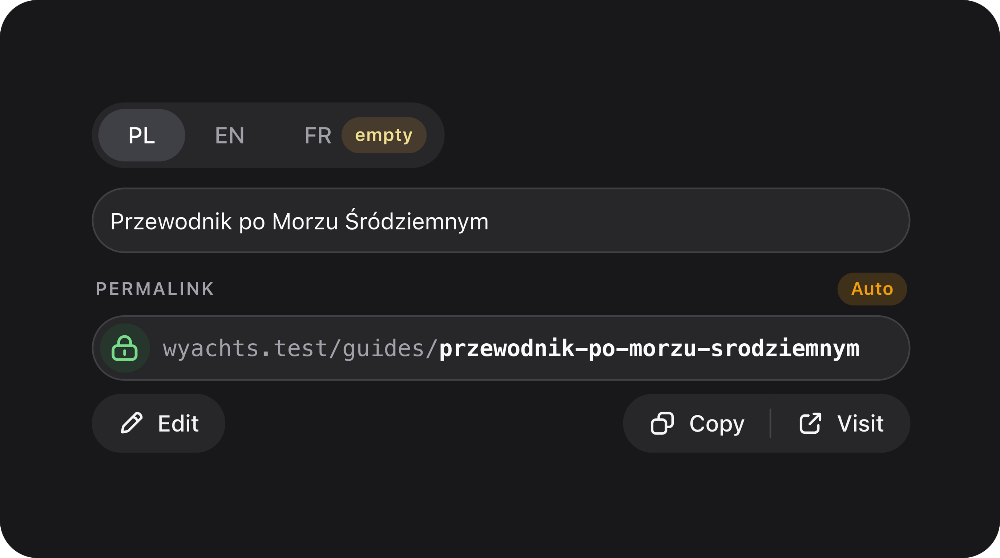
      <p style="margin-top: 8px; font-weight: 600; color: #374151;">SlugField & TranslatableFields — Translatable SEO Slugs</p>
    </td>
  </tr>
  <tr>
    <td width="50%" style="padding: 10px; border: none; text-align: center; vertical-align: top;">
      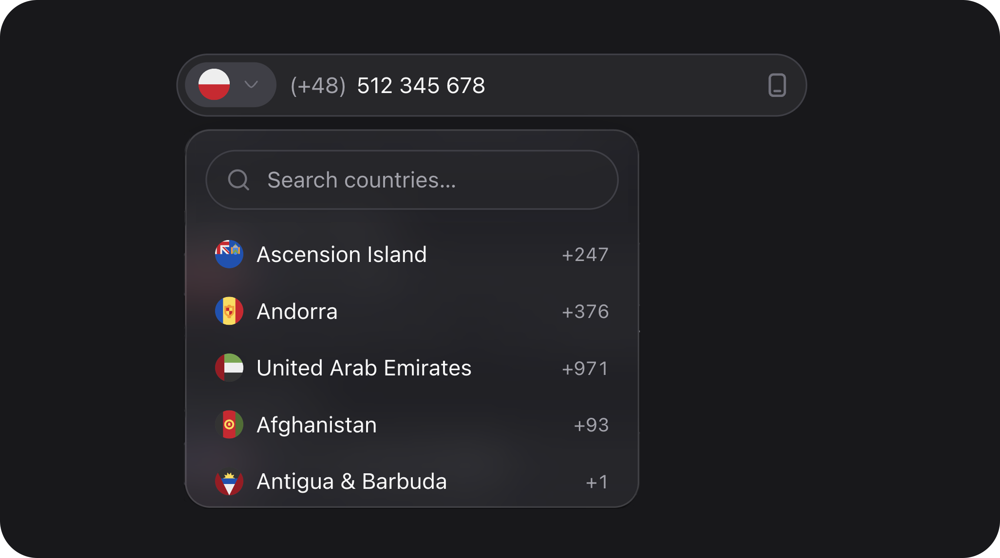
      <p style="margin-top: 8px; font-weight: 600; color: #374151;">PhoneField — International Phone Input</p>
    </td>
    <td width="50%" style="padding: 10px; border: none; text-align: center; vertical-align: top;">
      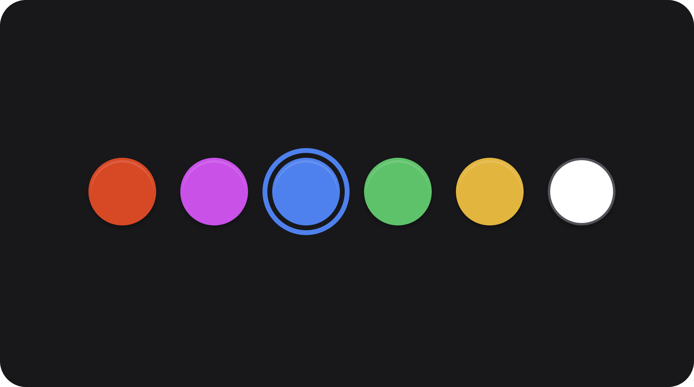
      <p style="margin-top: 8px; font-weight: 600; color: #374151;">ColorSwatchField — Preset Color Swatches</p>
    </td>
  </tr>
</table>


---

## Table of contents

- [Why Flex Fields?](#why-flex-fields)
- [Custom Components (61)](#custom-components-61)
- [Use cases](#use-cases)
- [Requirements](#requirements)
- [Installation](#installation)
- [Setup](#setup)
- [Quick usage](#quick-usage)
- [Playground](#playground)
- [Documentation](#documentation)
- [FAQ](#faq)
- [Development](#development)

---

## Why Flex Fields?

Filament Flex Fields is the most complete, visually stunning, and performance-optimized form component kit ever built for Filament v5. It is designed to replace dozens of scattered, uncoordinated community packages with a single, unified design system.

### 📦 61 Premium Filament Components (All-in-One UI Plugin)
No other package offers this level of coverage. Flex Fields delivers a massive library of **61 premium components** (50 form fields, 9 layout/schema components, and 2 table columns). Instead of stitching together 15+ different plugins—each with their own design philosophies, code quality, and styles—you get a single, curated suite where everything works together flawlessly.

### 🎨 Modern SaaS Form UI & modern SaaS-inspired Design
Standard admin panels look plain. Flex Fields brings gorgeous, state-of-the-art UI elements inspired by SaaS. Every component features smooth CSS transitions, interactive hover micro-animations, clean borders, and a unified design token scale (`--fff-*`). Customize component sizes (`sm`, `md`, `lg`), colors, and focus states globally or per-field.

### ⚡ Enterprise-Grade Asset Performance (Lazy CSS & JS Code Splitting)
Loading dozens of complex fields shouldn't make your admin panel sluggish. Flex Fields implements an advanced, enterprise-grade asset loading system:
* **Lazy-Loaded CSS:** Component stylesheets are injected on-the-fly *only* when the field is rendered on the page.
* **Tiered JS Chunks (esbuild code splitting):** Shared libraries (like Mapbox, libphonenumber, emoji pickers, and audio players) are split into semantic modules. They are automatically preloaded and deduplicated via `FlexFieldAlpineQueue`—meaning the browser downloads each shared helper *exactly once per page request*, no matter how many fields use it.

<details>
<summary>🔍 View Asset Optimization details (CSS & JS tables)</summary>

#### CSS — lazy per component

| Bundle | When it loads |
|--------|----------------|
| `core.css` | Always — design tokens, shared layout, table columns |
| `{component}.css` | **Only when that field is on the page** (injected via `load-stylesheet`) |
| `playground.css` | Playground page only |

Use `PhoneField` and `TagsField` on the same form → the browser fetches **only** `phone-field.css` and `tags-field.css`, not styles for the other 59 components.

#### JavaScript — tiered chunks (esbuild code splitting)

All Alpine components are built together with `splitting: true`:

| Layer | What you get |
|-------|----------------|
| **Entry** | Thin `{component}.js` — just the `x-data` factory for that field |
| **Shared chunks** | Reusable `core/` modules with **semantic names** (`flex-fields-emoji-*`, `flex-fields-audio-*`, `flex-fields-select-menu-*`, …) |
| **Manifest** | `alpine-manifest.json` maps each field → its chunks for `modulepreload` |
| **Dedup** | `FlexFieldAlpineQueue` preloads each shared chunk **once per request** |

#### Examples of what gets shared automatically:

| Shared module | Used by | Why it matters |
|---------------|---------|----------------|
| Emoji picker | `FlexTextInput`, `FlexTextarea` | ~45 KB library loaded once, not twice |
| Audio core | `AudioField`, `VoiceNoteRecorderField` | Waveform, playback, time formatting in one chunk |
| Select menu shell | `CountryField`, `TimezoneField`, `CurrencyField` | One composable for floating searchable menus |
| Mapbox helpers | `MapPickerField`, `AddressAutocompleteField` | Geocoding logic shared |
| libphonenumber-js | `PhoneField` | ~190 KB **lazy `import()`** — only when the field mounts |

Fields with no shared deps (e.g. `RatingField`) stay as a single small entry — no artificial splitting.

#### Consumer-friendly
* **Zero Node.js for consumers:** Pre-built assets in `resources/dist/` — no Node.js required in your host app.
* **Auto-registered:** After `composer update`, run `php artisan filament:assets`.
* **Technical deep-dive:** [docs/index.md](docs/index.md) (Assets & playground).

</details>

### 🧩 Zero-Migration Custom Fields (Dynamic JSON Storage)
Define your fields dynamically in PHP and store all custom attributes in a **single JSON column** using our `HasFlexFields` trait. Build dynamic CMS pages, customer onboarding surveys, or customizable tenant settings on the fly without database migrations, new tables, or complex EAV joins.

### 🧬 Highly Reactive Form Builder & Specialized Inputs
Build complex forms that would otherwise take weeks of custom frontend development:
* **MatrixChoiceField:** A survey-style grid with radio/checkbox modes and reactive `disableCellWhen()` / `disableRowWhen()` logic to easily disable specific choices.
* **TitleSlugField & SlugField:** Beautiful inputs with live URL permalink previews, automatic slug generation, copy actions, and database uniqueness validation.
* **Specialized inputs:** Custom audio players with waveforms (`AudioField`), voice recorders (`VoiceNoteRecorderField`), weighted A/B splitters (`TrafficSplit`), multi-currency inputs (`CurrencyField`), card selection lists (`ChoiceCards`), and map pins (`MapPickerField`).

### 🧪 Standalone Filament Inputs or Dynamic Schema Registry
* **Standalone Fields:** Import any of the 61 components directly into your standard Filament forms, chaining them like native fields (no JSON column required).
* **Dynamic Builder:** Bind your registry schemas to forms automatically using `FlexFieldFormBuilder` for dynamic JSON attributes.

### 🔍 Built-in Local Developer Playground (Visual QA)
Validate, preview, and interact with all 61 custom components instantly. Flex Fields features an out-of-the-box local Playground page (`/admin/playground` by default) containing interactive previews of every field to speed up your development.

---

## Custom Components (61)

Every item below is a **custom class shipped by this package** — own Blade views, CSS, and configuration API. This list does **not** include native Filament fields (`TextInput`, `TagsInput`, `Repeater`, etc.) used only as passthrough inside `FlexFieldFormBuilder`.

Full API for each component: **[docs/index.md](docs/index.md)**.

### Text & input (9)

| Component | Description |
|-----------|-------------|
| [`FlexTextInput`](docs/flextextinput.md) | Enhanced text input — speech dictation, emoji picker, password strength, clearable |
| [`FlexTextareaField`](docs/flextextareafield.md) | Animated autosizing textarea with character counter |
| [`PhoneField`](docs/phonefield.md) | International phone input with libphonenumber validation |
| [`CountryField`](docs/countryfield.md) | Searchable country picker with flags |
| [`TimezoneField`](docs/timezonefield.md) | IANA timezone picker with UTC offset display |
| [`SlugField`](docs/slugfield-and-titleslugfield.md) | Slug input with permalink preview, uniqueness, regenerate/copy actions |
| [`TitleSlugField`](docs/slugfield-and-titleslugfield.md) | Title + slug pair with live URL preview and optional Spatie Sluggable |
| [`AddressAutocompleteField`](docs/addressautocompletefield.md) | Mapbox-powered address search with structured storage |
| [`FlexVerificationCode`](docs/flexverificationcode.md) | OTP / 2FA verification code input with grouping |

### Number & range (6)

| Component | Description |
|-----------|-------------|
| [`NumberStepper`](docs/numberstepper.md) | +/- numeric stepper control |
| [`CurrencyField`](docs/currencyfield.md) | Multi-currency money input with locale-aware formatting |
| [`FlexSlider`](docs/flexslider.md) | Styled range slider with value display |
| [`TrackSlider`](docs/trackslider.md) | Track-style slider — single value, percentage, or min/max range |
| [`PriceRangeField`](docs/pricerangefield.md) | Dual-handle price filter with histogram |
| [`TrafficSplit`](docs/trafficsplit.md) | Weighted segment split control (A/B-style traffic allocation) |

### Choice & selection (13)

| Component | Description |
|-----------|-------------|
| [`SwitchField`](docs/switchfield.md) | Animated toggle switch with row/inline layouts |
| [`CellSwitch`](docs/switchfield.md) | Compact `SwitchField` variant for table cells |
| [`SegmentControl`](docs/segmentcontrol.md) | Segmented button control |
| [`ChoiceCards`](docs/choicecards.md) | Rich card-based radio selection |
| [`ChoiceCheckboxCards`](docs/choicecheckboxcards.md) | Rich card-based multi-select |
| [`FlexChecklist`](docs/flexchecklist.md) | Animated checklist with icons and descriptions |
| [`FlexRadiolist`](docs/flexradiolist.md) | Animated radio list with icons and descriptions |
| [`MatrixChoiceField`](docs/matrixchoicefield.md) | Survey / configurator matrix grid — radio or checkbox per row |
| [`SelectField`](docs/selectfield.md) | Rich select with avatars, badges, and descriptions |
| [`UserSelect`](docs/userselect.md) | User picker with avatar stacks and verification badges |
| [`DualListboxField`](docs/duallistboxfield.md) | Two-panel reorderable transfer list |
| [`TagsField`](docs/index.md) | Tag input — pills below the field with inline remove buttons |
| [`FlexSpatieTagsField`](docs/index.md) | Spatie Tags integration for `TagsField` |

### Date & time (9)

| Component | Description |
|-----------|-------------|
| [`FlexDateField`](docs/date-and-time-fields.md) | Segmented date input without calendar popover |
| [`FlexDatePicker`](docs/date-and-time-fields.md) | Date picker with calendar popover |
| [`FlexTimeField`](docs/date-and-time-fields.md) | Time picker (12h / 24h, seconds optional) |
| [`FlexDateTimePicker`](docs/date-and-time-fields.md) | Combined date + time picker |
| [`FlexDateRangeField`](docs/date-and-time-fields.md) | Start/end date range |
| [`FlexDurationField`](docs/date-and-time-fields.md) | Duration input (hours / minutes) |
| [`FlexTimeRangeField`](docs/date-and-time-fields.md) | Start/end time range |
| [`FlexMonthPicker`](docs/date-and-time-fields.md) | Month picker |
| [`FlexYearPicker`](docs/date-and-time-fields.md) | Year picker |

### Media, color & location (12)

| Component | Description |
|-----------|-------------|
| [`ColorSwatchField`](docs/colorswatchfield.md) | Preset color swatch picker |
| [`FlexColorPickerField`](docs/flexcolorpickerfield.md) | Advanced color picker with grid and eyedropper |
| [`FlexFileUpload`](docs/flexfileupload-and-fleximageupload.md) | Styled file upload with security presets |
| [`FlexImageUpload`](docs/flexfileupload-and-fleximageupload.md) | Image upload with processing options |
| [`FlexSpatieMediaLibraryFileUpload`](docs/flexfileupload-and-fleximageupload.md) | Spatie Media Library upload integration |
| [`VideoField`](docs/videofield.md) | Video URL / player with YouTube support |
| [`AudioField`](docs/audiofield.md) | Audio URL / player with waveform |
| [`VoiceNoteRecorderField`](docs/voicenoterecorderfield.md) | In-browser voice recorder — waveform, local playback, deferred or immediate upload |
| [`MapPickerField`](docs/mappickerfield.md) | Interactive map pin picker |
| [`SignatureField`](docs/signaturefield.md) | Canvas signature pad |
| [`CreditCardField`](docs/creditcardfield.md) | Card preview with Luhn validation and CVV flip |
| [`CellSlider`](docs/trackslider.md) | Compact `TrackSlider` variant for table cells |

### Rating (1)

| Component | Description |
|-----------|-------------|
| [`RatingField`](docs/ratingfield.md) | Star rating input |

### Layout & display — schemas (9)

| Component | Description |
|-----------|-------------|
| [`SegmentTabs`](docs/segmenttabs.md) | Tabbed segment navigation for forms |
| [`TranslatableFields`](docs/translatablefields.md) | Locale tabs wrapping any fields (JSON or Spatie Translatable) |
| [`TranslatableTabs`](docs/translatablefields.md) | Legacy alias for `TranslatableFields` |
| [`ItemCard`](docs/itemcard.md) | Single settings-style card row |
| [`ItemCardGroup`](docs/itemcardgroup.md) | Polished card-based settings group |
| [`ItemCardStack`](docs/itemcardstack.md) | Stacked card layout for profile / settings pages |
| [`CoverCard`](docs/covercard.md) | Hero cover card for tabbed editors |
| [`ProgressBar`](docs/progressbar.md) | Linear, pill, or segment progress bar |
| [`ProgressCircle`](docs/progresscircle.md) | Circular or semicircle progress indicator |

Ready-made layout recipes: [Form layout patterns](docs/index.md#form-layout-patterns).

### Table columns (2)

| Component | Description |
|-----------|-------------|
| [`UserColumn`](docs/usercolumn.md) | Avatar + name/email display with hover card |
| [`RatingColumn`](docs/ratingcolumn.md) | Star rating display in Filament tables |

**Total: 61 custom components** (50 form fields + 9 layout/schema + 2 table columns).

---

## Use cases

| Scenario | Recommended components |
|----------|------------------------|
| **CMS / page builder** | `TitleSlugField`, `TranslatableFields`, `FlexFileUpload`, `FlexImageUpload` |
| **CRM custom fields** | JSON flex fields + `PhoneField`, `CountryField`, `UserSelect` |
| **Product configurator** | `MatrixChoiceField`, `ChoiceCards`, `PriceRangeField`, `ColorSwatchField` |
| **Surveys & assessments** | `MatrixChoiceField`, `FlexRadiolist`, `RatingField` |
| **SaaS onboarding** | `ChoiceCards`, `SegmentTabs`, `CoverCard`, `ProgressCircle` |
| **E-commerce filters** | `PriceRangeField`, `TrackSlider`, `DualListboxField` |
| **User profile settings** | `ItemCardGroup`, `PhoneField`, `TimezoneField`, `SignatureField` |
| **Payment forms** | `CreditCardField`, `FlexVerificationCode` |
| **Location services** | `MapPickerField`, `AddressAutocompleteField` |
| **A/B configuration** | `TrafficSplit`, `SegmentControl` |

---

## Requirements

| Dependency | Version |
|------------|---------|
| PHP | 8.3+ |
| Laravel | 11+ |
| Filament | 5.x (`filament/filament ^5.0`) |

**Optional integrations** (see `composer.json` → `suggest`):

| Package | Used for |
|---------|----------|
| `spatie/laravel-sluggable` | Model-based slug generation in `SlugField` |
| `spatie/laravel-translatable` | JSON translation storage for translatable titles |
| `spatie/laravel-medialibrary` | `FlexSpatieMediaLibraryFileUpload` |
| `filament/spatie-laravel-media-library-plugin` | Filament base class for media upload |
| `spatie/laravel-tags` | `FlexSpatieTagsField` — sync tags on models using `HasTags` |

---

## Installation

### Composer (Packagist)

```bash
composer require janczakb/filament-flex-fields
```

### Composer (path repository — monorepo)

```json
{
    "repositories": [
        {
            "type": "path",
            "url": "packages/filament-flex-fields"
        }
    ],
    "require": {
        "janczakb/filament-flex-fields": "@dev"
    }
}
```

```bash
composer require janczakb/filament-flex-fields:@dev
```

> [!IMPORTANT]
> Register Filament assets after every install or update:
>
> ```bash
> php artisan filament:assets
> ```

Auto-discovered via `composer.json` → `extra.laravel.providers`.

**Keep assets in sync** — add to your host app `composer.json`:

```json
"scripts": {
    "post-autoload-dump": [
        "Illuminate\\Foundation\\ComposerScripts::postAutoloadDump",
        "@php artisan package:discover --ansi",
        "@php artisan filament:assets"
    ]
}
```

---

## Setup

### 1. Register the plugin

```php
use Bjanczak\FilamentFlexFields\FilamentFlexFieldsPlugin;

public function panel(Panel $panel): Panel
{
    return $panel->plugin(FilamentFlexFieldsPlugin::make());
}
```

### 2. Publish configuration (optional)

```bash
php artisan vendor:publish --tag=filament-flex-fields-config
```

### 3. Flex fields on a model (optional)

```php
use Bjanczak\FilamentFlexFields\Concerns\HasFlexFields;

class Product extends Model
{
    use HasFlexFields;

    protected $casts = [
        'flex_field_values' => 'array',
    ];
}
```

Define schemas in `config/filament-flex-fields.php` or `FlexFieldSchemaRegistry`, then build with `FlexFieldFormBuilder`.

---

## Quick usage

### Standalone form components

```php
use Bjanczak\FilamentFlexFields\Filament\Forms\Components\ChoiceCards;
use Bjanczak\FilamentFlexFields\Filament\Forms\Components\MatrixChoiceField;
use Bjanczak\FilamentFlexFields\Filament\Forms\Components\PhoneField;
use Bjanczak\FilamentFlexFields\Filament\Forms\Components\TitleSlugField;

ChoiceCards::make('plan')
    ->options(['basic' => 'Basic', 'pro' => 'Pro'])
    ->required();

MatrixChoiceField::make('priorities')
    ->mode('checkbox')
    ->rows(['dark_mode' => 'Dark mode', 'csv_export' => 'CSV export'])
    ->matrixColumns(['low' => 'Low', 'medium' => 'Medium', 'high' => 'High'])
    ->disableCellWhen('csv_export', 'high', 'dark_mode', 'high');

PhoneField::make('phone')->defaultCountry('PL');

TitleSlugField::make('title', 'slug')
    ->permalinkPreview()
    ->slugUnique();
```

Full API for every option: **[docs/index.md](docs/index.md)**.

### Schema / display components

```php
use Bjanczak\FilamentFlexFields\Filament\Schemas\Components\ItemCardGroup;
use Bjanczak\FilamentFlexFields\Filament\Schemas\Components\ProgressCircle;

ProgressCircle::make()
    ->value(72)
    ->displayValue('72%')
    ->variant('semicircle');

ItemCardGroup::make([
    // Polished card-based settings rows…
]);
```

---

## Playground

A dev UI page previews every custom component.

| Setting | Env variable | Default |
|---------|--------------|---------|
| Plugin enabled | `FLEX_FIELDS_ENABLED` | `true` |
| Playground | `FLEX_FIELDS_PLAYGROUND` | `true` when `APP_ENV=local` |
| Nav group | `FLEX_FIELDS_PLAYGROUND_NAV_GROUP` | `Settings & Tools` |
| Nav sort | `FLEX_FIELDS_PLAYGROUND_NAV_SORT` | `91` |

```env
FLEX_FIELDS_PLAYGROUND=false
```

Example slugs: `matrix-choice`, `choice-cards`, `tags-field`, `title-slug-field`, `phone-field`, `item-card-group`, `progress-circle`.

---

## Documentation

| Document | Contents |
|----------|----------|
| **[docs/index.md](docs/index.md)** | Complete per-component API — every method, option, validation rule, config key, and example |
| **config/filament-flex-fields.php** | Default schemas, UI sizes, playground toggles |

---

## FAQ

**Do I need Node.js to use this package?**
No. Pre-built CSS/JS are committed to `resources/dist/`. Node is only needed when developing the package itself.

**How does asset loading work?**
Each component loads its own CSS/JS on demand. Shared JavaScript (emoji picker, audio UI, country/timezone menus, Mapbox, etc.) is split into cached chunks with semantic names — loaded once per page even when multiple fields use the same module. See [Performance-first assets](#performance-first-assets).

**Can I use components without the JSON flex-field system?**
Yes. Import any component directly into Filament forms — the JSON column and `HasFlexFields` trait are optional.

**How many components are included?**
**61** custom UI classes with own views and CSS — listed in [Custom Components (61)](#custom-components-61). The optional JSON flex-field registry wires these components via `FlexFieldFormBuilder`.

**Does it work with Filament v4?**
No — this package targets **Filament v5** only.

**Is Spatie required?**
No. Sluggable, Translatable, and Media Library integrations are optional `composer suggest` packages.

**Where is the Matrix Choice / survey grid?**
`MatrixChoiceField` — radio or checkbox mode, per-row validation, reactive `disableCellWhen()` / `disableRowWhen()`. See [docs/index.md → MatrixChoiceField](docs/matrixchoicefield.md).

---

## Development

```bash
composer install
composer test          # Pest
composer analyse       # PHPStan

npm install
npm run build          # CSS + JS → resources/dist/
composer format        # Laravel Pint
```

Rebuild assets after changing `resources/css/` or `resources/js/`.

---

See [LICENSE](LICENSE) for license details.

<p align="center">Made with ❤️ by <a href="mailto:barek122@gmail.com">Bartłomiej Janczak</a></p>
