<p align="center" class="filament-hidden">
    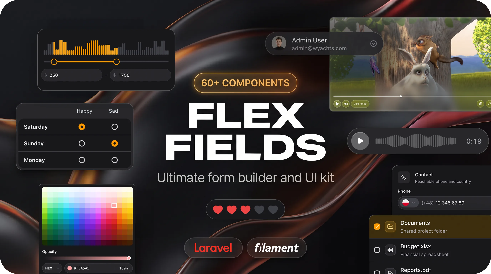
</p>

<h1 align="center">Filament Flex Fields</h1>

<p align="center"><strong>The Filament v5 form fields plugin teams use instead of stitching many single-purpose packages</strong><br>
<strong>79 custom components</strong> · one design system · lazy CSS/JS · optional JSON custom fields · built-in Playground</p>

<p align="center">
Virtualized Select with async Livewire search · Spatie Media Library &amp; disk/S3 uploads · phone, maps, signatures, rich editor, surveys — one cohesive kit for Laravel admin forms.
</p>
<p align="center">Pre-built assets · <strong>no Node.js in production</strong> · standalone fields or dynamic JSON schemas · docs for every component</p>

<p align="center">
    <a href="https://flex-fields.bjanczak.com/" target="_blank" rel="noopener noreferrer">
        
    </a>
</p>

<p align="center">
    <a href="https://packagist.org/packages/janczakb/filament-flex-fields"></a>
    <a href="https://github.com/janczakb/filament-flex-fields/blob/main/LICENSE"></a>
    <a href="https://packagist.org/packages/janczakb/filament-flex-fields"></a>
    <a href="https://github.com/janczakb/filament-flex-fields/stargazers"></a>
    <a href="https://github.com/janczakb/filament-flex-fields/issues"></a>
    <a href="https://github.com/janczakb/filament-flex-fields/actions"></a>
</p>

<p align="center">
    <a href="https://github.com/janczakb/filament-flex-fields/actions/workflows/flex-fields-ci.yml"></a>
    
    
    
    <a href="SUPPORT.md"></a>
</p>

<p align="center"><strong>Source-available.</strong> Free for most internal Filament admin panels under Permitted Free Use — commercial license only when you ship Flex Fields as a material SaaS dependency or redistribute it. See <a href="#license">License</a>.</p>

---

**Filament Flex Fields** is an all-in-one **Filament form fields / form components plugin** for [Filament v5](https://filamentphp.com) and Laravel admin panels: **79 custom components** (64 form fields, 8 layout & schema pieces, 7 table columns), a unified `--fff-*` design system, first-class **Spatie Media Library** and disk/S3 uploads (**Media Ingress**), and an optional **JSON custom-field layer** without EAV tables.

If you need a drop-in select, phone, map, signature, survey grid, rich editor, or Spatie upload that looks and behaves like one product — this package is built for that, so you do not install a separate plugin for each field type.

<details>
<summary>Need a drag-and-drop form Studio on top? → Filament Flex Forms (premium companion)</summary>

**[Filament Flex Forms](https://github.com/janczakb/filament-flex-forms)** is a separate commercial product: Studio, public fill & embed, submissions, Insights, and integrations — built on these same Flex Fields components.

[Buy Flex Forms](https://shop.bjanczak.com/checkout/buy/3d3a0d72-c9d5-4cfd-90c9-26869c444bb0) · [Docs](https://flexforms.bjanczak.com) · [GitHub](https://github.com/janczakb/filament-flex-forms)

</details>

---

## Filament v5 form components in one plugin

| Approach | Best for | What you need |
|----------|----------|---------------|
| **Standalone components** | Fixed forms — profiles, checkout, CMS pages | Import the field class and use Filament’s fluent API |
| **JSON custom fields** | CRM attributes, tenant settings, variable product fields | `HasFlexFields` + schemas in config or Field groups |

Both modes share the same component library, design tokens, and lazy asset loading.

### Filament select with virtualization & async search

`SelectField` extends Filament’s built-in `Select` with a headless combobox: **virtualized scrolling** for thousands of options, **async Livewire search** with pagination and rate limits, rich option rows (avatars, badges, descriptions), multi-select chips, create-option / smart suggest, grid layouts, and a **mobile bottom sheet** instead of a cramped desktop menu. `UserSelect` reuses the same Alpine entry; Icon picker shares the combobox engine; Tags, Phone, Country, and related pickers share the teleported **select-menu** stack — shared CSS/JS loads once per page. Full native Select API remains available.

→ [SelectField docs](https://flex-fields.bjanczak.com/docs/selectfield)

### Filament Spatie Media Library uploads (or plain disk / S3)

Use `FlexSpatieMediaLibraryFileUpload` or Media Ingress (`disk` | `spatie`) for files, images, voice notes, signatures, and rich-editor attachments — including **S3**, Spatie conversions, signed URLs, and virus-scan hooks — without a separate upload-only plugin. Spatie packages are optional (`composer suggest`).

→ [Media Ingress](https://flex-fields.bjanczak.com/docs/media-capture-os) · [File & image upload](https://flex-fields.bjanczak.com/docs/flexfileupload-and-fleximageupload)

### Filament custom fields in a JSON column (no EAV)

Add `HasFlexFields`, store values in one JSON column, define schemas in PHP config / Field groups admin, and render with `FlexFieldFormBuilder` / `FlexFieldStudio`. Conditions, formulas, tenant packs, and RBAC — same components as standalone forms.

→ [Docs index — JSON flex fields](https://flex-fields.bjanczak.com/docs/index) · config: `config/filament-flex-fields.php`

### Instead of installing many Filament field plugins

| Instead of a separate plugin for… | Use in Flex Fields |
|-----------------------------------|--------------------|
| Select / combobox / icon picker / tags | `SelectField`, `IconPickerField`, `TagsField`, `UserSelect` |
| Spatie media / styled file uploads | Media Ingress + `FlexFileUpload` / `FlexSpatieMediaLibraryFileUpload` |
| Custom fields / EAV attribute tables | `HasFlexFields` JSON layer |
| Phone, country, currency, maps, address | First-party fields in this kit |
| Signature, barcode, NPS, matrix surveys | First-party fields in this kit |
| Settings cards, tabs, progress UI | Layout & schema components + table columns |

One design system, one lazy asset pipeline, one Playground — not a patchwork of unrelated CSS/JS.

---

## Why Flex Fields?

### Who it's for

Teams building **Filament v5** backends that need more than stock inputs — **CRM** custom attributes, **CMS** editors, **SaaS** onboarding, **marketplaces** with configurable product fields, ops tools with barcodes and maps, or any admin UI that should feel like **one product**.

### At a glance

| | **Flex Fields** | **Typical approach** |
|---|-----------------|----------------------|
| **Scope** | **79** fields, layouts, and table columns — one package | Many single-purpose Filament plugins |
| **Select & pickers** | Virtualized lists, async search, mobile bottom sheets, rich option rows | Basic dropdowns that struggle at scale |
| **Media** | Media Ingress — disk or Spatie, S3, virus scan, image conversions | Separate upload plugins per storage backend |
| **Design** | One `--fff-*` system — sizes, focus, menus, dark mode | Mixed UI from unrelated packages |
| **Flexibility** | Standalone fields **or** dynamic JSON on models — same components | Usually one mode only |
| **Performance** | Lazy per-field CSS/JS, shared chunks, pre-built `dist/` — no npm in your app | Global bundles or consumer-side builds |
| **DX** | Playground for every component + dedicated doc per field | Trial-and-error per plugin |

### Standout capabilities

**SelectField & family** — headless combobox with **virtualized scrolling** for thousands of options, **async / Livewire search**, rich rows (avatars, badges, descriptions), multi-select chips, create-option flows, grid layouts, and a **mobile bottom sheet**. `UserSelect` reuses the same Select entry; `IconPickerField` shares the combobox engine + teleported menu; Tags, Phone, Country, Timezone, Currency, Address, Map, and Social Links share the **select-menu** overlay stack — CSS/JS chunks load **once per page**, not once per field instance.

**Media Ingress** — one upload path for files, images, voice notes, signatures, and rich-editor attachments. Choose **disk** (including **S3**) or **Spatie Media Library** with full `registerMediaConversions()` support, virus scanning, private signed URLs, and multi-tenant disk rules. See [Media Ingress](https://flex-fields.bjanczak.com/docs/media-capture-os).

**Rich interactions** — signature pads, barcode/QR camera scanning, Mapbox maps & address autocomplete, international phones, multi-currency money, weekly schedules, NPS/CSAT, animated todos, bubble multi-select, dual listboxes, and a YouTube/Vimeo/HTML5 video player.

**JSON custom fields** — define schemas in config or Field groups admin; store values in one JSON column via `HasFlexFields`. Conditions, formulas, tenant packs, and RBAC through `FlexFieldFormBuilder` / `FlexFieldStudio`.

<a id="lazy-assets--shared-chunks"></a>**Lazy assets (no duplicate CSS/JS)** — each field queues only what it needs; request-scoped queues + SPA injector ensure the same stylesheet or hashed chunk is fetched **once** even if five SelectFields (or Select + Tags + Phone) appear on one form. Heavy libraries live in shared esbuild chunks (`select-menu`, `combobox-engine`, `phone-lib`, …). Pre-built `resources/dist/` means **no Node.js or Vite in your Laravel project**.

<details>
<summary>Asset pipeline (technical)</summary>

1. **Lean core** — `core.css`: design tokens and shared hint chrome only.
2. **Conditional critical preload** — teleported menus and hold-confirm only when needed.
3. **Per-component queues** — Blade `@include(…load-stylesheet)` enqueues CSS + Alpine chunks; `FlexFieldStylesheetQueue` / `FlexFieldAlpineQueue` dedupe within the request (5× ChoiceCards → 1× CSS).
4. **Batch markers + injector** — `emit-assets` outputs `data-fff-asset-batch` spans; `flex-field-asset-injector.js` injects missing `<link>` / `modulepreload`, dedupes by href, and caches in-flight fetches across Livewire morph / Filament navigation (modal FOUC prevention).
5. **Lazy Alpine mount** — heavy fields can defer init until visible (`x-intersect`).
6. **`loadedOnRequest()`** — unused Filament-registered CSS never auto-loads via `@filamentStyles`.

See [Performance-first assets](#performance-first-assets) for the Select-family share map, classes, and bundle metrics.

</details>

<a id="dynamic-custom-fields-json"></a>**Playground & docs** — preview components in your panel; every field documented with methods, validation, and examples at [flex-fields.bjanczak.com](https://flex-fields.bjanczak.com/docs/index).

---

## Table of contents

- [Filament v5 form components in one plugin](#filament-v5-form-components-in-one-plugin)
- [Why Flex Fields?](#why-flex-fields)
- [Quick start](#quick-start)
- [Custom Components (79)](#custom-components-79)
- [Use cases](#use-cases)
- [Screenshots](#screenshots)
- [Requirements](#requirements)
- [Installation](#installation)
- [Setup](#setup)
- [Quick usage](#quick-usage)
- [Playground](#playground)
- [Documentation](#documentation)
- [FAQ](#faq)
- [Upgrading](#upgrading)
- [Performance-first assets](#performance-first-assets)
- [License](#license)

---

## Quick start

**First-time install:**

```bash
composer require janczakb/filament-flex-fields
php artisan filament:assets
```

Register the plugin on your Filament panel:

```php
use Bjanczak\FilamentFlexFields\FilamentFlexFieldsPlugin;

public function panel(Panel $panel): Panel
{
    return $panel->plugin(FilamentFlexFieldsPlugin::make());
}
```

Then drop any component into a form — e.g. `SelectField::make('status')->searchable()` or `MatrixChoiceField::make('priorities')`. Full install options: [Installation](#installation). **Already installed?** See [Upgrading](#upgrading).

**Fresh install:** Select (virtualized combobox), schema conditions, FormBuilder, and playground demos work out of the box — no migrations required for core fields. Optional: `php artisan fff:v3:upgrade` refreshes the asset registry marker.

---

## Custom Components (79)

Every item below is a **custom class shipped by this package** — own Blade views, CSS, and configuration API. This list does **not** include native Filament fields (`TextInput`, `TagsInput`, `Repeater`, etc.) used only as passthrough inside `FlexFieldFormBuilder`.

Full API for each component: **[https://flex-fields.bjanczak.com/docs/index](https://flex-fields.bjanczak.com/docs/index)**.

### Flagship highlights

| Capability | Where |
|------------|--------|
| **Virtualized option lists** (thousands of rows without DOM meltdown) | `SelectField`, `IconPickerField`, `TagsField`, `TodoListField` |
| **Async / Livewire search** with pagination & rate limits | `SelectField`, `UserSelect`, relationship-backed pickers |
| **Mobile bottom sheets** for searchable menus | `SelectField` and shared combobox family |
| **Disk or Spatie Media Library** (S3-ready) via Media Ingress | File / image / voice / signature / rich-editor attachments |
| **Survey & configurator UX** | `MatrixChoiceField`, `NpsField`, `BubbleChoiceField`, `ChoiceCards` |

---

### Text & input (13)

| Component | What you get |
|-----------|----------------|
| [`FlexTextInput`](https://flex-fields.bjanczak.com/docs/flextextinput) | Production text field — speech dictation, emoji picker, password strength meter, clearable, prefix/suffix chrome |
| [`FlexTextareaField`](https://flex-fields.bjanczak.com/docs/flextextareafield) | Autosizing textarea with smooth height animation and character counter |
| [`FlexRichEditor`](https://flex-fields.bjanczak.com/docs/flex-rich-editor) | JSON-first rich text — toolbar a11y, responsive images, limits, fullscreen, autosave; optional Spatie attachments & image variants |
| [`PhoneField`](https://flex-fields.bjanczak.com/docs/phonefield) | International phones with country flags, libphonenumber validation, and E.164-ready state |
| [`CountryField`](https://flex-fields.bjanczak.com/docs/countryfield) | Searchable country picker with flags — same combobox UX as Select |
| [`TimezoneField`](https://flex-fields.bjanczak.com/docs/timezonefield) | IANA timezones with UTC offset, browser detection helpers, and searchable list |
| [`LinkPreviewField`](https://flex-fields.bjanczak.com/docs/link-preview-field) | URL input with live Open Graph preview (horizontal, vertical, or full-width) |
| [`BarcodeScannerField`](https://flex-fields.bjanczak.com/docs/barcode-scanner-field) | Barcode & QR — Filament modal camera, format whitelist, EAN/UPC checksum, BarcodeDetector + ZXing, torch & camera flip |
| [`SocialLinksField`](https://flex-fields.bjanczak.com/docs/social-links-field) | Social profile links — platform picker, URL validation, custom platforms, reorder |
| [`SlugField`](https://flex-fields.bjanczak.com/docs/slugfield-and-titleslugfield) | Slug with permalink preview, uniqueness checks, regenerate & copy actions |
| [`TitleSlugField`](https://flex-fields.bjanczak.com/docs/slugfield-and-titleslugfield) | Title + slug pair with live URL preview; optional Spatie Sluggable |
| [`AddressAutocompleteField`](https://flex-fields.bjanczak.com/docs/addressautocompletefield) | Mapbox address search with structured place storage |
| [`FlexVerificationCode`](https://flex-fields.bjanczak.com/docs/flexverificationcode) | OTP / 2FA digit groups with paste support and masked modes |

### Number & range (7)

| Component | What you get |
|-----------|----------------|
| [`NumberStepper`](https://flex-fields.bjanczak.com/docs/numberstepper) | Accessible +/- stepper with min/max, step, and keyboard control |
| [`CalculatorField`](https://flex-fields.bjanczak.com/docs/calculator-field) | Money/number input with shared calculator panel (desktop float + mobile sheet) and per-field memory |
| [`CurrencyField`](https://flex-fields.bjanczak.com/docs/currencyfield) | Multi-currency money with locale formatting, currency switcher, and precision control |
| [`FlexSlider`](https://flex-fields.bjanczak.com/docs/flexslider) | Styled range slider with live value display |
| [`TrackSlider`](https://flex-fields.bjanczak.com/docs/trackslider) | Track slider — single value, percentage, or min/max range |
| [`PriceRangeField`](https://flex-fields.bjanczak.com/docs/pricerangefield) | Dual-handle price filter with optional histogram |
| [`TrafficSplit`](https://flex-fields.bjanczak.com/docs/trafficsplit) | Weighted A/B-style traffic allocation UI |

### Choice & selection (18)

| Component | What you get |
|-----------|----------------|
| [`SelectField`](https://flex-fields.bjanczak.com/docs/selectfield) | **Flagship select** — extends Filament `Select` with headless combobox UI: **virtualized scrolling** (from ~100 options), **async Livewire search** + paginated results, rich rows (avatar, badge, description), multi-select chips, grid option layouts, **create-option** / smart suggest, inline search, relationship mode, and a **mobile bottom sheet** (drag handle, sheet search, checkmarks). Full native Select API retained. |
| [`UserSelect`](https://flex-fields.bjanczak.com/docs/userselect) | User picker on the Select engine — avatar stacks, verification badges, searchable relationships |
| [`TagsField`](https://flex-fields.bjanczak.com/docs/tags-field) | Tag pills with inline remove, combobox search, and free-create flows |
| [`FlexSpatieTagsField`](https://flex-fields.bjanczak.com/docs/tags-field) | Spatie Tags sync on models using `HasTags` |
| [`IconPickerField`](https://flex-fields.bjanczak.com/docs/icon-picker-field) | Blade-icons picker — lazy SVG, **virtual scroll**, paginated search, W3C ARIA patterns |
| [`DualListboxField`](https://flex-fields.bjanczak.com/docs/duallistboxfield) | Two-panel transfer list with reorder and bulk move |
| [`SwitchField`](https://flex-fields.bjanczak.com/docs/switchfield) | Animated toggle — row or inline layouts |
| [`CellSwitch`](https://flex-fields.bjanczak.com/docs/switchfield) | Compact switch for dense UIs / table cells |
| [`SegmentControl`](https://flex-fields.bjanczak.com/docs/segmentcontrol) | Segmented control for mutually exclusive choices |
| [`ChoiceCards`](https://flex-fields.bjanczak.com/docs/choicecards) | Rich single-select cards with icons and descriptions |
| [`ChoiceCheckboxCards`](https://flex-fields.bjanczak.com/docs/choicecheckboxcards) | Multi-select card grid |
| [`ImageChoiceCards`](https://flex-fields.bjanczak.com/docs/imagechoicecards) | Full-bleed image cards — single or multi |
| [`FlexChecklist`](https://flex-fields.bjanczak.com/docs/flexchecklist) | Animated checklist with icons and helper text |
| [`TodoListField`](https://flex-fields.bjanczak.com/docs/todolistfield) | Animated todos — celebrations, sub-stacks, undo, reorder, search, **virtualized scroll** |
| [`BubbleChoiceField`](https://flex-fields.bjanczak.com/docs/bubblechoicefield) | Pannable bubble multi-select with center magnification |
| [`FlexRadiolist`](https://flex-fields.bjanczak.com/docs/flexradiolist) | Animated radio list with icons and descriptions |
| [`MatrixChoiceField`](https://flex-fields.bjanczak.com/docs/matrixchoicefield) | Survey / configurator matrix — radio or checkbox per row, cell/row disable rules |
| [`FlexMatrixTable`](https://flex-fields.bjanczak.com/docs/flex-matrix-table) | Advanced matrix with full Filament components inside cells |

### Date & time (11)

| Component | What you get |
|-----------|----------------|
| [`FlexDateField`](https://flex-fields.bjanczak.com/docs/date-and-time-fields) | Segmented date input without calendar popover |
| [`FlexDatePicker`](https://flex-fields.bjanczak.com/docs/date-and-time-fields) | Date picker with calendar popover |
| [`FlexTimeField`](https://flex-fields.bjanczak.com/docs/date-and-time-fields) | Segmented time (12h / 24h, optional seconds) |
| [`FlexTimeSegmentsField`](https://flex-fields.bjanczak.com/docs/date-and-time-fields) | Column time picker (`HH:MM`) |
| [`ScheduleField`](https://flex-fields.bjanczak.com/docs/schedule-field) | Weekly opening hours — day toggles, slots, breaks, copy-to-weekdays, timezone |
| [`FlexDateTimePicker`](https://flex-fields.bjanczak.com/docs/date-and-time-fields) | Combined date + time |
| [`FlexDateRangeField`](https://flex-fields.bjanczak.com/docs/date-and-time-fields) | Start / end date range |
| [`FlexDurationField`](https://flex-fields.bjanczak.com/docs/date-and-time-fields) | Duration (hours / minutes) |
| [`FlexTimeRangeField`](https://flex-fields.bjanczak.com/docs/date-and-time-fields) | Start / end time range |
| [`FlexMonthPicker`](https://flex-fields.bjanczak.com/docs/date-and-time-fields) | Month picker |
| [`FlexYearPicker`](https://flex-fields.bjanczak.com/docs/date-and-time-fields) | Year picker |

### Media, color & location (13)

> **[Media Ingress](https://flex-fields.bjanczak.com/docs/media-capture-os)** — one pipeline for disk or Spatie Media Library (S3-ready), virus scanning hooks, signed URLs, image conversions, retention, and FormBuilder wiring. Migration notes: [Media Ingress migration](https://flex-fields.bjanczak.com/docs/media-ingress-migration).

| Component | What you get |
|-----------|----------------|
| [`FlexFileUpload`](https://flex-fields.bjanczak.com/docs/flexfileupload-and-fleximageupload) | Styled uploads — webcam capture, URL import, security presets, Media Ingress disk/Spatie path |
| [`FlexImageUpload`](https://flex-fields.bjanczak.com/docs/flexfileupload-and-fleximageupload) | Image-focused upload with optimize / resize options |
| [`FlexSpatieMediaLibraryFileUpload`](https://flex-fields.bjanczak.com/docs/flexfileupload-and-fleximageupload) | First-class Spatie Media Library field (UUID state, conversions via model) |
| [`VoiceNoteRecorderField`](https://flex-fields.bjanczak.com/docs/voicenoterecorderfield) | In-browser voice recorder — waveform, local playback, deferred or immediate upload |
| [`VoiceNoteSpatieRecorderField`](https://flex-fields.bjanczak.com/docs/voicenoterecorderfield) | Voice notes stored through Spatie Media Library |
| [`VideoField`](https://flex-fields.bjanczak.com/docs/videofield) | Video URL / embed player — **YouTube, Vimeo, and HTML5** sources |
| [`AudioField`](https://flex-fields.bjanczak.com/docs/audiofield) | Audio URL / player with waveform; optional client-side Whisper transcription |
| [`MapPickerField`](https://flex-fields.bjanczak.com/docs/mappickerfield) | Interactive Mapbox pin — drag marker, reverse geocode, address autofill |
| [`SignatureField`](https://flex-fields.bjanczak.com/docs/signaturefield) | Canvas signature pad — SVG/`ffstage:` state; optional Spatie sink for archival |
| [`CreditCardField`](https://flex-fields.bjanczak.com/docs/creditcardfield) | Card preview with Luhn validation and CVV flip animation |
| [`ColorSwatchField`](https://flex-fields.bjanczak.com/docs/colorswatchfield) | Preset color swatches |
| [`FlexColorPickerField`](https://flex-fields.bjanczak.com/docs/flexcolorpickerfield) | Advanced picker — grid, eyedropper, custom formats |
| [`CellSlider`](https://flex-fields.bjanczak.com/docs/trackslider) | Compact track slider for dense layouts |

### Rating & surveys (2)

| Component | What you get |
|-----------|----------------|
| [`RatingField`](https://flex-fields.bjanczak.com/docs/ratingfield) | Star rating input with half-star and size options |
| [`NpsField`](https://flex-fields.bjanczak.com/docs/nps-field) | NPS, CSAT & Likert — pills, segments, and emoji variants |

### Layout & display — schemas (8)

| Component | What you get |
|-----------|----------------|
| [`SegmentTabs`](https://flex-fields.bjanczak.com/docs/segmenttabs) | Tabbed segment navigation for multi-section forms |
| [`TranslatableFields`](https://flex-fields.bjanczak.com/docs/translatablefields) | Locale tabs around any fields (JSON or Spatie Translatable) |
| [`ItemCard`](https://flex-fields.bjanczak.com/docs/itemcard) | Single settings-style card row |
| [`ItemCardGroup`](https://flex-fields.bjanczak.com/docs/itemcardgroup) | Polished card group for settings pages |
| [`ItemCardStack`](https://flex-fields.bjanczak.com/docs/itemcardstack) | Stacked cards for profile / settings editors |
| [`CoverCard`](https://flex-fields.bjanczak.com/docs/covercard) | Hero cover card for tabbed editors |
| [`ProgressBar`](https://flex-fields.bjanczak.com/docs/progressbar) | Linear, pill, or segment progress |
| [`ProgressCircle`](https://flex-fields.bjanczak.com/docs/progresscircle) | Circular or semicircle progress |

`TranslatableTabs` is a legacy alias of `TranslatableFields` (not counted separately). Ready-made recipes: [Form layout patterns](https://flex-fields.bjanczak.com/docs/index#form-layout-patterns).

### Table columns (7)

| Component | What you get |
|-----------|----------------|
| [`UserColumn`](https://flex-fields.bjanczak.com/docs/usercolumn) | Avatar + name/email with hover card |
| [`RatingColumn`](https://flex-fields.bjanczak.com/docs/ratingcolumn) | Star rating display |
| [`IconColumn`](https://flex-fields.bjanczak.com/docs/iconcolumn) | Blade-icons display for `IconPickerField` values |
| [`MapPinColumn`](https://flex-fields.bjanczak.com/docs/admin-columns) | Location label with optional lat/lng metadata |
| [`ProgressColumn`](https://flex-fields.bjanczak.com/docs/admin-columns) | Numeric or ratio completion with optional value label |
| [`SignaturePreviewColumn`](https://flex-fields.bjanczak.com/docs/admin-columns) | Inline SVG signature thumbnail in table rows |
| [`StatusChipColumn`](https://flex-fields.bjanczak.com/docs/admin-columns) | Colored status chips from strings or `{label, color}` arrays |

### Actions (not in the 79)

| Component | What you get |
|-----------|----------------|
| [`HoldConfirmAction`](https://flex-fields.bjanczak.com/docs/hold-confirm-action) | Press-and-hold Filament actions for destructive or irreversible operations |

**Total: 79 custom components** — **64** form fields (including 3 Spatie variants) + **8** layout/schema + **7** table columns.

---

## Use cases

| Scenario | Recommended components |
|----------|------------------------|
| **CRM / SaaS custom attributes** | JSON flex fields + `SelectField` (async/virtualized), `PhoneField`, `CountryField`, `UserSelect` |
| **CMS / page builder** | `TitleSlugField`, `TranslatableFields`, `FlexRichEditor`, `FlexFileUpload` / Spatie uploads |
| **Large option catalogs** | `SelectField` + `IconPickerField` — virtualization, async search, mobile sheets |
| **Product configurator** | `MatrixChoiceField`, `ChoiceCards`, `PriceRangeField`, `ColorSwatchField` |
| **Surveys & assessments** | `NpsField`, `TodoListField`, `BubbleChoiceField`, `MatrixChoiceField`, `FlexRadiolist`, `RatingField` |
| **SaaS onboarding** | `ChoiceCards`, `SegmentTabs`, `CoverCard`, `ProgressCircle` |
| **E-commerce filters** | `PriceRangeField`, `TrackSlider`, `DualListboxField`, `CalculatorField` |
| **User profile settings** | `ItemCardGroup`, `PhoneField`, `TimezoneField`, `SignatureField`, `SocialLinksField` |
| **Ops / warehouse** | `BarcodeScannerField`, `MapPickerField`, `VoiceNoteRecorderField` |
| **Payment forms** | `CreditCardField`, `FlexVerificationCode` |
| **Location services** | `MapPickerField`, `AddressAutocompleteField`, `MapPinColumn` |
| **A/B configuration** | `TrafficSplit`, `SegmentControl` |

---

## Screenshots

<div style="display: flex; flex-wrap: wrap; gap: 16px; justify-content: space-between; width: 100%;">
  <div style="flex-grow: 1; width: 48%; min-width: 280px; text-align: center; box-sizing: border-box; padding: 10px;">
    <a href="https://flex-fields.bjanczak.com/docs/selectfield">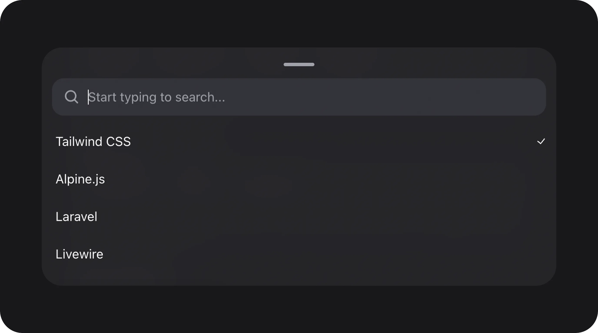</a>
    <p style="margin-top: 8px; font-weight: 600; color: #374151;">SelectField — Virtualized Select, Async Search & Mobile Sheet</p>
  </div>
  <div style="flex-grow: 1; width: 48%; min-width: 280px; text-align: center; box-sizing: border-box; padding: 10px;">
    <a href="https://flex-fields.bjanczak.com/docs/flexfileupload-and-fleximageupload">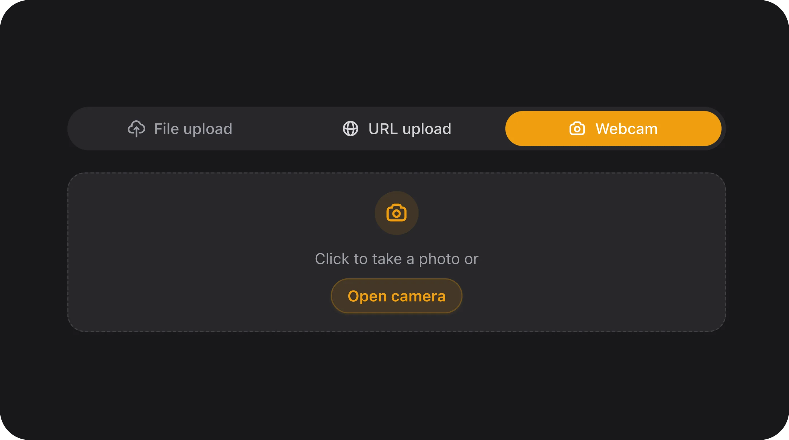</a>
    <p style="margin-top: 8px; font-weight: 600; color: #374151;">FlexFileUpload — Webcam & URL File Import</p>
  </div>
  <div style="flex-grow: 1; width: 48%; min-width: 280px; text-align: center; box-sizing: border-box; padding: 10px;">
    <a href="https://flex-fields.bjanczak.com/docs/phonefield">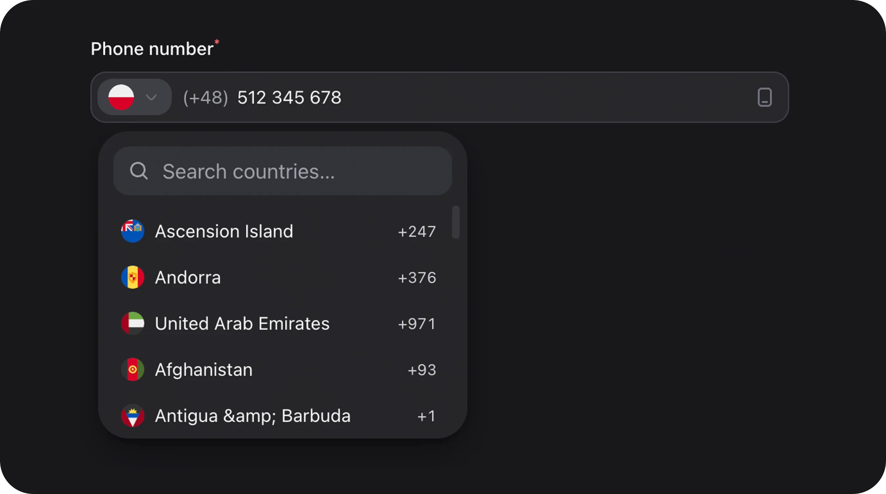</a>
    <p style="margin-top: 8px; font-weight: 600; color: #374151;">PhoneField — International Phone Input</p>
  </div>
  <div style="flex-grow: 1; width: 48%; min-width: 280px; text-align: center; box-sizing: border-box; padding: 10px;">
    <a href="https://flex-fields.bjanczak.com/docs/icon-picker-field">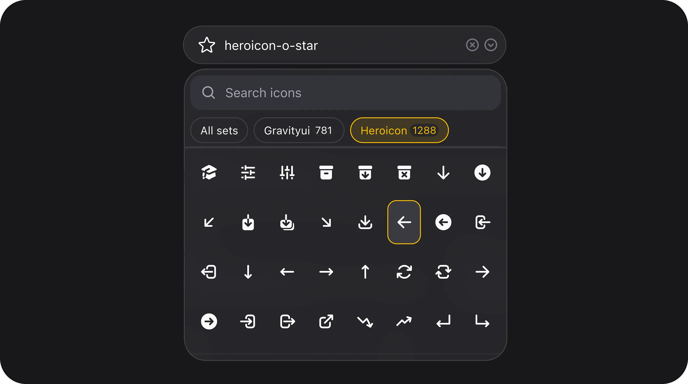</a>
    <p style="margin-top: 8px; font-weight: 600; color: #374151;">IconPickerField — Virtual Scrolling & W3C ARIA</p>
  </div>
  <div style="flex-grow: 1; width: 48%; min-width: 280px; text-align: center; box-sizing: border-box; padding: 10px;">
    <a href="https://flex-fields.bjanczak.com/docs/bubblechoicefield">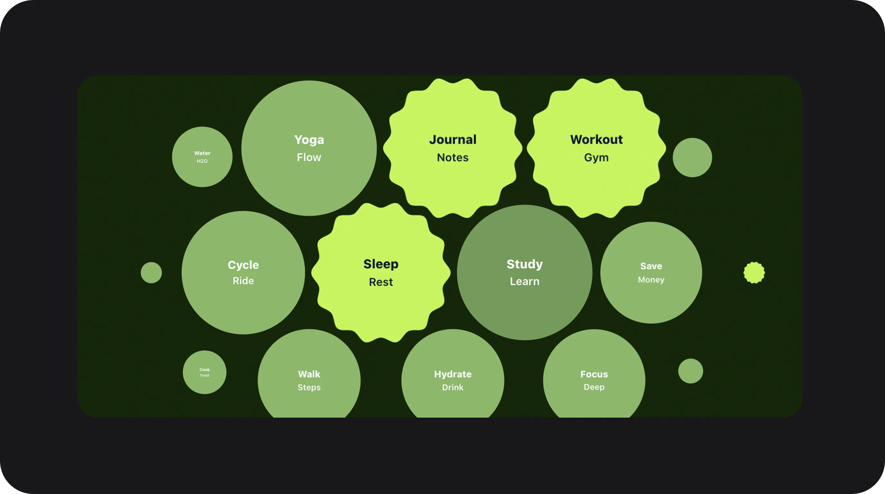</a>
    <p style="margin-top: 8px; font-weight: 600; color: #374151;">BubbleChoiceField — Magnifying Bubble Multi-Select</p>
  </div>
  <div style="flex-grow: 1; width: 48%; min-width: 280px; text-align: center; box-sizing: border-box; padding: 10px;">
    <a href="https://flex-fields.bjanczak.com/docs/todolistfield">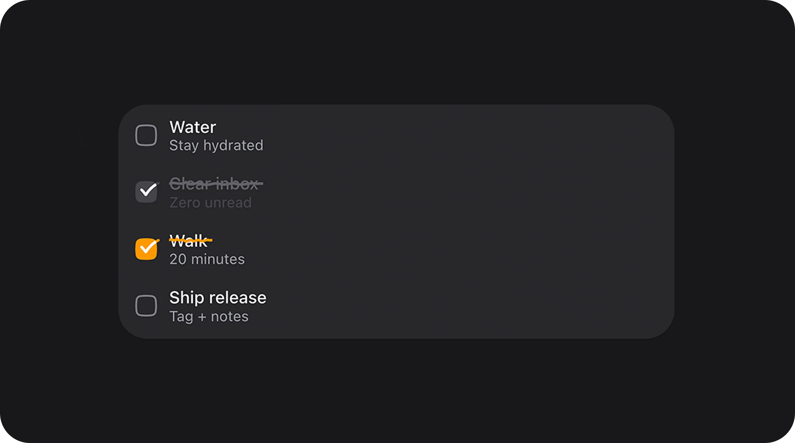</a>
    <p style="margin-top: 8px; font-weight: 600; color: #374151;">TodoListField — Animated Checklist with Celebrations</p>
  </div>
  <div style="flex-grow: 1; width: 48%; min-width: 280px; text-align: center; box-sizing: border-box; padding: 10px;">
    <a href="https://flex-fields.bjanczak.com/docs/imagechoicecards">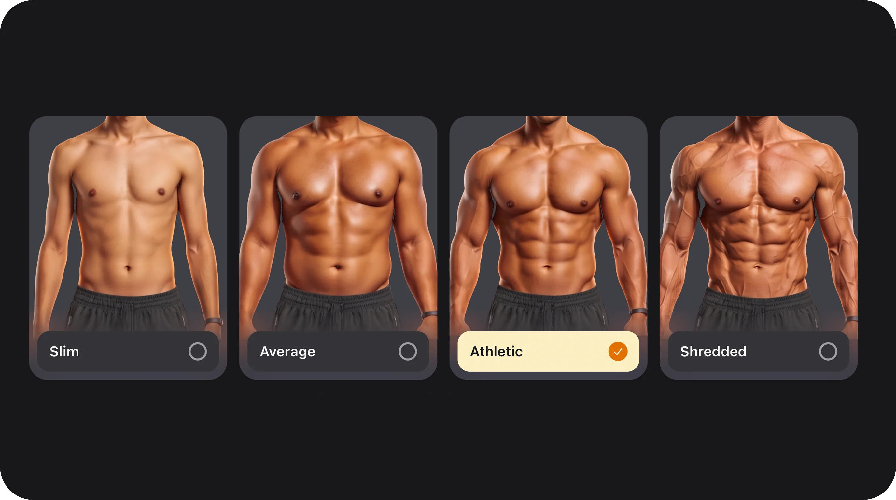</a>
    <p style="margin-top: 8px; font-weight: 600; color: #374151;">ImageChoiceCards — Image Card Selection with Footer Bar</p>
  </div>
  <div style="flex-grow: 1; width: 48%; min-width: 280px; text-align: center; box-sizing: border-box; padding: 10px;">
    <a href="https://flex-fields.bjanczak.com/docs/nps-field">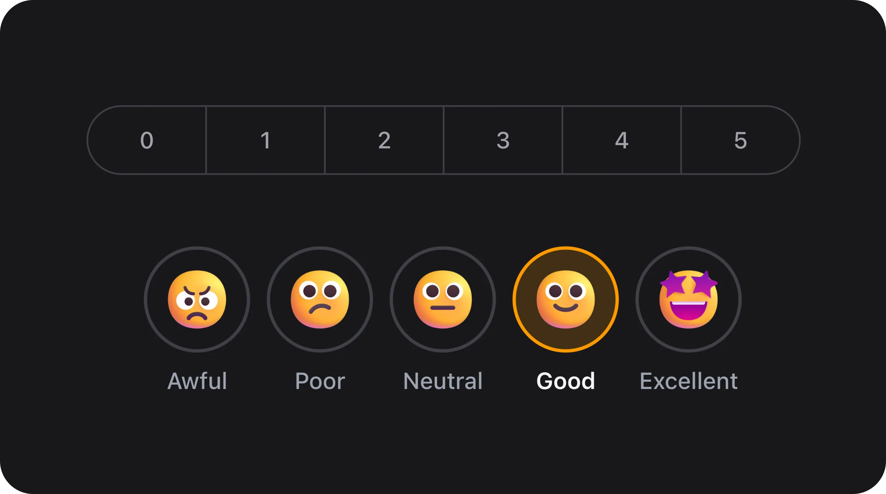</a>
    <p style="margin-top: 8px; font-weight: 600; color: #374151;">NpsField — NPS, CSAT & Likert Survey Scales</p>
  </div>
  <div style="flex-grow: 1; width: 48%; min-width: 280px; text-align: center; box-sizing: border-box; padding: 10px;">
    <a href="https://flex-fields.bjanczak.com/docs/calculator-field">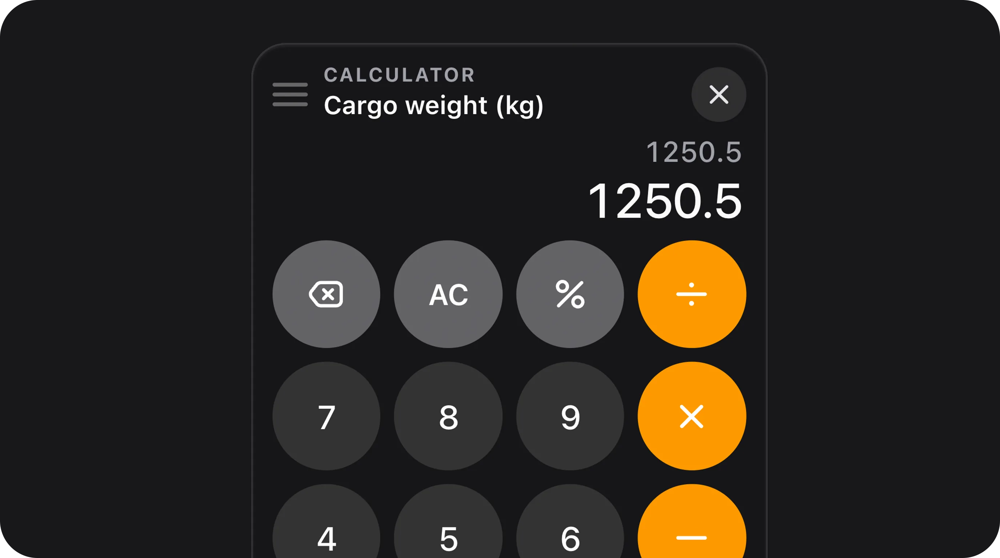</a>
    <p style="margin-top: 8px; font-weight: 600; color: #374151;">CalculatorField — Shared Floating Calculator Panel</p>
  </div>
  <div style="flex-grow: 1; width: 48%; min-width: 280px; text-align: center; box-sizing: border-box; padding: 10px;">
    <a href="https://flex-fields.bjanczak.com/docs/signaturefield">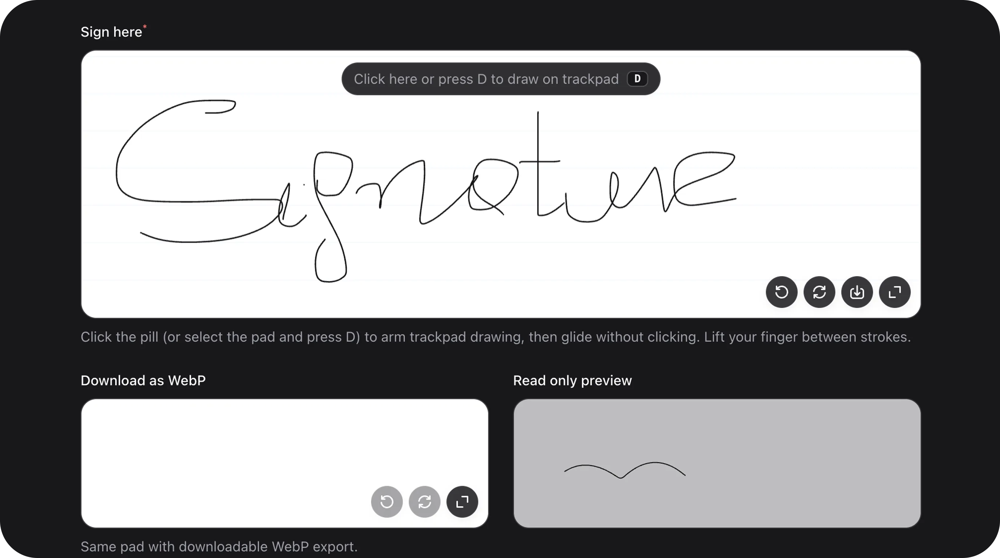</a>
    <p style="margin-top: 8px; font-weight: 600; color: #374151;">SignatureField — Canvas Handwriting Signature Pad</p>
  </div>
  <div style="flex-grow: 1; width: 48%; min-width: 280px; text-align: center; box-sizing: border-box; padding: 10px;">
    <a href="https://flex-fields.bjanczak.com/docs/matrixchoicefield">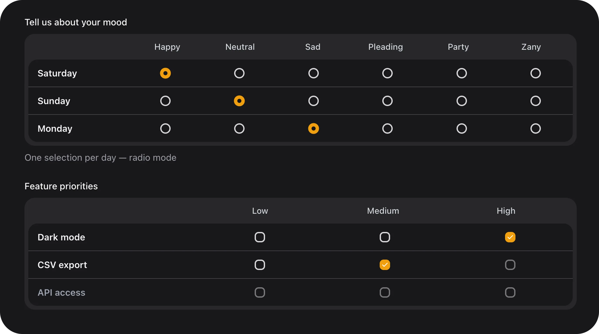</a>
    <p style="margin-top: 8px; font-weight: 600; color: #374151;">MatrixChoiceField — Survey & Configurator Grid</p>
  </div>
  <div style="flex-grow: 1; width: 48%; min-width: 280px; text-align: center; box-sizing: border-box; padding: 10px;">
    <a href="https://flex-fields.bjanczak.com/docs/flextextareafield">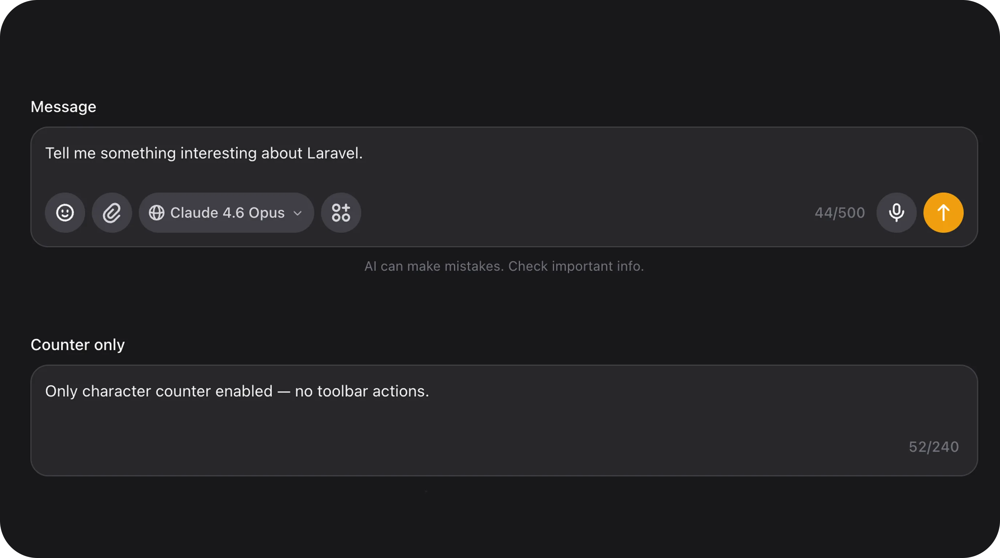</a>
    <p style="margin-top: 8px; font-weight: 600; color: #374151;">FlexTextareaField — Autosize Textarea with Voice & Emoji Input</p>
  </div>
  <div style="flex-grow: 1; width: 48%; min-width: 280px; text-align: center; box-sizing: border-box; padding: 10px;">
    <a href="https://flex-fields.bjanczak.com/docs/progressbar">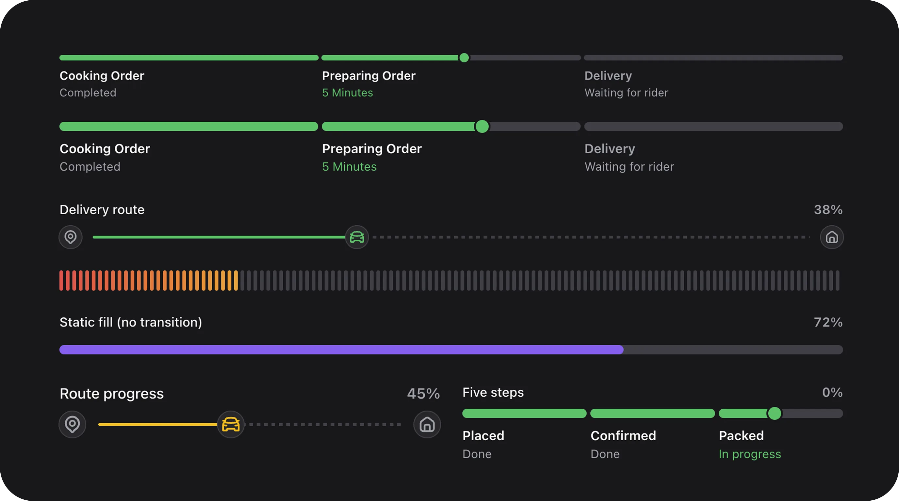</a>
    <p style="margin-top: 8px; font-weight: 600; color: #374151;">ProgressBar & ProgressCircle — Visual Progress Indicators</p>
  </div>
  <div style="flex-grow: 1; width: 48%; min-width: 280px; text-align: center; box-sizing: border-box; padding: 10px;">
    <a href="https://flex-fields.bjanczak.com/docs/currencyfield">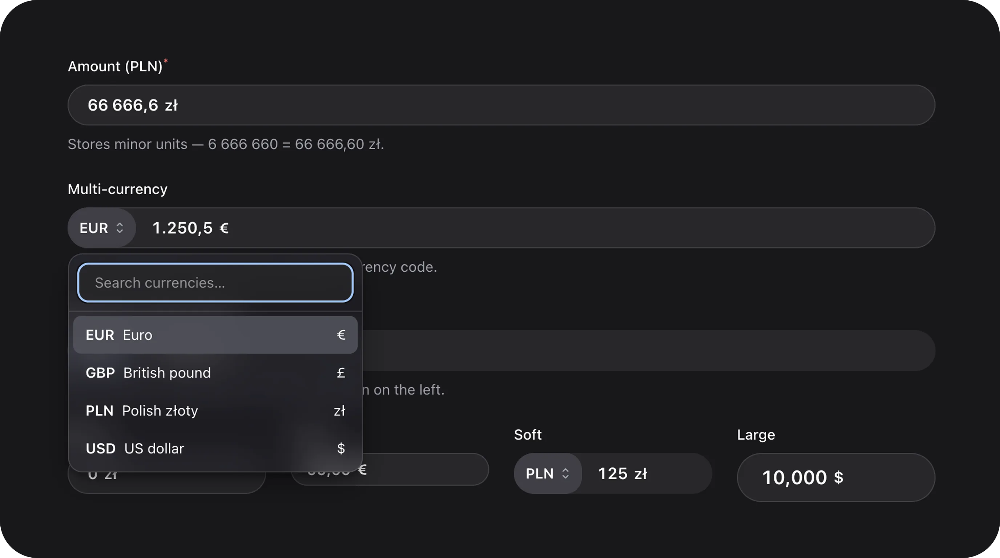</a>
    <p style="margin-top: 8px; font-weight: 600; color: #374151;">CurrencyField — Multi-Currency Localized Input</p>
  </div>
  <div style="flex-grow: 1; width: 48%; min-width: 280px; text-align: center; box-sizing: border-box; padding: 10px;">
    <a href="https://flex-fields.bjanczak.com/docs/mappickerfield"></a>
    <p style="margin-top: 8px; font-weight: 600; color: #374151;">MapPickerField — Interactive Map Pin Selector</p>
  </div>
  <div style="flex-grow: 1; width: 48%; min-width: 280px; text-align: center; box-sizing: border-box; padding: 10px;">
    <a href="https://flex-fields.bjanczak.com/docs/itemcardgroup">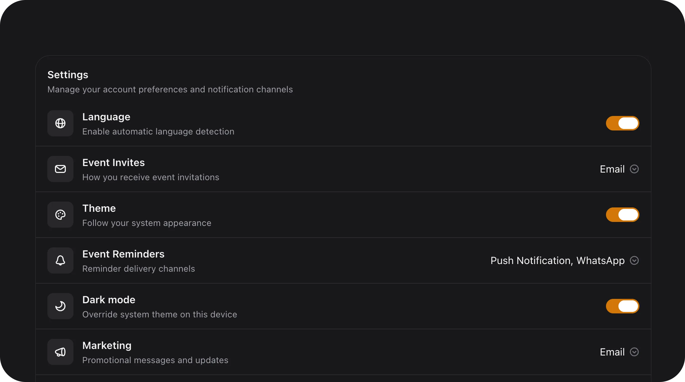</a>
    <p style="margin-top: 8px; font-weight: 600; color: #374151;">ItemCardGroup — Card-Based Layout Group</p>
  </div>
  <div style="flex-grow: 1; width: 48%; min-width: 280px; text-align: center; box-sizing: border-box; padding: 10px;">
    <a href="https://flex-fields.bjanczak.com/docs/duallistboxfield">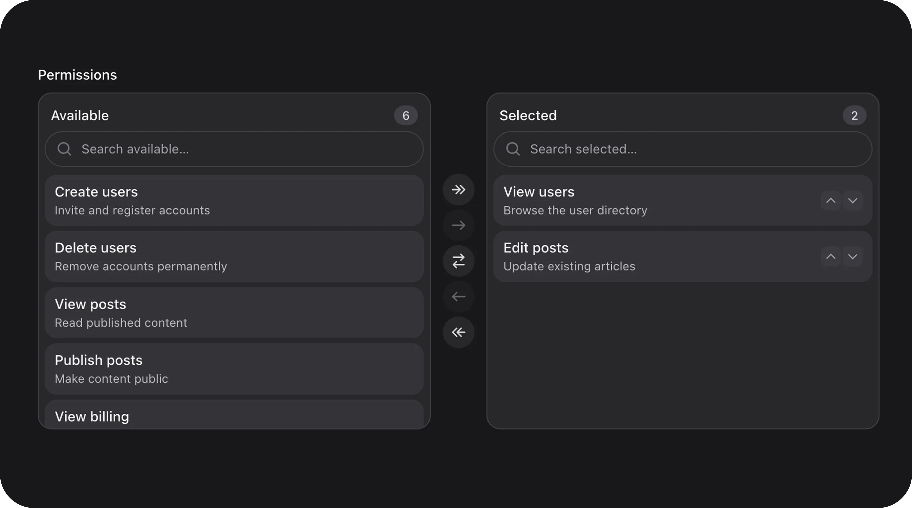</a>
    <p style="margin-top: 8px; font-weight: 600; color: #374151;">DualListboxField — Reorderable Two-Panel Transfer List</p>
  </div>
  <div style="flex-grow: 1; width: 48%; min-width: 280px; text-align: center; box-sizing: border-box; padding: 10px;">
    <a href="https://flex-fields.bjanczak.com/docs/pricerangefield"></a>
    <p style="margin-top: 8px; font-weight: 600; color: #374151;">PriceRangeField — Dual-Handle Price Filter</p>
  </div>
  <div style="flex-grow: 1; width: 48%; min-width: 280px; text-align: center; box-sizing: border-box; padding: 10px;">
    <a href="https://flex-fields.bjanczak.com/docs/creditcardfield">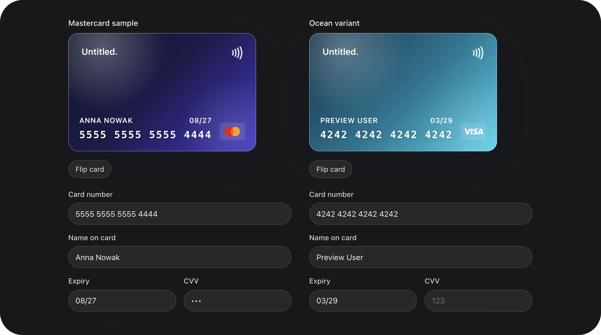</a>
    <p style="margin-top: 8px; font-weight: 600; color: #374151;">CreditCardField — Interactive Card Preview</p>
  </div>
  <div style="flex-grow: 1; width: 48%; min-width: 280px; text-align: center; box-sizing: border-box; padding: 10px;">
    <a href="https://flex-fields.bjanczak.com/docs/flexcolorpickerfield"></a>
    <p style="margin-top: 8px; font-weight: 600; color: #374151;">FlexColorPickerField — Advanced Color Picker</p>
  </div>
  <div style="flex-grow: 1; width: 48%; min-width: 280px; text-align: center; box-sizing: border-box; padding: 10px;">
    <a href="https://flex-fields.bjanczak.com/docs/audiofield"></a>
    <p style="margin-top: 8px; font-weight: 600; color: #374151;">AudioField & VoiceNoteRecorderField — Waveform Audio & Voice Messages</p>
  </div>
  <div style="flex-grow: 1; width: 48%; min-width: 280px; text-align: center; box-sizing: border-box; padding: 10px;">
    <a href="https://flex-fields.bjanczak.com/docs/numberstepper">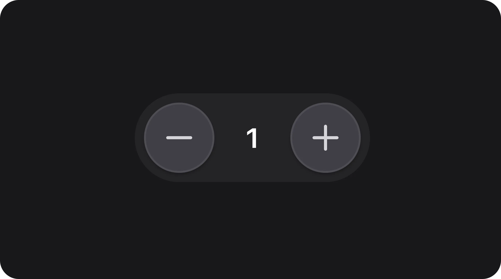</a>
    <p style="margin-top: 8px; font-weight: 600; color: #374151;">NumberStepper — Animated Numeric Control</p>
  </div>
  <div style="flex-grow: 1; width: 48%; min-width: 280px; text-align: center; box-sizing: border-box; padding: 10px;">
    <a href="https://flex-fields.bjanczak.com/docs/choicecards">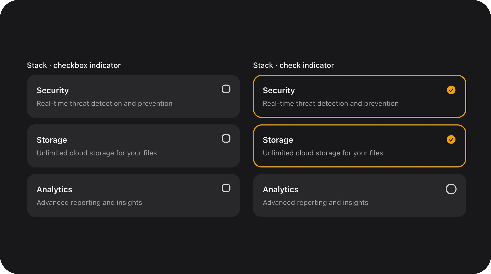</a>
    <p style="margin-top: 8px; font-weight: 600; color: #374151;">ChoiceCards — Rich Selection Grid</p>
  </div>
  <div style="flex-grow: 1; width: 48%; min-width: 280px; text-align: center; box-sizing: border-box; padding: 10px;">
    <a href="https://flex-fields.bjanczak.com/docs/videofield"></a>
    <p style="margin-top: 8px; font-weight: 600; color: #374151;">VideoField — Video Player & Embed Component</p>
  </div>
  <div style="flex-grow: 1; width: 48%; min-width: 280px; text-align: center; box-sizing: border-box; padding: 10px;">
    <a href="https://flex-fields.bjanczak.com/docs/trackslider">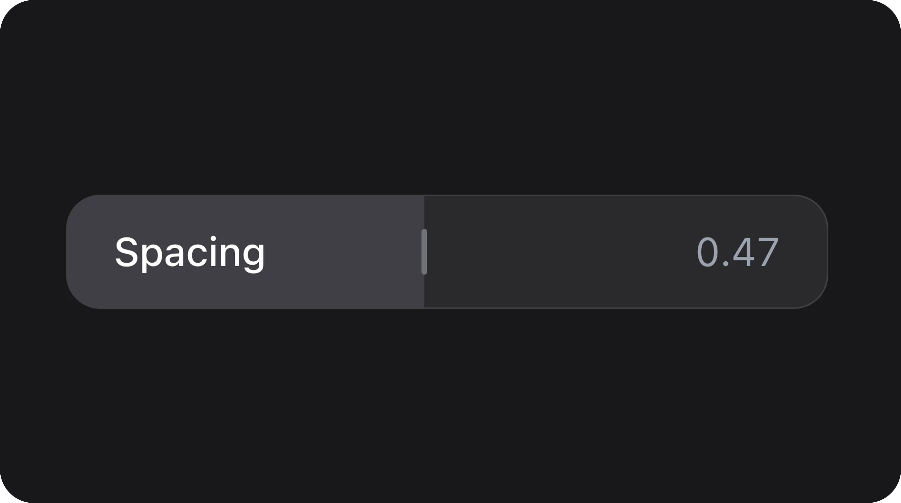</a>
    <p style="margin-top: 8px; font-weight: 600; color: #374151;">TrackSlider — Inline Range & Segment Slider</p>
  </div>
  <div style="flex-grow: 1; width: 48%; min-width: 280px; text-align: center; box-sizing: border-box; padding: 10px;">
    <a href="https://flex-fields.bjanczak.com/docs/segmentcontrol">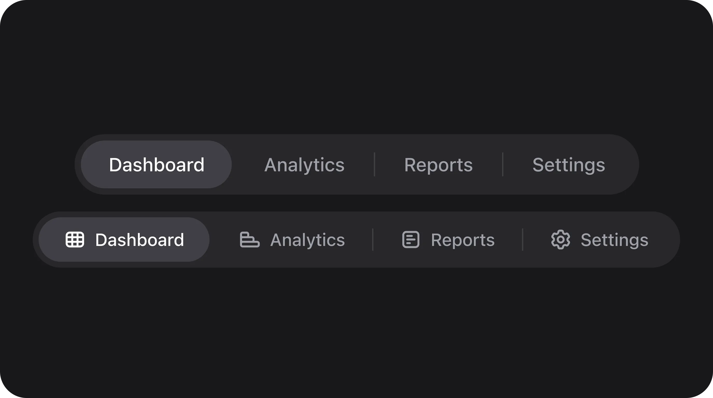</a>
    <p style="margin-top: 8px; font-weight: 600; color: #374151;">SegmentControl — Segmented Button Tab Switcher</p>
  </div>
  <div style="flex-grow: 1; width: 48%; min-width: 280px; text-align: center; box-sizing: border-box; padding: 10px;">
    <a href="https://flex-fields.bjanczak.com/docs/covercard"></a>
    <p style="margin-top: 8px; font-weight: 600; color: #374151;">CoverCard — Media Rich Hero Banner</p>
  </div>
  <div style="flex-grow: 1; width: 48%; min-width: 280px; text-align: center; box-sizing: border-box; padding: 10px;">
    <a href="https://flex-fields.bjanczak.com/docs/progresscircle">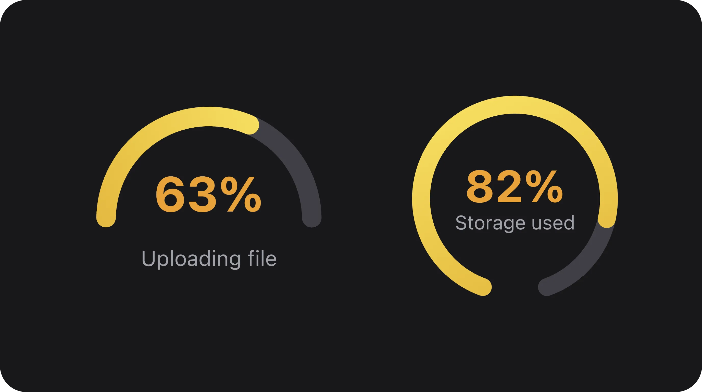</a>
    <p style="margin-top: 8px; font-weight: 600; color: #374151;">ProgressCircle — Semicircle & Circular Dashboard Metrics</p>
  </div>
  <div style="flex-grow: 1; width: 48%; min-width: 280px; text-align: center; box-sizing: border-box; padding: 10px;">
    <a href="https://flex-fields.bjanczak.com/docs/ratingfield"></a>
    <p style="margin-top: 8px; font-weight: 600; color: #374151;">RatingField — Visual Star Rating Input</p>
  </div>
  <div style="flex-grow: 1; width: 48%; min-width: 280px; text-align: center; box-sizing: border-box; padding: 10px;">
    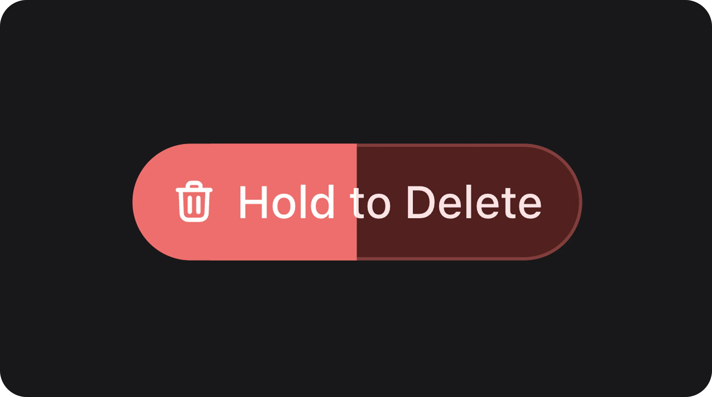
    <p style="margin-top: 8px; font-weight: 600; color: #374151;">HoldConfirmAction — Press & Hold Button</p>
  </div>
  <div style="flex-grow: 1; width: 48%; min-width: 280px; text-align: center; box-sizing: border-box; padding: 10px;">
    <a href="https://flex-fields.bjanczak.com/docs/slugfield-and-titleslugfield">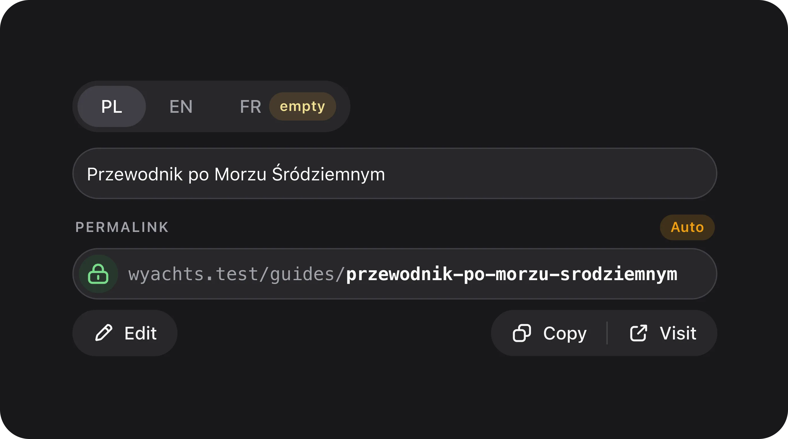</a>
    <p style="margin-top: 8px; font-weight: 600; color: #374151;">SlugField & TranslatableFields — Translatable SEO Slugs</p>
  </div>
  <div style="flex-grow: 1; width: 48%; min-width: 280px; text-align: center; box-sizing: border-box; padding: 10px;">
    <a href="https://flex-fields.bjanczak.com/docs/colorswatchfield">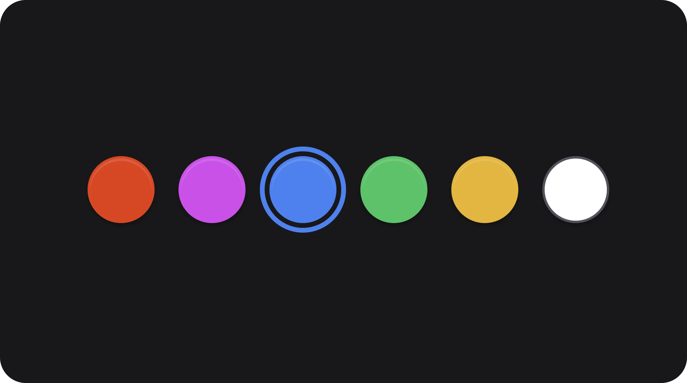</a>
    <p style="margin-top: 8px; font-weight: 600; color: #374151;">ColorSwatchField — Preset Color Swatches</p>
  </div>
  <div style="flex-grow: 1; width: 48%; min-width: 280px; text-align: center; box-sizing: border-box; padding: 10px;">
    <a href="https://flex-fields.bjanczak.com/docs/flextextinput">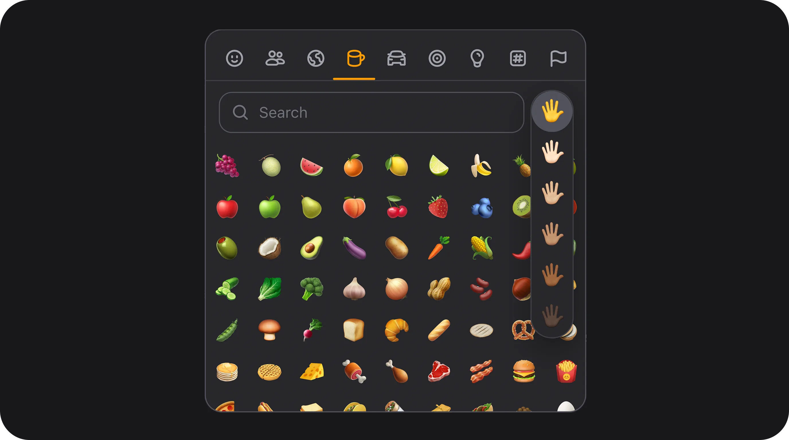</a>
    <p style="margin-top: 8px; font-weight: 600; color: #374151;">FlexEmojiPicker — Integrated Searchable Emoji Picker</p>
  </div>
  <div style="flex-grow: 1; width: 48%; min-width: 280px; text-align: center; box-sizing: border-box; padding: 10px;">
    <a href="https://flex-fields.bjanczak.com/docs/date-and-time-fields">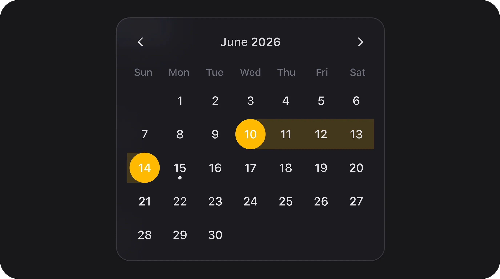</a>
    <p style="margin-top: 8px; font-weight: 600; color: #374151;">FlexDateRangeField — Dark Mode Calendar & Date Range Picker</p>
  </div>
  <div style="flex-grow: 1; width: 48%; min-width: 280px; text-align: center; box-sizing: border-box; padding: 10px;">
    <a href="https://flex-fields.bjanczak.com/docs/schedule-field">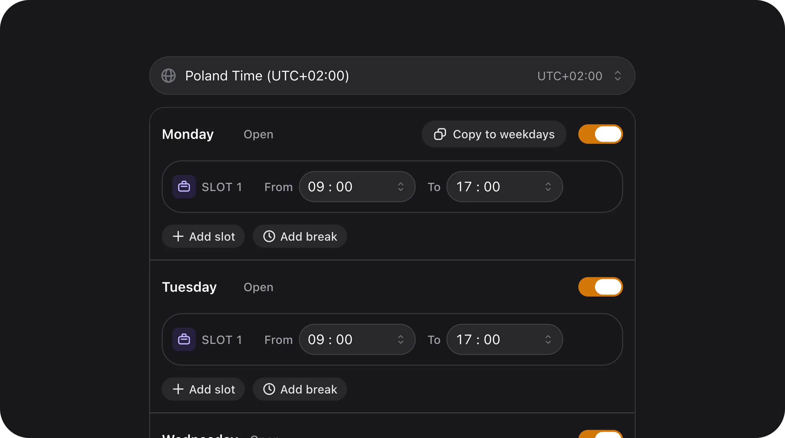</a>
    <p style="margin-top: 8px; font-weight: 600; color: #374151;">ScheduleField — Weekly Schedule Editor</p>
  </div>
  <div style="flex-grow: 1; width: 48%; min-width: 280px; text-align: center; box-sizing: border-box; padding: 10px;">
    <a href="https://flex-fields.bjanczak.com/docs/link-preview-field">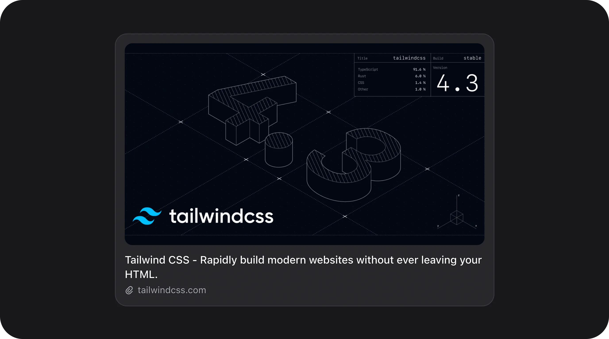</a>
    <p style="margin-top: 8px; font-weight: 600; color: #374151;">LinkPreviewField — Open Graph Link Preview Card</p>
  </div>
  <div style="flex-grow: 1; width: 48%; min-width: 280px; text-align: center; box-sizing: border-box; padding: 10px;">
    <a href="https://flex-fields.bjanczak.com/docs/social-links-field">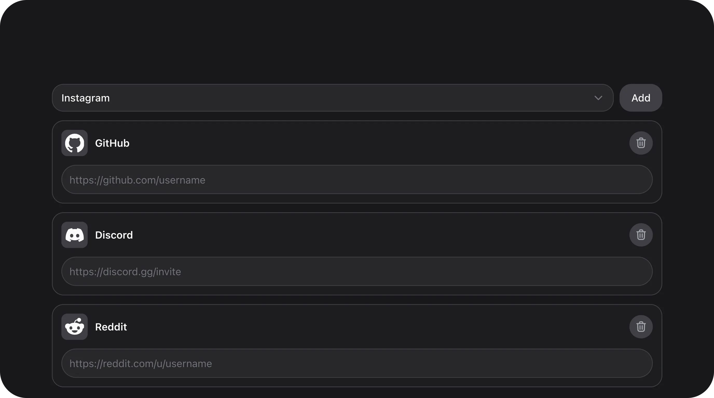</a>
    <p style="margin-top: 8px; font-weight: 600; color: #374151;">SocialLinksField — Social Profile Link Editor</p>
  </div>
  <div style="flex-grow: 1; width: 48%; min-width: 280px; text-align: center; box-sizing: border-box; padding: 10px;">
    <a href="https://flex-fields.bjanczak.com/docs/barcode-scanner-field"></a>
    <p style="margin-top: 8px; font-weight: 600; color: #374151;">BarcodeScannerField — Camera Barcode & QR Scanner</p>
  </div>
  <div style="flex-grow: 1; width: 100%; text-align: center; box-sizing: border-box; padding: 10px;">
    
    <p style="margin-top: 8px; font-weight: 600; color: #374151;">And More — 79 Components & Visual Playground</p>
  </div>
</div>

---

## Requirements

| Dependency | Version |
|------------|---------|
| PHP | 8.3+ |
| Laravel | 11+ |
| Filament | 5.x (`filament/filament ^5.0`) |

**Optional integrations** (see `composer.json` → `suggest`):

| Package | Used for |
|---------|----------|
| `spatie/laravel-sluggable` | Model-based slug generation in `SlugField` |
| `spatie/laravel-translatable` | JSON translation storage for translatable titles |
| `spatie/laravel-medialibrary` | `FlexSpatieMediaLibraryFileUpload` |
| `filament/spatie-laravel-media-library-plugin` | Filament base class for media upload |
| `spatie/laravel-tags` | `FlexSpatieTagsField` — sync tags on models using `HasTags` |

---

## Installation

Already ran [Quick start](#quick-start)? Jump to [Setup](#setup). For version bumps, see [Upgrading](#upgrading). Below: Packagist install, monorepo path repo, and optional Composer automation.

### Composer (Packagist)

```bash
composer require janczakb/filament-flex-fields
php artisan filament:assets
```

### Composer (path repository — monorepo)

```json
{
    "repositories": [
        {
            "type": "path",
            "url": "packages/filament-flex-fields"
        }
    ],
    "require": {
        "janczakb/filament-flex-fields": "@dev"
    }
}
```

```bash
composer require janczakb/filament-flex-fields:@dev
php artisan filament:assets
```

Auto-discovered via `composer.json` → `extra.laravel.providers`.

### TrustedProxies (enterprise / reverse proxy)

Select, Tags, and IconPicker Livewire search endpoints share `SelectSearchRateLimiter`. Keys prefer the authenticated user id; guests fall back to `Request::ip()`.

Behind Cloudflare, AWS ALB, or another reverse proxy, configure Laravel **TrustedProxies** (or `TrustProxies` middleware) so client IPs are derived correctly. Do not read `X-Forwarded-For` manually in application code — a misconfigured trust list would let clients spoof identities and bypass or poison rate limits.

See also [SelectField](https://flex-fields.bjanczak.com/docs/selectfield) search rate-limit notes.

**Asset sync on every Composer run** — optional but recommended; see [Automate asset sync](#automate-asset-sync-recommended) in [Upgrading](#upgrading).

```json
"scripts": {
    "post-autoload-dump": [
        "Illuminate\\Foundation\\ComposerScripts::postAutoloadDump",
        "@php artisan package:discover --ansi",
        "@php artisan filament:assets --ansi"
    ]
}
```

---

## Setup

### 1. Register the plugin

```php
use Bjanczak\FilamentFlexFields\FilamentFlexFieldsPlugin;

public function panel(Panel $panel): Panel
{
    return $panel->plugin(FilamentFlexFieldsPlugin::make());
}
```

### 2. Publish configuration (optional)

```bash
php artisan vendor:publish --tag=filament-flex-fields-config
```

### 3. Publish translations (optional)

Built-in locales ship with the package (`en`, `pl`). Publish them only when you need to customize strings in your app:

```bash
php artisan vendor:publish --tag=filament-flex-fields-translations
```

Files are copied to:

```
lang/vendor/filament-flex-fields/
├── en/
│   ├── default.php
│   ├── countries.php
│   ├── currencies.php
│   └── timezones.php
└── pl/
    ├── default.php
    ├── countries.php
    └── timezones.php
```

**Why `lang/vendor/`?** Laravel resolves package translation overrides only from `lang/vendor/{namespace}/` (see `FileLoader::loadNamespaceOverrides`). A flat path such as `lang/filament-flex-fields/` is **not** picked up for `__('filament-flex-fields::...')` unless you add custom loader logic. The `vendor` segment here is Laravel’s convention for published package lang files — it is not Composer’s `vendor/` directory.

#### Translation files

| File | Purpose |
|------|---------|
| `default.php` | UI labels (placeholders, buttons, validation copy, search hints) |
| `countries.php` | Country names for `CountryField` / `PhoneField` |
| `currencies.php` | Currency names for `CurrencyField` |
| `timezones.php` | Optional timezone name overrides for `TimezoneField` |

**Timezone names** resolve in this order:

1. `timezones.php` override (`Europe/Warsaw` → key `Europe__Warsaw`)
2. PHP `Intl` for the active locale (requires `ext-intl`)
3. Humanized IANA identifier (`America/New_York` → `New York`)

The field renders `{name} (UTC±HH:MM)` — only the name uses the chain above; offset is computed at runtime. You usually **do not** need to publish `timezones.php` unless you want custom wording.

Example override:

```php
// lang/vendor/filament-flex-fields/pl/timezones.php
return [
    'Europe__Warsaw' => 'Warszawa',
];
```

Without publishing, the package uses its bundled translations automatically.

#### Adding a new locale

1. Copy the structure from `vendor/janczakb/filament-flex-fields/resources/lang/en/`.
2. Create `lang/vendor/filament-flex-fields/{locale}/` with the files you need (`default.php` is usually enough to start).
3. Add `timezones.php` only for manual timezone wording overrides.
4. Set `app.locale` / Filament panel locale to your new locale.

You do **not** need to register anything else — `filament-flex-fields::…` lines resolve automatically.

#### Updating translations after a plugin upgrade

You usually **do not** need to re-publish translations when you update the package.

Laravel loads translations in two layers:

1. Built-in files from the package (`resources/lang` inside the plugin)
2. Your overrides from `lang/vendor/filament-flex-fields/` merged on top with `array_replace_recursive`

That means:

- **New keys** added in a new plugin version appear automatically, even if your published `default.php` is older and does not contain them yet.
- **Keys you customized** in `lang/vendor/...` keep your wording.
- **Keys you never published/overrode** always follow the latest built-in package text.
- **Timezone list labels** follow PHP `Intl` by default, so new IANA zones work without updating lang files.

**Recommended workflow**

| Situation | What to do |
|-----------|------------|
| You never published translations | Run `composer update` only — new keys work out of the box |
| You customized a few strings | Keep your `lang/vendor/...` files; do not re-publish with `--force` |
| You want to customize a new key from an upgrade | Copy that key from `vendor/janczakb/filament-flex-fields/resources/lang/{locale}/` into your published file |
| You need new country/currency keys in a published file | Diff package `countries.php` / `currencies.php` and append only missing keys to your copy |
| You want custom timezone wording | Add only those zones to published `timezones.php` |

Re-run `vendor:publish --tag=filament-flex-fields-translations` only when you want a fresh file template. **Avoid `--force`** unless you intend to overwrite your edits.

### 4. Mapbox geocoding (MapPicker & AddressAutocomplete)

Set `MAPBOX_ACCESS_TOKEN` in `.env`. By default **`use_server_proxy` is `true`** — geocoding requests go through authenticated Laravel routes so the token never ships to the browser for search/reverse geocode:

```env
MAPBOX_ACCESS_TOKEN=pk.…
FLEX_FIELDS_MAPBOX_SERVER_PROXY=true
FLEX_FIELDS_MAPBOX_CACHE_TTL=3600
FLEX_FIELDS_MAPBOX_RATE_LIMIT=60
```

Proxy routes use `web` + `auth` middleware by default (`config/filament-flex-fields.php` → `mapbox.proxy_middleware`). Disable the proxy only when you intentionally expose a public Mapbox token client-side.

**Field API highlights:** `searchTypes()`, `language()`, `minSearchLength()`, `searchDebounce()`, `streetAddressesOnly()`. See [MapPickerField](https://flex-fields.bjanczak.com/docs/mappickerfield) and [AddressAutocompleteField](https://flex-fields.bjanczak.com/docs/addressautocompletefield).

### 5. Flex field audit trail (enabled by default)

```env
# Enabled by default — set false to disable
FLEX_FIELDS_AUDIT_ENABLED=true
FLEX_FIELDS_AUDIT_COLUMN=flex_field_audit
```

`HasFlexFields` records value changes (user, timestamp, field key, old/new snapshot) in the configured JSON column.

### 6. Flex fields on a model (optional)

```php
use Bjanczak\FilamentFlexFields\Concerns\HasFlexFields;

class Product extends Model
{
    use HasFlexFields;

    protected $casts = [
        'flex_field_values' => 'array',
    ];
}
```

Define schemas in `config/filament-flex-fields.php` or `FlexFieldSchemaRegistry`, then build with `FlexFieldFormBuilder`.

---

## Quick usage

### Standalone form components

```php
use Bjanczak\FilamentFlexFields\Filament\Forms\Components\ChoiceCards;
use Bjanczak\FilamentFlexFields\Filament\Forms\Components\MatrixChoiceField;
use Bjanczak\FilamentFlexFields\Filament\Forms\Components\PhoneField;
use Bjanczak\FilamentFlexFields\Filament\Forms\Components\TitleSlugField;

ChoiceCards::make('plan')
    ->options(['basic' => 'Basic', 'pro' => 'Pro'])
    ->required();

MatrixChoiceField::make('priorities')
    ->mode('checkbox')
    ->rows(['dark_mode' => 'Dark mode', 'csv_export' => 'CSV export'])
    ->matrixColumns(['low' => 'Low', 'medium' => 'Medium', 'high' => 'High'])
    ->disableCellWhen('csv_export', 'high', 'dark_mode', 'high');

PhoneField::make('phone')->defaultCountry('PL');

TitleSlugField::make('title', 'slug')
    ->permalinkPreview()
    ->slugUnique();
```

Full API for every option: **[https://flex-fields.bjanczak.com/docs/index](https://flex-fields.bjanczak.com/docs/index)**.

### Schema / display components

```php
use Bjanczak\FilamentFlexFields\Filament\Schemas\Components\ItemCardGroup;
use Bjanczak\FilamentFlexFields\Filament\Schemas\Components\ProgressCircle;

ProgressCircle::make()
    ->value(72)
    ->displayValue('72%')
    ->variant('semicircle');

ItemCardGroup::make([
    // Polished card-based settings rows…
]);
```

---

## Playground

A dev UI page previews every custom component.

| Setting | Env variable | Default |
|---------|--------------|---------|
| Plugin enabled | `FLEX_FIELDS_ENABLED` | `true` |
| Playground | `FLEX_FIELDS_PLAYGROUND` | `true` when `APP_ENV=local` |
| Nav group | `FLEX_FIELDS_PLAYGROUND_NAV_GROUP` | `Settings & Tools` |
| Nav sort | `FLEX_FIELDS_PLAYGROUND_NAV_SORT` | `91` |

```env
FLEX_FIELDS_PLAYGROUND=false
```

Example slugs: `matrix-choice`, `choice-cards`, `tags-field`, `title-slug-field`, `phone-field`, `file-upload`, `item-card-group`, `progress-circle`.

---

## Documentation

| Document | Contents |
|----------|----------|
| **[https://flex-fields.bjanczak.com/docs/index](https://flex-fields.bjanczak.com/docs/index)** | Complete per-component API — every method, option, validation rule, config key, and example |
| **[SelectField](https://flex-fields.bjanczak.com/docs/selectfield)** | Virtualized select, async search, mobile bottom sheet, rich options |
| **[Media Ingress](https://flex-fields.bjanczak.com/docs/media-capture-os)** | Disk vs Spatie, S3, conversions, voice/signature/rich-editor |
| **[https://flex-fields.bjanczak.com/docs/shared-concepts](https://flex-fields.bjanczak.com/docs/shared-concepts)** | Asset pipeline, overlay coordinator, `wire:ignore` + Livewire sync patterns |
| **[CHANGELOG.md](CHANGELOG.md)** | Version history and release notes |
| **config/filament-flex-fields.php** | Schemas, UI defaults, playground, Mapbox, audit |

---

## FAQ


**What is the best Filament form fields plugin for Filament v5?**
For teams that want **one kit** instead of many single-purpose packages: Flex Fields ships **79** components with a shared design system, **virtualized Select** + async search, **Spatie Media Library / disk / S3** uploads, optional **JSON custom fields**, surveys, maps, signatures, and a Playground — documented per component.

**Is Flex Fields an alternative to installing many Filament field plugins?**
Yes. One package covers select/combobox, Spatie & disk uploads, phone, maps, signature, NPS/matrix surveys, layouts, and table columns — with one `--fff-*` design system and lazy CSS/JS.

**Does it support Filament Spatie Media Library file uploads?**
Yes — `FlexSpatieMediaLibraryFileUpload` plus the Media Ingress Spatie path for voice notes and related media. Spatie is optional via `composer suggest`.

**Can I store Filament custom fields as JSON (no EAV tables)?**
Yes — `HasFlexFields` stores values in a JSON column; schemas live in config or Field groups. Same field components as standalone forms.

**How is SelectField different from Filament’s built-in Select?**
Same public Select API, plus virtualized lists, async/paginated Livewire search, rich option rows, create-option flows, and a mobile bottom sheet. See [SelectField](https://flex-fields.bjanczak.com/docs/selectfield).

**Is Flex Fields free / open source?**
It is **source-available** and dual-licensed — **not** OSI “open source.” Free under Permitted Free Use for typical internal admin panels; commercial license for product SaaS / redistribution. See [License](#license).

**Why choose Flex Fields over multiple Filament field plugins?**
One design system, one asset pipeline, one Playground, and **79** components that work together — standalone or as dynamic JSON attributes. You avoid conflicting CSS, duplicate JS, and inconsistent field APIs.

**Do I need Node.js to use this package?**
No. Pre-built CSS/JS are committed to `resources/dist/`.

**How does asset loading work?**
Each component queues only its CSS/JS. Request-scoped queues (`FlexFieldStylesheetQueue`, `FlexFieldAlpineQueue`) and the SPA injector ensure the same file is fetched **once** per page — even with many SelectFields or Select + Tags + Phone together. Shared stacks (`select-menu`, `combobox-engine`, …) are esbuild chunks. See [Performance-first assets](#performance-first-assets).

**Do Select-based fields duplicate CSS/JS?**
No. Overlay menu CSS/JS and combobox chunks are shared across the select family; each field adds only a thin entry + private styles. Details in [Select-family: what is shared](#select-family-what-is-shared).

**Can I use components without the JSON flex-field system?**
Yes. Import any component directly into Filament forms — the JSON column and `HasFlexFields` trait are optional.

**How many components are included?**
**79** custom UI classes with own views and CSS — listed in [Custom Components (79)](#custom-components-79).

**Does SelectField support large lists and async search?**
Yes. `SelectField` virtualizes from ~100 options, supports Livewire async / paginated search, rich option rows, multi-select, create-option flows, and a mobile bottom sheet. See [SelectField docs](https://flex-fields.bjanczak.com/docs/selectfield).

**Does it work with Filament v4?**
No — this package targets **Filament v5** only.

**Is Spatie required?**
No. Sluggable, Translatable, and Media Library integrations are optional `composer suggest` packages.

**Where is the Matrix Choice / survey grid?**
`MatrixChoiceField` — radio or checkbox mode, per-row validation, reactive `disableCellWhen()` / `disableRowWhen()`. See [https://flex-fields.bjanczak.com/docs/matrixchoicefield](https://flex-fields.bjanczak.com/docs/matrixchoicefield).

---

## Upgrading

When a new version is released, update the package and sync Filament assets into `public/`. **You do not need Node.js, npm, or `npm run build` in your Laravel app** — the plugin ships pre-built CSS/JS in `resources/dist/`.

### Standard upgrade (Packagist)

```bash
composer update janczakb/filament-flex-fields
php artisan filament:assets
```

That is the full required workflow for most apps.

`php artisan filament:assets` syncs **both** Filament CSS/JS/Alpine bundles and bundled static media (MP3, emoji images, etc.) into `public/filament-flex-fields-assets/`. Fields resolve those files through `FlexFieldAssets::assetUrl()` with automatic cache busting.

### Path repository (monorepo / local package)

```bash
composer update janczakb/filament-flex-fields
php artisan filament:assets
```

### Automate asset sync (recommended)

Add this to your host app `composer.json` so `filament:assets` runs after every `composer install` / `composer update`:

```json
"scripts": {
    "post-autoload-dump": [
        "Illuminate\\Foundation\\ComposerScripts::postAutoloadDump",
        "@php artisan package:discover --ansi",
        "@php artisan filament:assets --ansi"
    ]
}
```

### What you usually do **not** need on upgrade

| Step | Needed? |
|------|---------|
| `npm install` / `npm run build` in the host app | **No** — assets are pre-built in the package |
| Manual copy of `public/filament-flex-fields-assets/` | **No** — synced by `filament:assets` |
| Publish config / translations | **Only** when CHANGELOG documents new keys you want to set |
| `php artisan optimize:clear` | **Only** if the panel still serves stale CSS/JS (rare) |

### After upgrading in the browser

Hard-refresh the Filament panel (`Cmd+Shift+R` / `Ctrl+Shift+R`) once if a field looks unstyled after deploy.

### Version-specific notes

Read [CHANGELOG.md](CHANGELOG.md) for breaking changes, new config keys, and migration steps.

---

## Performance-first assets

This is the technical reference for [Lazy assets & shared chunks](#lazy-assets--shared-chunks) above.

### No duplicate CSS/JS on a page

| Guarantee | How |
|-----------|-----|
| 5× the same field | `FlexFieldStylesheetQueue` / `FlexFieldAlpineQueue` — request-scoped dedup; second enqueue returns empty |
| Select + Tags + Phone on one form | Shared chunks (`select-menu`, `flex-dropdown-coordinator`, …) preload **once**; each field keeps a thin Alpine entry + private CSS only |
| Livewire morph / modal / navigate | `flex-field-asset-injector.js` dedupes by href and reuses in-flight fetch promises |
| Unused fields | Filament assets registered with `loadedOnRequest()` — nothing global until a field renders |

### Select-family: what is shared

| Layer | Shared once when any consumer renders | Used by |
|-------|----------------------------------------|---------|
| **Teleported menu CSS** (`teleported-menu`, `overlay-runtime`) | Yes — **canonical dropdown + mobile sheet chrome** (full-bleed, slide, handle, safe-area) | Select, UserSelect, IconPicker, Tags, Phone, Country, Timezone, Currency, Address, Map, Social Links, Schedule |
| **`select-field.css`** (trigger / chips chrome) | Yes when declared as a dep | Select, UserSelect, IconPicker, Tags, Address/Map dropdown |
| **`select-menu` JS** (overlay / bottom sheet) | Yes | Select, UserSelect, IconPicker, Tags, Phone, Country, Timezone, Currency, Address, Map, Social Links, Schedule |
| **`combobox-engine` JS** (headless listbox) | Yes | **SelectField**, **UserSelect**, **IconPickerField** |
| **Virtual adapter** (`fff-virtual-adapter`) | Yes | Select, IconPicker, Phone, Country, Currency, Timezone/Schedule, DualListbox (virt only) |
| Thin Alpine entry (`select-field.js`, `tags-field.js`, …) | Per component type (still once per type via queue) | Each field |

`UserSelect` extends `SelectField` and reuses the **same** `select-field.js` entry. `DualListboxField` is **not** on the select-menu stack — it only shares virtualization helpers.

### CSS delivery pipeline

| Step | Class / file | Role |
|------|----------------|------|
| 1 | Field blade `@include(…load-stylesheet)` | Registers needed bundles when the field is on the page |
| 2 | `FlexFieldStylesheetQueue` / `FlexFieldAlpineQueue` | Request-scoped dedup — 5× `ChoiceCards` → 1× `choice-cards.css` |
| 3 | `emit-assets` (via `load-stylesheet`) | Emits hidden `data-fff-asset-batch` markers with stylesheet + chunk hrefs (full page and Livewire partials) |
| 4 | `queued-stylesheets` render hook | Flushes any remaining `pending()` queues at `STYLES_AFTER` and `BODY_END` |
| 5 | `flex-field-asset-injector.js` | Injects missing `<link>` / `modulepreload`, dedupes hrefs, prevents modal FOUC |
| 6 | `loadedOnRequest()` on Filament CSS assets | Prevents unused bundles from auto-loading via `@filamentStyles` |

Dependency order is declared in `FlexFieldAssets::STYLESHEET_DEPENDENCIES` and resolved depth-first in `stylesheetsFor()` (e.g. `schedule-field` → `timezone-field` → `flex-time-segments`; `tags-field` → `select-field` → `teleported-menu`).

### JavaScript delivery pipeline

| Step | Class / file | Role |
|------|----------------|------|
| 1 | `x-load` + thin `{component}.js` entry | Alpine factory only — heavy libs in shared chunks |
| 2 | esbuild `splitting: true` + semantic chunk names | `flex-fields-select-menu-*`, `flex-fields-combobox-engine-*`, `flex-fields-phone-lib-*`, … |
| 3 | `alpine-manifest.json` | Maps each field → chunk list for preload |
| 4 | `FlexFieldAlpineQueue` | Dedup `modulepreload` — one fetch per chunk per request |
| 5 | `flex-field-asset-injector.js` | Loads missing chunks from morph batches; in-flight promise cache prevents duplicate fetches |
| 6 | Dynamic `import()` where possible | e.g. libphonenumber, emoji picker — parse cost deferred until interaction |

#### Bundle inventory

Pre-built assets ship in `resources/dist/`. The table below lists sample bundle sizes (raw + gzip KB). Full metrics are in [`resources/dist/bundle-metrics.json`](resources/dist/bundle-metrics.json). JS = entry + preloaded chunks from `alpine-manifest.json`; CSS `+ deps` = declared stylesheet dependencies.

<!-- bundle-summary:start -->
| Field / component | JS (KB) | CSS (KB) |
|-------------------|--------:|---------:|
| core (always) | — | 32.7 (gzip 6.7) |
| PhoneField | 6.3 (gzip 2) + country-registry 4 (gzip 1.7) + fff-virtual-adapter 29.5 (gzip 8.6) + flex-dropdown-coordinator 1.8 (gzip 0.8) + observability 0.2 (gzip 0.2) + overlay-menu-keyboard 2.9 (gzip 1.1) + phone-lib 184.7 (gzip 43.2) + search-normalize 0.1 (gzip 0.1) + select-menu 40 (gzip 10.4) + theme-utils 0.6 (gzip 0.3) + virtualized-list 0 (gzip 0) | 14.1 (gzip 2.7) + deps 31.1 |
| CountryField | 4.2 (gzip 1.5) + country-registry 4 (gzip 1.7) + fff-virtual-adapter 29.5 (gzip 8.6) + flex-dropdown-coordinator 1.8 (gzip 0.8) + observability 0.2 (gzip 0.2) + overlay-menu-keyboard 2.9 (gzip 1.1) + search-normalize 0.1 (gzip 0.1) + select-menu 40 (gzip 10.4) + theme-utils 0.6 (gzip 0.3) + virtualized-list 0 (gzip 0) | 9.3 (gzip 2) + deps 31.1 |
| FlexTextInput | 11.2 (gzip 3.3) + emoji 19.7 (gzip 6.2) lazy + flex-dropdown-coordinator 1.8 (gzip 0.8) + flex-text-input-caret 0.7 (gzip 0.4) + shared 37.4 (gzip 13.4) + theme-utils 0.6 (gzip 0.3) | 23 (gzip 3.8) + deps 3 |
| TagsField | 6.6 (gzip 2.2) + flex-dropdown-coordinator 1.8 (gzip 0.8) + observability 0.2 (gzip 0.2) + overlay-menu-keyboard 2.9 (gzip 1.1) + search-normalize 0.1 (gzip 0.1) + select-menu 40 (gzip 10.4) + theme-utils 0.6 (gzip 0.3) | 2.3 (gzip 0.7) + deps 151.3 |
| RatingField | 0.7 (gzip 0.3) | 4.7 (gzip 1.4) |
| SwitchField | Alpine inline | 12.8 (gzip 2.5) |
| UserSelect | 55.4 (gzip 13.8) + combobox-engine 4.2 (gzip 1.8) + components-select-field-headless-combobox-livewire-search 15.9 (gzip 4.1) + entity-mention 1.9 (gzip 0.8) + fff-virtual-adapter 29.5 (gzip 8.6) + flex-dropdown-coordinator 1.8 (gzip 0.8) + flex-text-input-caret 0.7 (gzip 0.4) + observability 0.2 (gzip 0.2) + overlay-scrollbar 1.9 (gzip 0.8) + search-normalize 0.1 (gzip 0.1) + select-menu 40 (gzip 10.4) + select-trigger 3.9 (gzip 1.5) + theme-utils 0.6 (gzip 0.3) | 13.4 (gzip 2.2) + deps 134.1 |
| MapPickerField | 7.5 (gzip 2.6) + flex-dropdown-coordinator 1.8 (gzip 0.8) + mapbox 15.5 (gzip 4.7) + observability 0.2 (gzip 0.2) + overlay-menu-keyboard 2.9 (gzip 1.1) + select-menu 40 (gzip 10.4) + theme-utils 0.6 (gzip 0.3) | 9 (gzip 2.2) + deps 32.7 |
| SelectField | 55.4 (gzip 13.8) + combobox-engine 4.2 (gzip 1.8) + components-select-field-headless-combobox-livewire-search 15.9 (gzip 4.1) + entity-mention 1.9 (gzip 0.8) + fff-virtual-adapter 29.5 (gzip 8.6) + flex-dropdown-coordinator 1.8 (gzip 0.8) + flex-text-input-caret 0.7 (gzip 0.4) + observability 0.2 (gzip 0.2) + overlay-scrollbar 1.9 (gzip 0.8) + search-normalize 0.1 (gzip 0.1) + select-menu 40 (gzip 10.4) + select-trigger 3.9 (gzip 1.5) + theme-utils 0.6 (gzip 0.3) | 116.2 (gzip 13.9) + deps 8.1 |

Sample bundles (10 of **69** production CSS files). Full per-file metrics — every component, shared chunk, and gzip size — live in [`resources/dist/bundle-metrics.json`](resources/dist/bundle-metrics.json) (regenerated on `npm run build`). JS = entry + preloaded chunks from `alpine-manifest.json`; CSS `+ deps` = declared stylesheet dependencies.
<!-- bundle-summary:end -->

---

## License

Flex Fields is **source-available and dual-licensed**. In **most real-world cases** you can use it **for free** under **Permitted Free Use** in [LICENSE](LICENSE) (v1.1) — no purchase required. A **commercial license** is only needed when you go beyond that (typical examples: your own commercial SaaS/product where Flex Fields is a material dependency, or redistributing Flex Fields as a kit).

### What free use (Permitted Free Use) allows

| You can… | Free? |
|----------|-------|
| Run Flex Fields in your **company’s internal / staff** Filament admin | Yes — LICENSE §1.7(a) |
| Use **staging, preview, CI, and local** environments for the same entity | Yes |
| Keep `vendor/` and published Filament assets in a **private application repo** (no standalone FF transfer to third parties) | Yes — §1.5(iii) |
| **Override app CSS** that targets Flex Fields output (e.g. `.fff-*`) | Yes — §2.3 |
| Apply **local patches under `vendor/`** only for your permitted install | Yes — §2.4 |
| Build **one client project** as work-for-hire — client gets the **running app**, not a reusable standalone copy of Flex Fields | Yes — §1.7(b) |

### Quick counsel

| Question | Answer |
|----------|--------|
| Internal staff back-office | **Free** — §1.7(a) |
| Private app repo + published assets | **Allowed** (free) |
| App CSS override of `.fff-*` | **Allowed** (free) |
| Local `vendor/` patch only for your install | **Allowed** (free) |
| **Publishing / redistributing** a modified copy as a kit or standalone package | **Commercial license** required |

Free §1.7(b) **does not** apply if the client **resells, licenses, or commercially distributes** the product to third parties — then the **distributing party** needs a commercial license.

### When a commercial license is typically required

| Situation | Plan (from [COMMERCIAL.md](COMMERCIAL.md)) |
|-----------|---------------------------------------------|
| Your **commercial SaaS / product**; customers use **your app only** (no standalone Flex Fields copy) | **Single Product** ($169) or **Unlimited** ($299) — one-time |
| You **sell or redistribute Flex Fields itself** (starter kit, OEM, white-label field pack) | **Custom** (from $1,500) |

- Full license text: [LICENSE](LICENSE) (v1.1)
- Commercial plans, Custom / OEM, and purchase: [COMMERCIAL.md](COMMERCIAL.md)
- Third-party attributions: [CREDITS.md](CREDITS.md)

Questions: open a GitHub issue or email [barek122@gmail.com](mailto:barek122@gmail.com).

---

<p align="center">Made with ❤️ by <a href="mailto:barek122@gmail.com">Bartłomiej Janczak</a></p>

