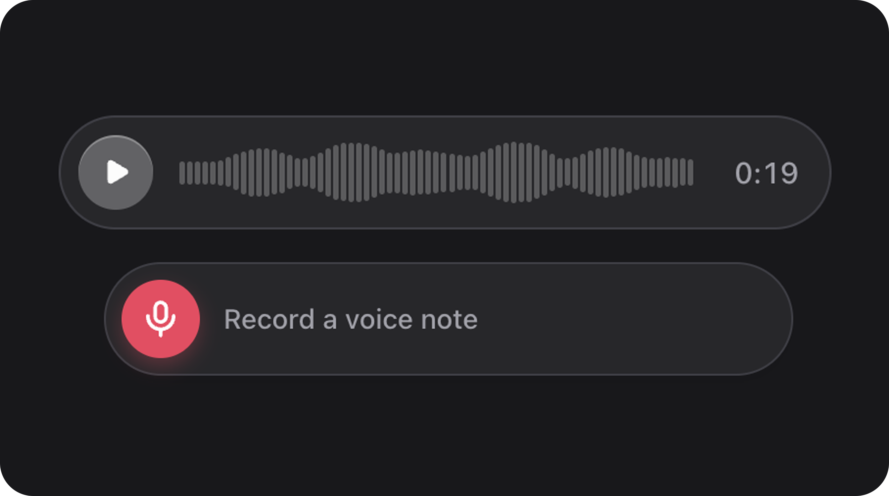

# AudioField



[← Back to Table of Contents](index.md)


### Summary

Compact audio player with waveform visualization, play/pause control, and optional loop. State is typically a URL string.

| | |
|---|---|
| **Class** | `Bjanczak\FilamentFlexFields\Filament\Forms\Components\AudioField` |
| **State type** | `string\|null` — audio URL (when not using static `src()`) |
| **FieldType** | `audio` |

### Basic usage

```php
use Bjanczak\FilamentFlexFields\Filament\Forms\Components\AudioField;

AudioField::make('preview_url')
    ->label('Voice message')
    ->fullWidth()
    ->loop();

AudioField::make('jingle')
    ->src('/audio/notification.mp3')
    ->waveform([20, 45, 80, 60, 35, 90, 50, 30])
    ->size('lg');
```

Display-only (fixed source, state ignored):

```php
AudioField::make('demo_track')
    ->src('https://cdn.example.com/demo.mp3')
    ->readOnly();
```

### State format

| Mode | Behaviour |
|------|-----------|
| Default | Form state string = audio URL |
| `src()` set | Static URL; `resolveAudioSrc()` prefers `src()` over state |
| Empty | No playback; placeholder waveform shown |

### Validation

| Rule | Detail |
|------|--------|
| `nullable` | State may be empty |
| `string` | State must be string when present |

### Configuration API

#### `src(string|Closure|null $src)`


Fixed audio URL. When set, overrides state for playback.

```php
AudioField::make('field_name')
    ->src('https://example.com/audio.mp3');
```
#### `fullWidth(bool|Closure $condition = true)`


Stretch player to container width. Default: `false`.

```php
AudioField::make('field_name')
    ->fullWidth(true);
```
#### `loop(bool|Closure $condition = true)`


Loop playback. Default: `false`.

```php
AudioField::make('field_name')
    ->loop(true);
```
#### `waveform(array|Closure|null $waveform)`


Custom peak heights `8`–`100`. When omitted, waveform is generated from URL fingerprint or placeholder.

```php
->waveform([30, 70, 45, 90, 55, 40, 75, 50])
```

#### `playIcon()` / `pauseIcon()`


Custom play/pause icons.

```php
AudioField::make('field_name')
    ->playIcon('heroicon-o-play')
    ->pauseIcon('heroicon-o-pause');
```
#### `size(string|ControlSize|Closure $size)`


`sm`, `md`, `lg`. Default: `md`.

```php
AudioField::make('field_name')
    ->size('md');
```
#### `readOnly(bool|Closure $condition = true)`


Disable interaction.

```php
AudioField::make('field_name')
    ->readOnly(true);
```

### Public helper methods

| Method | Returns | Description |
|--------|---------|-------------|
| `getSrc()` | `string\|null` | Static src |
| `isFullWidth()` | `bool` | Full width layout |
| `shouldLoop()` | `bool` | Loop enabled |
| `resolveAudioSrc(mixed $state)` | `string\|null` | Effective URL |
| `hasCustomWaveform()` | `bool` | Custom peaks configured |
| `getWaveform()` | `list<int>` | Normalized peaks |
| `resolveWaveform(mixed $state)` | `list<int>` | Peaks for display |
| `getPlayIcon()` / `getPauseIcon()` | `string\|BackedEnum\|Htmlable` | Icons |
| `getWrapperClasses()` | `list<string>` | `fff-audio-field-field` |

### FlexField schema config

| Config key | Maps to |
|------------|---------|
| `size` | `size()` |
| `full_width` | `fullWidth()` |
| `src` | `src()` |
| `loop` | `loop()` |
| `waveform` | `waveform()` |

### CSS classes

| Class | Role |
|-------|------|
| `fff-audio-field-field` | Root wrapper |
| `fff-audio-field-field--{sm\|md\|lg}` | Size modifier |
| `fff-audio-field__waveform` | Waveform bars |
| `fff-audio-field__play` | Play/pause button |

### Implementation notes

- Waveform without custom peaks uses `AudioWaveformGenerator::fromFingerprint($url)` for stable visuals per URL.
- Non-numeric waveform values throw `InvalidArgumentException`.

---
