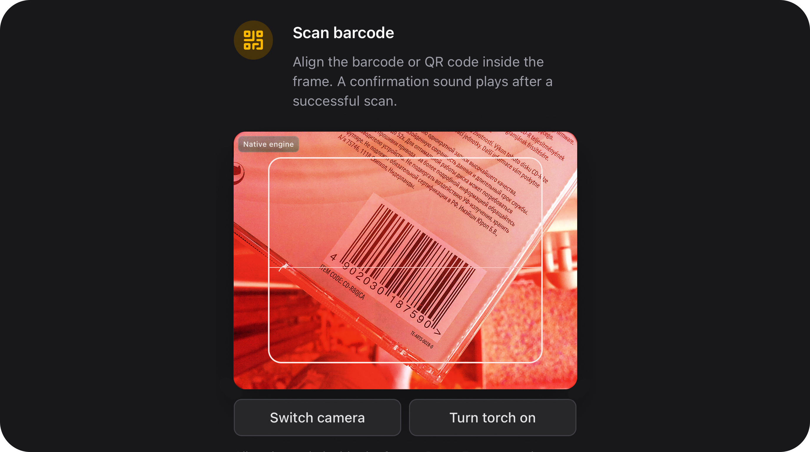

# BarcodeScannerField



> **Added in v2.6.0**

[← Back to Table of Contents](index.md)

### Summary

**Barcode and QR input** on the FlexTextInput shell with a **Filament modal** camera scanner, optional manual typing, format whitelist, and EAN/UPC checksum validation. Uses a **hybrid scan engine**: native `BarcodeDetector` when the browser supports it (Chrome/Edge), with automatic **ZXing** fallback. On a successful scan the field fills the input, plays a confirmation sound, and closes the modal (unless `continuous()` is enabled).

| | |
|---|---|
| **Class** | `Bjanczak\FilamentFlexFields\Filament\Forms\Components\BarcodeScannerField` |
| **State type** | `string\|null` — scanned or typed barcode value (symbology is **not** stored) |
| **Model cast** | `'sku' => 'string'` (typical) |
| **FieldType** | *(no dedicated FieldType mapping yet — use the class directly)* |
| **Playground** | `barcode-scanner-field` slug in Flex Fields playground |

---

### Basic usage

```php
use Bjanczak\FilamentFlexFields\Filament\Forms\Components\BarcodeScannerField;

BarcodeScannerField::make('sku')
    ->label('Product barcode')
    ->placeholder('Scan or type barcode…')
    ->required();
```

Filament resource example:

```php
use Filament\Forms\Form;
use Bjanczak\FilamentFlexFields\Filament\Forms\Components\BarcodeScannerField;
use Bjanczak\FilamentFlexFields\Enums\BarcodeFormat;

public static function form(Form $form): Form
{
    return $form->schema([
        BarcodeScannerField::make('ean')
            ->label('EAN barcode')
            ->formats([BarcodeFormat::Ean13, BarcodeFormat::Ean8])
            ->validateChecksum()
            ->allowManualInput(false)
            ->helperText('Scan the product barcode with your camera.')
            ->columnSpanFull(),
    ]);
}
```

---

### State format

The field stores a **plain string** (or `null` when empty). Whitespace is trimmed on hydrate/dehydrate.

```php
// Valid EAN-13 example
'5901234123457'

// QR / Code128 example
'SKU-WAREHOUSE-42'
```

The detected symbology is **not** persisted in state. Validation uses heuristics on the string (see [Format detection](#format-detection)).

---

### Supported formats

Configure allowed symbologies with `formats()` or `supportedFormats()`. When omitted, **all** built-in formats are allowed.

| Enum case | Slug | Typical use | Example test value |
|-----------|------|-------------|-------------------|
| `BarcodeFormat::Qr` | `qr` | QR codes, tickets, URLs | `https://example.com/t/abc` |
| `BarcodeFormat::Ean13` | `ean_13` | Retail products (EU) | `5901234123457` ✓ checksum |
| `BarcodeFormat::Ean8` | `ean_8` | Small retail packages | `96385074` |
| `BarcodeFormat::UpcA` | `upc_a` | US retail (12 digits) | `036000291452` |
| `BarcodeFormat::UpcE` | `upc_e` | Compressed UPC | `042526` |
| `BarcodeFormat::Code128` | `code_128` | Logistics, GS1-128 | `ABC-128-TEST` |
| `BarcodeFormat::Code39` | `code_39` | Industrial, inventory | `ABC-123` |
| `BarcodeFormat::Itf` | `itf` | Carton / interleaved 2 of 5 | `1234567890` |
| `BarcodeFormat::Pdf417` | `pdf417` | IDs, boarding passes | `PDF417-DEMO-VALUE` |
| `BarcodeFormat::DataMatrix` | `data_matrix` | Small parts, pharma | `DM-TEST-001` |

Invalid checksum example (EAN-13): `5901234123450`.

---

### Limit formats to specific symbologies

Yes — pass only the formats you need. The whitelist is applied in **three places**:

1. **Camera engine** — BarcodeDetector / ZXing hints (what the camera tries to decode).
2. **Client validation** — rejects scans that do not match allowed patterns before accepting.
3. **Server validation** — `BarcodeValidator` on form submit.

#### EAN / UPC only (retail)

```php
BarcodeScannerField::make('ean')
    ->formats([
        BarcodeFormat::Ean13,
        BarcodeFormat::Ean8,
        BarcodeFormat::UpcA,
        BarcodeFormat::UpcE,
    ])
    ->validateChecksum()
    ->allowManualInput(false);
```

#### QR only

```php
BarcodeScannerField::make('ticket_code')
    ->formats([BarcodeFormat::Qr])
    ->modalHeading('Scan ticket QR code');
```

#### Warehouse — Code 128 + ITF

```php
BarcodeScannerField::make('pallet_id')
    ->formats([BarcodeFormat::Code128, BarcodeFormat::Itf])
    ->scanDelay(500);
```

#### Dynamic whitelist (Closure)

```php
BarcodeScannerField::make('code')
    ->formats(fn (): array => $this->record?->requires_qr_only
        ? [BarcodeFormat::Qr]
        : [BarcodeFormat::Ean13, BarcodeFormat::Code128]);
```

---

### Format detection

There are two layers:

| Layer | What it does |
|-------|----------------|
| **Camera (ZXing / BarcodeDetector)** | Decodes the physical symbology from the image. Respects `formats()` hints. |
| **Validation (JS + PHP)** | Checks whether the **string value** matches allowed patterns (regex/heuristics). |

**Important:**

- By default state is a **string** (value only). Enable `storeDetectedFormat()` to persist `{ value, format }` from the camera engine.
- Server-side matching is heuristic (e.g. 13 digits → EAN-13). Ambiguous strings may match the first allowed format in priority order (EAN before QR).
- `BarcodeFormat::Qr` is the widest pattern — avoid combining it with numeric formats if you rely on manual typing.
- `validateChecksum()` adds real modulo-10 verification for EAN/UPC (recommended for retail).

---

### Scan UX

Default flow (without `continuous()`):

1. User clicks scan button → Filament modal opens.
2. Camera starts after the modal transition (badge shows **Native engine** on desktop Chrome/Edge or **ZXing engine** on mobile).
3. On valid scan → input filled, confirmation beep (when `beepOnScan()` is on), modal closes immediately.
4. **Toolbar below the preview** — **Switch camera** and **Turn torch on/off** (when supported); not overlaid on the video.
5. On **mobile**, switch camera toggles front ↔ rear via `facingMode`; on **desktop**, cycles `MediaDeviceInfo` when multiple inputs exist.
6. When `pauseWhenHidden()` is on (default), decoding pauses while the browser tab is in the background to save battery.

With `continuous()` — modal stays open for inventory-style scanning; input updates on each successful read.

#### Mobile / iOS notes

| Topic | Behaviour |
|-------|-----------|
| Camera preview | Body-mounted video portal + synced overlay so WebKit renders the stream inside the Filament modal |
| Switch camera | `environment` ↔ `user` facing toggle (recommended on phones) |
| Success sound | Short **Web Audio** tone — no lock-screen / Control Center “Now Playing” entry |
| Desktop sound | Bundled MP3 (`barcode-scan-success.mp3`) with synthesized fallback |

---

### Configuration API

All methods accept `Closure` for dynamic configuration.

| Method | Description | Default |
|--------|-------------|---------|
| `formats()` / `supportedFormats()` | Allowed symbologies (`list<BarcodeFormat\|string>`) | all formats |
| `validateChecksum()` | Modulo-10 check for EAN/UPC | `false` |
| `continuous()` | Keep modal open after each scan | `false` |
| `beepOnScan()` | Play confirmation sound on success (MP3 on desktop; transient Web Audio on mobile) | `true` |
| `autoSubmit()` | Dispatch `barcode-auto-submit` + `form.requestSubmit()` | `false` |
| `cameraFacing('environment'\|'user')` | Preferred camera when no `preferredDeviceId()` | `environment` |
| `preferredDeviceId(?string)` | Pin a specific `MediaDeviceInfo.deviceId` | `null` |
| `allowCameraSwitch()` | Show switch-camera in toolbar (`facingMode` on mobile; cycle devices on desktop) | `true` |
| `scanDelay(int)` | Debounce duplicate reads (ms) | `750` |
| `scanInterval(int)` | Decode loop interval (ms), clamped 50–2000 | `120` |
| `decodeFps(int)` | Shorthand for `scanInterval` via `1000 / fps` | — |
| `pauseWhenHidden()` | Pause decode when tab is hidden (Page Visibility API) | `true` |
| `storeDetectedFormat()` | State `{ value, format }` instead of plain string | `false` |
| `allowManualInput()` | Text input fallback | `true` |
| `scanButtonLabel()` | Scan button / `aria-label` | translated |
| `modalHeading()` | Filament modal title | translated |
| `scanIcon()` | Scan trigger icon | QR icon |
| `barcodeRule(Closure\|string)` | Extra Filament validation | none |
| `variant()` | `primary`, `secondary`, `soft`, `flat`, `ghost` | `primary` |
| `size()` | `sm`, `md`, `lg` | `md` |

Standard Filament field methods (`required()`, `rule()`, `unique()`, `live()`, `helperText()`, …) work as usual.

---

### Recipes

#### Retail shelf — EAN-13 with checksum, scan-only

```php
BarcodeScannerField::make('barcode')
    ->formats([BarcodeFormat::Ean13])
    ->validateChecksum()
    ->allowManualInput(false)
    ->required();
```

#### Inventory loop — continuous + beep

```php
BarcodeScannerField::make('scan_buffer')
    ->continuous()
    ->beepOnScan()
    ->scanDelay(400)
    ->formats([BarcodeFormat::Code128, BarcodeFormat::Code39]);
```

#### Auto-submit lookup form

```php
BarcodeScannerField::make('lookup_code')
    ->autoSubmit()
    ->live()
    ->afterStateUpdated(fn (?string $state) => $this->lookupProduct($state));
```

#### Laptop with multiple cameras + slower decode

```php
BarcodeScannerField::make('asset_tag')
    ->allowCameraSwitch()
    ->decodeFps(5) // ~200 ms between attempts
    ->pauseWhenHidden();
```

#### Persist symbology from camera

```php
BarcodeScannerField::make('scan')
    ->storeDetectedFormat()
    ->formats([BarcodeFormat::Ean13, BarcodeFormat::Qr]);

// State: ['value' => '5901234123457', 'format' => 'ean_13']
// Input still shows value only; use $get('scan.format') or state array in callbacks.
```

#### Custom validation + uniqueness

```php
BarcodeScannerField::make('sku')
    ->formats([BarcodeFormat::Code128])
    ->barcodeRule('regex:/^[A-Z0-9-]{6,32}$/')
    ->unique('products', 'sku')
    ->validationMessages([
        'unique' => 'This SKU is already registered.',
    ]);
```

---

### Events

Alpine dispatches browser events on successful scans:

| Event | Detail |
|-------|--------|
| `barcode-scanned` | `{ value, format, engine, statePath }` — `format` / `engine` from camera when available |
| `barcode-auto-submit` | `{ value, statePath }` — when `autoSubmit()` is enabled |

Listen in a parent Alpine scope or Livewire hook as needed.

---

### Validation

Built-in rules run through `BarcodeValidator`:

| Check | Message key |
|-------|-------------|
| Empty required field | Laravel `validation.required` |
| Value does not match any allowed format | `barcode_scanner.validation.unrecognized` |
| EAN/UPC checksum failure | `barcode_scanner.validation.checksum` |
| Custom `barcodeRule()` | your message |

Client-side validation mirrors server rules before accepting a camera scan (invalid scans show an inline error in the modal without closing it).

---

### Accessibility

- Scan button: keyboard operable, `aria-haspopup="dialog"`.
- Modal: native Filament `<x-filament::modal>` — focus trap, Escape to close, header close button.
- Loading state: `aria-live="polite"` while camera starts.
- Errors: `role="alert"` in modal body.
- `@media (prefers-reduced-motion: reduce)` disables scan-line animation and spinner.

---

### CSS classes

| Class | Purpose |
|-------|---------|
| `fff-barcode-scanner` | Root wrapper |
| `fff-barcode-scanner-field` | Field wrapper (via `getWrapperClasses`) |
| `fff-barcode-scanner__scan-btn` | Scan trigger in input suffix |
| `fff-barcode-scanner__viewport` | Camera preview shell (portal-synced on mobile) |
| `fff-barcode-scanner__reticle` | Scan frame + animated scan line |
| `fff-barcode-scanner__engine-badge` | Native / ZXing engine indicator (compact, top-left) |
| `fff-barcode-scanner__toolbar` | Row below preview — switch camera & torch |
| `fff-barcode-scanner__switch-camera-btn` | Switch camera control |
| `fff-barcode-scanner__torch-btn` | Torch toggle control |
| `fff-barcode-scanner-modal` | Filament modal root modifier |

Stylesheet: `barcode-scanner-field` (lazy). Depends on `flex-text-input`.

---

### Assets

| Asset | Loading |
|-------|---------|
| CSS `barcode-scanner-field` | Lazy per field |
| Alpine `barcode-scanner-field` | Lazy per field |
| ZXing chunk | Dynamic import when camera opens |
| MP3 `barcode-scan-success.mp3` | Published to `public/.../audio/...` |

Rebuild after JS/CSS changes:

```bash
cd packages/filament-flex-fields
npm install
npm run build
```

---

### Playground

Slug: **`barcode-scanner-field`**

| Demo field | Shows |
|------------|-------|
| `barcode__default` | Default + prefilled valid EAN-13 |
| `barcode__ean_only` | EAN/UPC whitelist + checksum |
| `barcode__continuous` | Continuous inventory mode + beep |
| `barcode__checksum` | EAN-13 only + checksum enforcement |
| `barcode__manual_only` | Scan-only (manual input disabled) |

---

### Testing

```bash
php artisan test --compact packages/filament-flex-fields/tests/Unit/BarcodeScannerFieldTest.php
php artisan test --compact packages/filament-flex-fields/tests/Feature/BarcodeScannerFieldRenderTest.php
node --test packages/filament-flex-fields/tests/js/barcode-scanner-field.test.mjs
```

Use playground values `5901234123457` (valid EAN-13) and `5901234123450` (invalid checksum) to verify validation.
