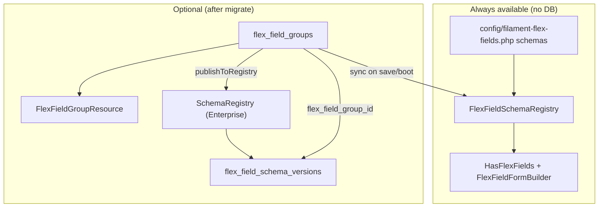

# Flex Field Groups

[← Back to Table of Contents](/docs/index)

## Why these migrations exist

Filament Flex Fields ships **two optional database tables** as part of the **M8 schema product**. They are **not required** for normal field usage, AudioField, or `HasFlexFields` with PHP/config schemas.

| Without migrations | With migrations |
|--------------------|-----------------|
| Schemas live in `config/filament-flex-fields.php` or `FlexFieldSchemaRegistry` (PHP, in-memory at boot) | Same, **plus** optional DB storage for admin-managed groups |
| `SchemaRegistry` keeps version history in memory (tests, dev) | `SchemaRegistry` can persist publish/rollback history to `flex_field_schema_versions` |
| No extra Filament nav items | Optional **Field groups** CRUD when `schema.resource_enabled=true` |

The package registers migrations via `loadMigrationsFrom`, so `php artisan migrate` on a host app **creates the tables** even when the admin resource stays disabled. That is intentional: empty tables are harmless; enabling the feature later does not require a separate migration step.

You can also publish migrations explicitly:

```bash
php artisan vendor:publish --tag=filament-flex-fields-migrations
php artisan migrate
```

---

## The two tables

### `flex_field_groups`

Stores **editable field group definitions** for the optional Filament resource.

| Column | Type | Purpose |
|--------|------|---------|
| `id` | bigint | Primary key |
| `name` | string | Display label in admin |
| `slug` | string | Stable key (unique per `tenant_id`) |
| `target_type` | string | Eloquent model class for `HasFlexFields` |
| `fields` | JSON | Array of field defs: `slug`, `label`, `type`, `sort`, … |
| `order` | unsigned int | Sort weight in list UI |
| `tenant_id` | string | Multi-tenant scope — `''` for global groups |
| `timestamps` | | Created / updated |

**Model:** `Bjanczak\FilamentFlexFields\Models\FlexFieldGroup`

**Unique constraint:** `(tenant_id, slug)` — same slug may exist for different tenants; global groups use empty string `''` (not SQL `NULL`).

### `flex_field_schema_versions`

Append-only **version history** for `SchemaRegistry` (enterprise control plane), not for individual Eloquent records.

| Column | Type | Purpose |
|--------|------|---------|
| `flex_field_group_id` | FK, nullable | Links to `flex_field_groups` when published from a group (`nullOnDelete`) |
| `schema_id` | string | Logical schema key (e.g. `crm-lead` or `tenant-a:booking`) |
| `version` | unsigned int | Monotonic version per `schema_id` |
| `schema` | JSON | Full schema payload + checksum |
| `checksum` | string(64) | SHA-256 via `SchemaImportExport` |
| `actor` | string, nullable | Who published (email, user id, …) |
| `state` | string(16) | `draft`, `review`, or `live` |
| `published_at` | timestamp | When this version was published |
| `timestamps` | | Row metadata |

**Model:** `Bjanczak\FilamentFlexFields\Models\FlexFieldSchemaVersion`

Generic `SchemaRegistry::publish()` calls may omit `flex_field_group_id`; group publishes always set it. Use `$group->schemaVersions()` for the relationship.

---

## Architecture (what talks to what)



`SchemaRegistry` (enterprise versioning) is separate from `FlexFieldSchemaRegistry` (runtime form builder), but **Field groups** sync into the runtime registry automatically when `schema.sync_on_save` / `schema.sync_from_database` are enabled (default).

| Class | Role |
|-------|------|
| `FlexFieldSchemaRegistry` | Runtime registry: which fields render on which Eloquent model |
| `SchemaRegistry` | Versioned publish / rollback / approval states for schema JSON |

---

## Do I need to run migrations?

| Your goal | Run migrations? | Enable resource? |
|-----------|-----------------|------------------|
| Use individual Flex Fields only | Optional (tables unused) | No |
| JSON fields via config / service provider | Optional | No |
| Admin UI to edit field groups in DB | **Yes** | `FLEX_FIELDS_SCHEMA_RESOURCE_ENABLED=true` |
| Persist schema version history across requests | **Yes** | No (use `SchemaRegistry` in code) |
| Multi-tenant field packs in admin | **Yes** | Yes + custom policy |

If you never enable the resource and never call `SchemaRegistry::publish()`, the tables stay empty and the package behaves like a config-only install.

---

## Enable the Filament resource

1. Run migrations (see above).

2. Turn on the resource:

```env
FLEX_FIELDS_SCHEMA_RESOURCE_ENABLED=true
```

Or in config:

```php
'schema' => [
    'resource_enabled' => true,
    'navigation_group' => 'Flex Fields',
    'navigation_sort' => 90,
],
```

3. Keep `FilamentFlexFieldsPlugin` on your panel — it registers `FlexFieldGroupResource` when the flag is true.

Navigation: **Field groups** (`/flex-field-groups` slug under your panel path).

---

## SchemaRegistry persistence

When `schema.registry_persistence` is `true` (default) **and** `flex_field_schema_versions` exists, publish/rollback writes to the database. Otherwise `SchemaRegistry` uses in-memory storage (fine for unit tests).

```env
FLEX_FIELDS_SCHEMA_REGISTRY_DB=false
```

```php
use Bjanczak\FilamentFlexFields\Support\Enterprise\SchemaRegistry;

$v1 = SchemaRegistry::publish('crm-lead', $schemaArray, 'admin@example.com', SchemaRegistry::STATE_DRAFT);
SchemaRegistry::setApprovalState('crm-lead', $v1, SchemaRegistry::STATE_LIVE);
$rolled = SchemaRegistry::rollback('crm-lead', $v1); // new live version with old schema payload
$history = SchemaRegistry::versions('crm-lead');
```

States: `draft`, `review`, `live`.

Rows published via `$group->publishToRegistry()` store `flex_field_group_id` and are available through `$group->schemaVersions()`.

---

## Runtime sync (automatic)

When enabled (default), groups stay aligned with `FlexFieldSchemaRegistry`:

| Event | Behavior |
|-------|----------|
| App boot | `FlexFieldGroupRegistrySync::syncAllFromDatabase()` after config schemas load |
| Group saved | Registry entry updated (`registrySchemaId()` key, `target_type`, fields) |
| Group deleted | Registry entry removed |
| Slug / `tenant_id` changed | Previous registry key removed before the new one is synced |

**Key collision:** DB groups registered after config schemas use the same string key — a DB group with slug `crm` overwrites a config schema keyed `crm`. Use distinct slugs or disable `sync_from_database`.

```env
FLEX_FIELDS_SCHEMA_SYNC_FROM_DB=true
FLEX_FIELDS_SCHEMA_SYNC_ON_SAVE=true
FLEX_FIELDS_SCHEMA_DEFAULT_TARGET=App\Models\Model
```

Disable either flag if you prefer manual registration in your service provider.

---

## One-line Filament integration (`FlexFieldStudio`)

After a model uses `HasFlexFields` and field groups are synced to the runtime registry, wire forms, tables, and infolists without hand-building each component:

```php
use Bjanczak\FilamentFlexFields\Filament\Concerns\InteractsWithFlexFieldSchemas;
use Bjanczak\FilamentFlexFields\Support\Schema\FlexFieldStudio;

// In a Filament Resource — trait helpers
class LeadResource extends Resource
{
    use InteractsWithFlexFieldSchemas;

    public static function form(Schema $schema): Schema
    {
        return $schema->components([
            // …your core fields…
            static::flexFieldFormSectionForResource('CRM attributes', collapsible: true),
        ]);
    }

    public static function table(Table $table): Table
    {
        return $table->columns([
            // …core columns…
            ...static::flexFieldTableColumnsForResource(),
        ]);
    }
}

// Or fluent API directly
$section = app(FlexFieldStudio::class)
    ->form()
    ->forModel(\App\Models\Lead::class)
    ->record($lead) // optional — resolves tenant + RBAC from context
    ->only(['deal_stage', 'company_name'])
    ->section();
```

| API | Purpose |
|-----|---------|
| `FlexFieldStudio::form()` | Build form section / components from live schemas |
| `FlexFieldStudio::table()` | Searchable, sortable table columns for JSON values |
| `FlexFieldStudio::infolist()` | Read-only entries on view pages |
| `InteractsWithFlexFieldSchemas` | Resource trait with `flexFieldFormSection()`, `flexFieldTableColumns()`, … |

Tenant-aware resolution uses `FlexFieldSchemaResolver` (global schemas + `tenantId:slug` scoped groups). Field types can be limited per tenant via `TenantFieldPacks::registerPack()` and per user via `FieldRbacMatrix`.

---

## Filament admin workflow

On **Create / Edit field group**, header actions include:

| Action | Effect |
|--------|--------|
| **Publish workflow** (draft / review / live) | Versioned snapshots in `flex_field_schema_versions`; **live** syncs runtime registry |
| **Import JSON** | Paste `SchemaImportExport` payload — validated before apply |
| **Export JSON** | Copy portable schema JSON |
| **Apply blueprint** | Seed from `SchemaBlueprintPacks` (CRM, HR, Booking, …) |
| **Rollback to version** | Restore prior JSON + new live version row |

The repeater supports slug, label, type, sort, required flag, help text, placeholder, config JSON, and JSON condition rules (`visible_when`, `required_when`, `disabled_when`). Saves run through `FlexFieldGroupValidator` (duplicate slug detection, type checks, `FlexFieldDefinition` parsing).

Programmatic API remains on the model:

```php
$group->publishToRegistry($actor, SchemaRegistry::STATE_REVIEW);
$group->rollbackRegistryVersion(3);
```

---

## Tenant resolver & admin scoping

Register how the active tenant is resolved for schema filtering and optional admin list scoping:

```php
// AppServiceProvider::boot()
config([
    'filament-flex-fields.schema.tenant_resolver' => fn (?object $context): ?string => Filament::getTenant()?->id,
    'filament-flex-fields.schema.rbac_user_key_resolver' => fn (?object $context): ?string => auth()->user()?->email,
    'filament-flex-fields.schema.scope_resource_by_tenant' => true,
]);
```

When `scope_resource_by_tenant` is true, the **Field groups** list shows global groups (`tenant_id = ''`) plus groups for the resolved tenant.

---

## FlexFieldGroup helpers

```php
use Bjanczak\FilamentFlexFields\Models\FlexFieldGroup;
use Bjanczak\FilamentFlexFields\Support\Enterprise\SchemaRegistry;

$group = FlexFieldGroup::query()->where('slug', 'booking')->first();

// schema_id = slug, or "tenantId:slug" when tenant_id is set
$version = $group->publishToRegistry(auth()->user()?->email, SchemaRegistry::STATE_LIVE);

// Restores fields JSON (and name from schema label) from a prior version; creates a new live version in SchemaRegistry
$record = $group->rollbackRegistryVersion(1);
```

`toRegistrySchema()` returns a payload compatible with `SchemaImportExport` / blueprint packs. Set **`target_type`** on each group (or `FLEX_FIELDS_SCHEMA_DEFAULT_TARGET`) so `HasFlexFields` resolves the correct Eloquent model.

---

## Security & RBAC

Default policy requires Gate ability **`manageFlexFieldSchemas`** (configurable):

```php
// AppServiceProvider::boot()
use Illuminate\Support\Facades\Gate;

Gate::define('manageFlexFieldSchemas', fn (\App\Models\User $user): bool => $user->isAdmin());
```

Custom policy:

```php
use Bjanczak\FilamentFlexFields\Models\FlexFieldGroup;

Gate::policy(FlexFieldGroup::class, YourFlexFieldGroupPolicy::class);
```

Publish and rollback actions authorize `publish` / `rollback` on the policy. Enable `scope_resource_by_tenant` or add a custom policy / global scope for stricter tenant isolation.

---

## Slug uniqueness (multi-tenant)

- **Database:** unique index on `(tenant_id, slug)` with `tenant_id = ''` for global groups (no MySQL `NULL` duplicate slugs).
- **Filament form:** `unique` rule scoped to the same `tenant_id` value.

The same slug may exist for different tenants; not twice for the same tenant (including global).

---

## Configuration reference

```php
// config/filament-flex-fields.php
'schema' => [
    'resource_enabled' => env('FLEX_FIELDS_SCHEMA_RESOURCE_ENABLED', false),
    'navigation_group' => env('FLEX_FIELDS_SCHEMA_NAV_GROUP', 'Flex Fields'),
    'navigation_sort' => (int) env('FLEX_FIELDS_SCHEMA_NAV_SORT', 90),
    'registry_persistence' => env('FLEX_FIELDS_SCHEMA_REGISTRY_DB', true),
    'sync_from_database' => env('FLEX_FIELDS_SCHEMA_SYNC_FROM_DB', true),
    'sync_on_save' => env('FLEX_FIELDS_SCHEMA_SYNC_ON_SAVE', true),
    'default_target_type' => env('FLEX_FIELDS_SCHEMA_DEFAULT_TARGET', 'App\\Models\\Model'),
    'policy_ability' => env('FLEX_FIELDS_SCHEMA_POLICY_ABILITY', 'manageFlexFieldSchemas'),
    'tenant_resolver' => null, // callable (?object $context): ?string
    'rbac_user_key_resolver' => null, // callable (?object $context): ?string
    'scope_resource_by_tenant' => env('FLEX_FIELDS_SCHEMA_SCOPE_BY_TENANT', false),
],
```

| Env variable | Default | Effect |
|--------------|---------|--------|
| `FLEX_FIELDS_SCHEMA_RESOURCE_ENABLED` | `false` | Filament **Field groups** resource |
| `FLEX_FIELDS_SCHEMA_REGISTRY_DB` | `true` | Persist `SchemaRegistry` to DB when table exists |
| `FLEX_FIELDS_SCHEMA_SYNC_FROM_DB` | `true` | Hydrate runtime registry on boot |
| `FLEX_FIELDS_SCHEMA_SYNC_ON_SAVE` | `true` | Sync registry when groups saved/deleted |
| `FLEX_FIELDS_SCHEMA_DEFAULT_TARGET` | `App\Models\Model` | Default `target_type` for new groups |
| `FLEX_FIELDS_SCHEMA_POLICY_ABILITY` | `manageFlexFieldSchemas` | Gate ability for CRUD + publish/rollback |
| `FLEX_FIELDS_SCHEMA_SCOPE_BY_TENANT` | `false` | Filter admin list by resolved tenant |
| `FLEX_FIELDS_SCHEMA_NAV_GROUP` | `Flex Fields` | Navigation group label |
| `FLEX_FIELDS_SCHEMA_NAV_SORT` | `90` | Navigation sort |

---

## Tests

`tests/Schema/FlexFieldStudioTest.php`, `tests/Schema/FlexFieldGroupResourceTest.php`, `tests/Schema/FlexFieldGroupRegistrySyncTest.php`, `tests/Schema/FlexFieldGroupEnterpriseTest.php`, `tests/Unit/EnterpriseControlPlaneTest.php` — resolver/tenant/RBAC, FlexFieldStudio form+table builders, validation, CRUD, registry sync, publish/rollback/import/blueprint Livewire actions, composite slug uniqueness.

---

## Related

- JSON schemas in config: `config/filament-flex-fields.php` → `schemas`
- Runtime builder: `HasFlexFields`, `FlexFieldFormBuilder`, `FlexFieldSchemaRegistry`, **`FlexFieldStudio`**
- Blueprint packs: `SchemaBlueprintPacks` (CRM / HR / Booking / …)
- Import / export: `SchemaImportExport`
- JSON conditions: [Upgrade v2 → v3](/docs/upgrade-v2-to-v3) (schema conditions section)
- Enterprise control plane: `TenantFieldPacks`, `FieldRbacMatrix`, `ObservabilityHooks` (see CHANGELOG M13)
