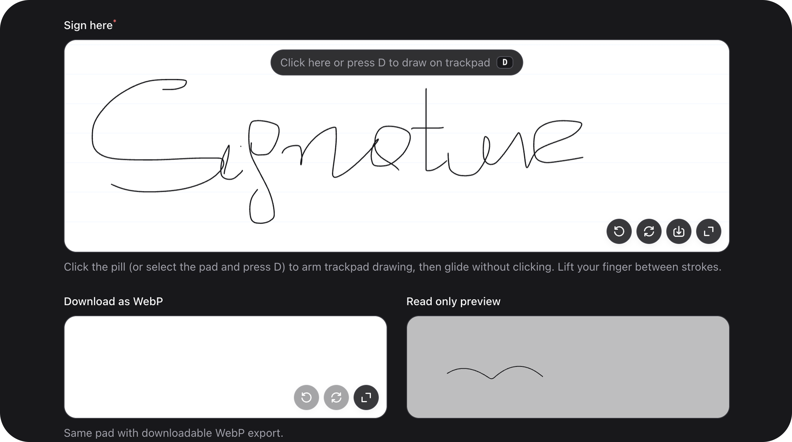

# SignatureField



[← Back to Table of Contents](index.md)


### Summary

Canvas signature pad storing normalized SVG markup. Supports undo, fullscreen, optional download (SVG/WebP), and stroke validation.

| | |
|---|---|
| **Class** | `Bjanczak\FilamentFlexFields\Filament\Forms\Components\SignatureField` |
| **State type** | `string\|null` — normalized SVG document |
| **FieldType** | `signature` |
| **Storage constants** | `STORE_SVG = 'svg'` |

### Basic usage

```php
use Bjanczak\FilamentFlexFields\Filament\Forms\Components\SignatureField;

SignatureField::make('signature')
    ->label('Sign here')
    ->penColor('#18181b')
    ->backgroundColor('#ffffff')
    ->required();

SignatureField::make('approval_signature')
    ->fullscreen()
    ->undoable()
    ->downloadable(SignatureField::DOWNLOAD_WEBP)
    ->downloadFilename('approval')
    ->maxSizeKb(64)
    ->minStrokes(2);
```

Read-only preview of an existing signature:

```php
SignatureField::make('signed_at')
    ->default($record->signature_svg)
    ->readOnly();
```

### State format

State is a compact SVG string produced by `SignatureSvg::normalize()`. `null` or empty string means no signature.

Use `normalizeState(mixed $state): ?string` to sanitize external SVG before setting state.

### Validation

| Check | Detail |
|-------|--------|
| `required()` | State must not be empty |
| Format | Must pass `SignatureSvg::isValid()` |
| Size | Byte size ≤ `maxSizeKb()` × 1024 |
| Strokes | Path count ≥ `minStrokes()` |

### Configuration API

#### `penColor(string|Closure $color)`


Hex pen color. Default: `#18181b`. Must match `#RGB` or `#RRGGBB`.

```php
SignatureField::make('field_name')
    ->penColor('#000000');
```
#### `penWidth(float|Closure $width)`


Stroke width in SVG units. Clamped to `0.5`–`12`. Default: `2.5`.

```php
SignatureField::make('field_name')
    ->penWidth(2.5);
```
#### `backgroundColor(string|Closure|null $color)`


Canvas background hex, or `null` / `'transparent'` for transparent. Default: `#ffffff`.

```php
SignatureField::make('field_name')
    ->backgroundColor('#ffffff');
```
#### `fullscreen(bool|Closure $condition = true)`


Enable fullscreen drawing mode. Default: `true`.

```php
SignatureField::make('field_name')
    ->fullscreen(true);
```
#### `undoable(bool|Closure $condition = true)`


Show undo control. Default: `true`.

```php
SignatureField::make('field_name')
    ->undoable(true);
```
#### `maxSizeKb(int|Closure $kilobytes)`


Maximum stored SVG size in kilobytes. Default: `48`.

```php
SignatureField::make('field_name')
    ->maxSizeKb(1024);
```
#### `minStrokes(int|Closure $strokes)`


Minimum number of SVG paths required. Default: `1`.

```php
SignatureField::make('field_name')
    ->minStrokes(3);
```
#### `viewBox(int|Closure $width, int|Closure $height)`


SVG viewBox dimensions. Defaults from `SignatureSvg::VIEWBOX_WIDTH` / `VIEWBOX_HEIGHT`.

```php
SignatureField::make('field_name')
    ->viewBox(400, 200);
```
#### `smoothing(bool|Closure $condition = true)`


Bezier smoothing on strokes. Default: `true`.

```php
SignatureField::make('field_name')
    ->smoothing(true);
```
#### `trackpadGlide(bool|Closure $condition = true)`


Hold modifier key to draw with trackpad without clicking. Default: `false`.

```php
SignatureField::make('field_name')
    ->trackpadGlide(true);
```
#### `trackpadGlideKey(string|Closure $key)`


Single letter `a`–`z` for glide modifier. Default: `d`.

```php
SignatureField::make('field_name')
    ->trackpadGlideKey('shift');
```
#### `guidelines(bool|Closure $condition = true)`


Show baseline guidelines on canvas. Default: `false`.

```php
SignatureField::make('field_name')
    ->guidelines(true);
```
#### `downloadable(string|Closure|null $format = 'svg')`


Enable client-side download. Formats: `SignatureField::DOWNLOAD_SVG` or `SignatureField::DOWNLOAD_WEBP`. Pass `null` to disable.

```php
SignatureField::make('field_name')
    ->downloadable('svg');
```
#### `downloadFilename(string|Closure $filename)`


Download file base name without extension. Default: `signature`.

```php
SignatureField::make('field_name')
    ->downloadFilename('signature.svg');
```
#### `webpQuality(float|Closure $quality)`


WebP export quality `0.1`–`1`. Default: `0.9`.

```php
SignatureField::make('field_name')
    ->webpQuality(0.8);
```
#### `undoIcon()` / `clearIcon()` / `downloadIcon()` / `fullscreenIcon()` / `closeIcon()`


Override toolbar icons (`string|BackedEnum|Htmlable|Closure|null`).

```php
SignatureField::make('field_name')
    ->undoIcon('heroicon-o-arrow-path')
    ->clearIcon('heroicon-o-trash')
    ->downloadIcon('heroicon-o-arrow-down-tray')
    ->fullscreenIcon('heroicon-o-arrows-pointing-out')
    ->closeIcon('heroicon-o-x-mark');
```
#### `readOnly(bool|Closure $condition = true)`


Disable drawing; display existing SVG only.

```php
SignatureField::make('field_name')
    ->readOnly(true);
```

### Public helper methods

| Method | Returns | Description |
|--------|---------|-------------|
| `getPenColor()` | `string` | Lowercase hex |
| `getPenWidth()` | `float` | Clamped width |
| `getBackgroundColor()` | `string\|null` | Background hex or `null` |
| `isFullscreenEnabled()` | `bool` | Fullscreen available |
| `isUndoable()` | `bool` | Undo enabled |
| `getMaxSizeKb()` | `int` | Size limit |
| `getMinStrokes()` | `int` | Minimum paths |
| `getViewBoxWidth()` / `getViewBoxHeight()` | `int` | ViewBox size |
| `isSmoothingEnabled()` | `bool` | Smoothing on |
| `isTrackpadGlideEnabled()` | `bool` | Trackpad glide on |
| `getTrackpadGlideKey()` | `string` | Modifier key |
| `isGuidelinesEnabled()` | `bool` | Guidelines visible |
| `getDownloadFormat()` | `string\|null` | `svg`, `webp`, or `null` |
| `getDownloadFilename()` | `string` | Download base name |
| `getWebpQuality()` | `float` | WebP quality |
| `getUndoIcon()` etc. | `string\|BackedEnum\|Htmlable` | Resolved icons |
| `normalizeState(mixed $state)` | `string\|null` | Sanitized SVG |
| `getWrapperClasses()` | `array<string, bool>` | `fff-signature-field` |

### FlexField schema config

| Config key | Maps to |
|------------|---------|
| `pen_color` | `penColor()` |
| `pen_width` | `penWidth()` |
| `background_color` | `backgroundColor()` |
| `fullscreen` | `fullscreen()` |
| `undoable` | `undoable()` |
| `max_size_kb` | `maxSizeKb()` |
| `min_strokes` | `minStrokes()` |
| `smoothing` | `smoothing()` |
| `download_format` | `downloadable()` |
| `download_filename` | `downloadFilename()` |
| `webp_quality` | `webpQuality()` |

### CSS classes

| Class | Role |
|-------|------|
| `fff-signature-field` | Root wrapper |
| `fff-signature-field__canvas` | Drawing surface |
| `fff-signature-field__toolbar` | Action buttons |

### Implementation notes

- Store SVG in `text` or `longText` columns; consider `maxSizeKb()` for DB limits.
- WebP download is generated client-side from the canvas — not stored in form state.

---
