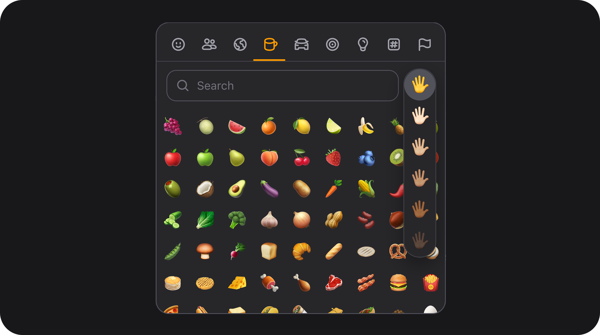

# UserSelect



[← Back to Table of Contents](index.md)


### Summary

Rich user picker extending [SelectField](selectfield.md): avatar, name, email, and verified badge in dropdown and trigger. Single selection shows a compact rich trigger; multiple selection shows a names summary in the trigger plus removable avatar tags below the field.

| | |
|---|---|
| **Class** | `Bjanczak\FilamentFlexFields\Filament\Forms\Components\UserSelect` |
| **State type** | `string\|int\|null` (single) or `list<string\|int>` (multiple) |
| **FieldType** | `user_select` |
| **Parent** | `SelectField` — inherits select API unless overridden below |

For **read-only user display in tables**, use [UserColumn](usercolumn.md) instead.

### Basic usage

With Eloquent model search (`optionModel`):

```php
use Bjanczak\FilamentFlexFields\Filament\Forms\Components\UserSelect;
use App\Models\User;

UserSelect::make('assignee_id')
    ->label('Assignee')
    ->optionModel(User::class)
    ->nameColumn('name')
    ->emailColumn('email')
    ->avatarColumn('avatar_url')
    ->verificationColumn('email_verified_at')
    ->searchable()
    ->required();
```

With a relationship:

```php
UserSelect::make('team_member_ids')
    ->label('Team members')
    ->relationship('members', 'name')
    ->emailColumn('email')
    ->multiple()
    ->searchable();
```

Static rich options (no database):

```php
UserSelect::make('reviewer_id')
    ->options([
        1 => [
            'label' => 'Jane Doe',
            'description' => 'jane@example.com',
            'image' => '/avatars/jane.jpg',
            'verified' => true,
        ],
    ]);
```

Custom resolvers (aligned with [UserColumn](usercolumn.md)):

```php
UserSelect::make('owner_id')
    ->optionModel(User::class)
    ->getAvatarUrlUsing(fn (User $record): ?string => $record->getFilamentAvatarUrl())
    ->getNameUsing(fn (User $record): string => $record->name)
    ->isVerifiedUsing(fn (User $record): bool => $record->hasVerifiedEmail());
```

### Display behaviour

| Mode | Trigger | Dropdown |
|------|---------|----------|
| **Single** | Avatar + name + email + verified badge | Rich option rows; selected user hidden from list |
| **Multiple (1 user)** | Same as single | Same as single |
| **Multiple (2+ users)** | Truncated comma-separated names (`+N` when overflow) | Rich option rows; removable avatar tags rendered below the field |

Options for `optionModel()` are loaded **lazily** — default suggestions and search results are fetched when the dropdown opens or when the user searches, not on initial page render.

### State format

Same as SelectField: scalar ID for single mode, array of IDs for `multiple()`. Values must match model primary keys when using `optionModel()` or `relationship()`.

### Validation

Inherits SelectField / Filament Select validation (`required`, etc.). Option keys must exist in search results or static `options()`.

### Avatar resolution order

When resolving a user record (trigger, tags, or search results):

1. `getAvatarUrlUsing()` callback, if set
2. `avatarColumn()` value on the model
3. If neither yields a URL, initials are shown on a gradient surface

Use `getAvatarUrlUsing(fn ($record) => $record->getFilamentAvatarUrl())` to integrate with Filament's user avatar convention.

### Configuration API (UserSelect-specific)

#### `resolveSelectedUsersForDisplay(array $values)`


Resolves custom user data shapes for the given raw values to properly display avatars and details in the trigger badges.

```php
UserSelect::make('author_id')
    ->resolveSelectedUsersForDisplay([
        1 => ['name' => 'John Doe', 'avatar' => '/avatars/john.jpg', 'email' => 'john@example.com']
    ]);
```
### Inherited SelectField API

All [SelectField](selectfield.md) methods apply: `multiple()`, `searchable()`, `options()`, `variant()`, `size()`, `richOptions()`, `native()`, `placeholder()`, `preload()` (with `relationship()`), etc.

### Public helper methods

| Method | Returns | Description |
|--------|---------|-------------|
| `getUserModel()` | `string\|null` | Model class from `optionModel()` |
| `getNameColumn()` | `string` | Name attribute |
| `getEmailColumn()` | `string\|null` | Email attribute |
| `getAvatarColumn()` | `string\|null` | Avatar attribute |
| `getVerificationColumn()` | `string\|null` | Verification attribute |
| `getMinSearchLength()` | `int` | Minimum search query length |
| `getDefaultSuggestionsLimit()` | `int` | Default suggestion count on open |
| `shouldRenderMultipleUserTags()` | `bool` | `true` when `multiple()` |
| `renderUserOption(array $option, string $layout)` | `string` | HTML for `list`, `trigger`, or `tag` layout |
| `recordToOptionArray(Model $record)` | `array` | Normalized option shape |
| `resolveOptionLabelsForValues(array $values)` | `array` | Labels per value |
| `searchRecords(?string $search)` | `array` | Model search results |
| `getUserSelectInitials(string $name)` | `string` | Initials fallback |
| `getInitialTriggerLabel()` | `string\|null` | Rich trigger HTML (single) |
| `getInitialMultipleTriggerHtml()` | `string\|null` | SSR trigger HTML (multiple) |
| `getInitialSelectedUserTagsHtml()` | `string\|null` | SSR tag row HTML (multiple, 2+ users) |
| `getInitialSelectedUserEntriesForJs()` | `list<array>` | Hydration payload for client display |
| `getInitialOptionsForJs()` | `list<array>` | Empty on page load for `optionModel()` (lazy) |
| `getOptionsForJs()` | `list<array>` | Full options for Livewire fetches |

### FlexField schema config

Inherits SelectField config keys plus:

| Config key | Maps to |
|------------|---------|
| `option_model` / `model` | `optionModel()` |
| `name_column` | `nameColumn()` |
| `email_column` | `emailColumn()` |
| `avatar_column` | `avatarColumn()` |
| `verification_column` | `verificationColumn()` |
| `max_visible_avatars` | `maxVisibleAvatars()` (schema only; see note above) |
| `multiple` | `multiple()` |

### CSS classes

| Class | Role |
|-------|------|
| `fff-user-select` | Root (with SelectField classes) |
| `fff-user-select--single` / `--multiple` | Mode modifier |
| `fff-user-select-option--list` | Dropdown option row |
| `fff-user-select-option--trigger` | Single / one-user trigger |
| `fff-user-select-option--tag` | Multi-select tag chip |
| `fff-user-select__trigger-names` | Comma-separated names (multiple, 2+ users) |
| `fff-user-select__selected-tags` | Tag container below field |
| `fff-user-select__selected-tag` | Individual removable tag |
| `fff-user-select__avatar` | Avatar wrapper |
| `fff-user-select__verified-badge` | Verified seal icon |
| `fff-select-field--rich-list-trigger` | Rich trigger layout |

### Implementation notes

- `richOptions()` and `allowHtml()` are enabled in `setUp()`.
- User option shape: `label`, `description`, `image`, `verified` (optional `disabled`).
- Client-side rendering uses lean JSON (`user` payload) with virtual scroll for lists larger than 30 options.
- Search uses prefix `LIKE` on name and email by default, with relevance ordering and request-level caching.

---
