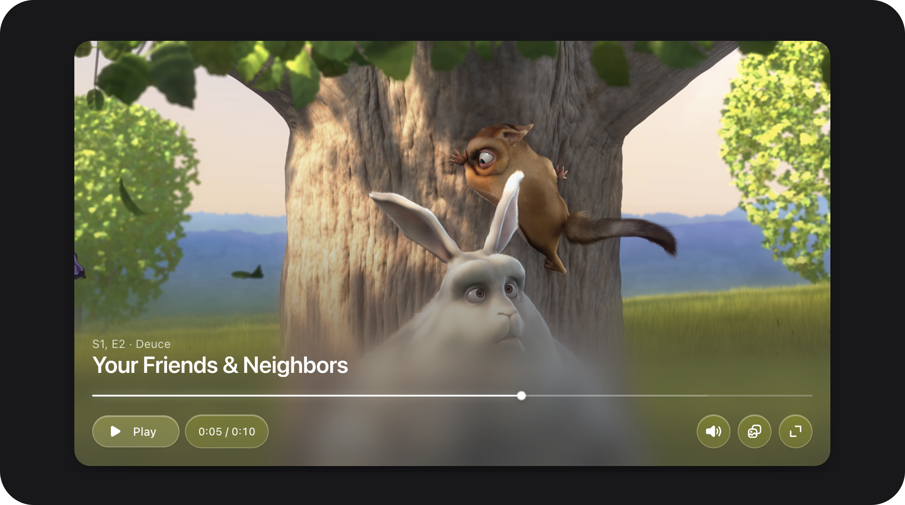

# VideoField



[← Back to Table of Contents](index.md)


### Summary

Custom video player with optional YouTube embed, skip controls, PiP, fullscreen, and compact control layout.

| | |
|---|---|
| **Class** | `Bjanczak\FilamentFlexFields\Filament\Forms\Components\VideoField` |
| **State type** | `string\|null` — video URL or YouTube link |
| **FieldType** | `video` |

### Basic usage

```php
use Bjanczak\FilamentFlexFields\Filament\Forms\Components\VideoField;

VideoField::make('trailer_url')
    ->label('Trailer')
    ->ratio('16:9')
    ->title('Product trailer')
    ->controls()
    ->allowYoutube();

VideoField::make('tutorial')
    ->src('https://cdn.example.com/tutorial.mp4')
    ->poster('/images/tutorial-poster.jpg')
    ->skipSeconds(15)
    ->pictureInPictureable()
    ->compactControls();
```

YouTube URL in state:

```php
VideoField::make('promo_video')
    ->default('https://www.youtube.com/watch?v=dQw4w9WgXcQ')
    ->youtubeNoCookie()
    ->autoHideControls();
```

### State format

| Mode | Behaviour |
|------|-----------|
| Default | State string = direct video URL or YouTube URL |
| `src()` set | Static URL overrides state for playback |
| YouTube | Detected via `VideoSources::youtubeId()` when `allowYoutube()` |

### Validation

| Rule | Detail |
|------|--------|
| `nullable` | State may be empty |
| `string` | State must be string when present |

### Configuration API

#### `allowVimeo(bool|Closure $condition = true)`


Enables or disables parsing of Vimeo URLs and loading of Vimeo player embeds. Default is `true`.

```php
VideoField::make('trailer')
    ->allowVimeo(false); // Only allow YouTube/HTML5 sources
```
### Public helper methods

| Method | Returns | Description |
|--------|---------|-------------|
| `getControlsLayout()` | `string` | `default` or `compact` |
| `usesCompactControls()` | `bool` | Compact layout |
| `getRatio()` / `getAspectRatioStyle()` | `string\|null` | Aspect ratio |
| `resolveVideoSrc(mixed $state)` | `string\|null` | Effective URL |
| `resolveYoutubeId(mixed $state)` | `string\|null` | YouTube video ID |
| `usesYoutubeEmbed(mixed $state)` | `bool` | YouTube mode |
| `resolveProvider(mixed $state)` | `string` | `html5`, `youtube`, etc. |
| `resolveYoutubeEmbedUrl(...)` | `string\|null` | Embed URL |
| `usesYoutubeCustomControls(mixed $state)` | `bool` | Custom YT chrome |
| `usesYoutubeFacade(mixed $state)` | `bool` | Click-to-play facade |
| `getYoutubeIframePlayerVars(...)` | `array` | iframe `playerVars` |
| `resolveYoutubeThumbnail(mixed $state)` | `string\|null` | Poster/thumbnail |
| `supportsPictureInPicture(mixed $state)` | `bool` | PiP available |
| `hasMetadata()` | `bool` | Title or subtitle set |
| `shouldShowControls()` etc. | `bool` | Feature flags |
| `getSkipSeconds()` | `int` | Skip interval |

### FlexField schema config

| Config key | Maps to |
|------------|---------|
| `size` | `size()` |
| `ratio` | `ratio()` |
| `full_width` | `fullWidth()` |
| `src` | `src()` |
| `poster` / `placeholder` | `poster()` |
| `title` | `title()` |
| `subtitle` | `subtitle()` |
| `controls` | `controls()` |
| `native_controls` | `nativeControls()` |
| `autoplay` | `autoplay()` |
| `loop` | `loop()` |
| `muted` | `muted()` |
| `plays_inline` | `playsInline()` |
| `skip_seconds` | `skipSeconds()` |
| `picture_in_picture` | `pictureInPictureable()` |
| `allow_youtube` | `allowYoutube()` |
| `youtube_no_cookie` | `youtubeNoCookie()` |
| `auto_hide_controls` | `autoHideControls()` |
| `controls_layout` | `controlsLayout()` |

### CSS classes

| Class | Role |
|-------|------|
| `fff-video-field-field` | Root wrapper |
| `fff-video-field-field--{sm\|md\|lg}` | Size modifier |
| `fff-video-field__stage` | Video area |
| `fff-video-field__controls` | Control bar |
| `fff-video-field__controls--compact` | Compact layout |

### Implementation notes

- YouTube with custom controls uses iframe API; facade mode shows thumbnail until play.
- Invalid `ratio` strings throw `InvalidArgumentException`.

---
